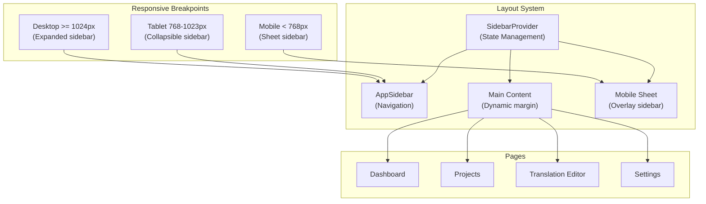
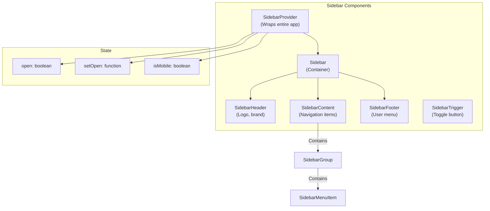
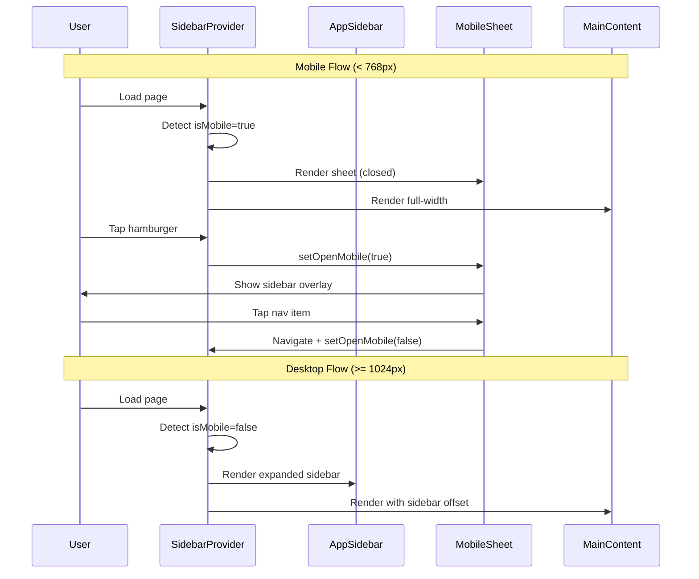

# UI/UX Overhaul Design Document

## Overview

Complete UI/UX overhaul of the Localeflow web application implementing mobile-first responsive design with shadcn sidebar integration. This project transforms the fixed desktop-only layout into a fluid, touch-friendly responsive interface that adapts seamlessly across all device sizes.

## Design Summary (Meta)

```yaml
design_type: "refactoring"
risk_level: "medium"
main_constraints:
  - "frontend-design skill MANDATORY for all component implementations"
  - "Preserve existing functionality and data flow"
  - "Maintain Localeflow brand identity (deep indigo/violet + warm amber)"
  - "Support Tailwind CSS v4 with oklch color system"
biggest_risks:
  - "Translation editor multi-column layout complexity on mobile"
  - "Sidebar state management across navigation"
  - "Touch target sizing may conflict with information density"
unknowns:
  - "Exact animation timing for sidebar transitions"
  - "Mobile keyboard handling for translation editor"
```

## Background and Context

### Prerequisite ADRs

- **ADR-0001-monorepo-structure.md**: Workspace structure using pnpm + Turborepo
- **ADR-0003-authentication-approach.md**: JWT authentication for web sessions

### Agreement Checklist

#### Scope
- [x] Replace current fixed sidebar with responsive shadcn sidebar component
- [x] Implement mobile-first responsive design across all 27-32 pages
- [x] Unify spacing, typography, and color hierarchy
- [x] Ensure touch-friendly interactions (44x44px minimum touch targets)
- [x] Dashboard layout (`/apps/web/src/app/(dashboard)/layout.tsx`)
- [x] All dashboard pages (projects, spaces, branches, translations, settings)
- [x] Auth pages (login, register)

#### Non-Scope (Explicitly not changing)
- [x] API layer and data fetching logic
- [x] Authentication flow (JWT handling)
- [x] Business logic in custom hooks
- [x] Backend API endpoints
- [x] Dark mode toggle (already supported via CSS variables)

#### Constraints
- [x] Parallel operation: No (complete replacement)
- [x] Backward compatibility: Not required
- [x] Performance measurement: Required (Core Web Vitals)
- [x] **frontend-design skill MANDATORY**: All UI implementation must invoke this skill

### Problem to Solve

The current Localeflow UI has critical responsive design limitations:
1. Fixed sidebar (w-64) does not collapse on mobile devices
2. Main content uses fixed margin (ml-64) breaking layout on smaller screens
3. Translation editor grid assumes desktop widths
4. Touch targets are sized for mouse interactions, not touch

### Current Challenges

| Challenge | Current Implementation | Impact |
|-----------|----------------------|--------|
| Fixed sidebar | `w-64` with `translate-x-full` hide | Unusable on mobile |
| Fixed content margin | `ml-64` on main content | Content pushed off-screen on mobile |
| Grid layouts | Fixed column counts | Broken layouts on small screens |
| Touch targets | Default button sizes | Difficult to tap on mobile |
| Information density | Desktop-optimized spacing | Cramped on mobile, sparse on large screens |

### Requirements

#### Functional Requirements

- FR-UI-001: Sidebar collapses to hamburger menu on mobile (< 768px)
- FR-UI-002: Sidebar expands on desktop (>= 1024px)
- FR-UI-003: All interactive elements have minimum 44x44px touch targets
- FR-UI-004: Translation editor adapts to single-column on mobile
- FR-UI-005: Navigation remains accessible on all screen sizes

#### Non-Functional Requirements

- **Performance**: First Contentful Paint < 1.5s, Layout Shift < 0.1
- **Accessibility**: WCAG 2.1 AA compliance for touch targets and contrast
- **Maintainability**: Consistent design tokens, component-based architecture
- **Scalability**: Design system scales to future page additions

## Acceptance Criteria (AC) - EARS Format

### FR-UI-001: Responsive Sidebar

- [x] **When** viewport width is less than 768px (mobile), the system shall hide the sidebar and display a hamburger menu button
- [x] **When** user taps the hamburger menu on mobile, the system shall display the sidebar as an overlay/sheet
- [x] **When** viewport width is 1024px or greater, the system shall display the sidebar in expanded state by default
- [x] **While** sidebar is open on mobile, the system shall display a backdrop overlay that closes sidebar on tap
- [x] **If** user navigates to a new page on mobile, **then** the system shall automatically close the sidebar

### FR-UI-002: Touch-Friendly Interactions

- [x] All interactive elements (buttons, links, menu items) shall have minimum dimensions of 44x44px
- [x] **When** user taps a button on mobile, the system shall provide visual feedback within 100ms
- [x] Spacing between adjacent touch targets shall be at least 8px

### FR-UI-003: Responsive Layouts

- [x] **When** viewport is mobile (< 640px), the system shall display content in single-column layout
- [x] **When** viewport is tablet (768px - 1023px), the system shall display content in 2-column grid
- [x] **When** viewport is desktop (>= 1024px), the system shall display content in 3+ column grid where appropriate

### FR-UI-004: Translation Editor Mobile

- [x] **When** viewport is mobile, the system shall display language columns as swipeable cards or stacked rows
- [x] **When** editing a translation on mobile, the system shall expand the textarea to full width
- [x] The system shall maintain translation key visibility while editing on mobile

### FR-UI-005: Consistent Styling

- [x] Typography shall follow the defined scale across all pages
- [x] Spacing shall follow 4px base unit across all components
- [x] Color usage shall follow the established hierarchy (primary, secondary, accent)

## Existing Codebase Analysis

### Implementation Path Mapping

| Type | Path | Description |
|------|------|-------------|
| Existing | `apps/web/src/app/(dashboard)/layout.tsx` | Dashboard layout with fixed sidebar |
| Existing | `apps/web/src/app/(auth)/layout.tsx` | Auth layout (already responsive) |
| Existing | `apps/web/src/app/(dashboard)/dashboard/page.tsx` | Dashboard home page |
| Existing | `apps/web/src/app/(dashboard)/projects/page.tsx` | Projects list |
| Existing | `apps/web/src/app/(dashboard)/projects/[projectId]/page.tsx` | Project detail |
| Existing | `apps/web/src/app/(dashboard)/projects/[projectId]/spaces/page.tsx` | Spaces list |
| Existing | `apps/web/src/app/(dashboard)/projects/[projectId]/spaces/[spaceId]/page.tsx` | Space detail |
| Existing | `apps/web/src/app/(dashboard)/projects/[projectId]/spaces/[spaceId]/branches/[branchId]/translations/page.tsx` | Translation editor (complex) |
| Existing | `apps/web/src/app/(dashboard)/projects/[projectId]/spaces/[spaceId]/branches/[branchId]/diff/page.tsx` | Branch diff view |
| Existing | `apps/web/src/app/(dashboard)/settings/page.tsx` | Settings page |
| Existing | `apps/web/src/app/(dashboard)/settings/api-keys/page.tsx` | API keys management |
| Existing | `apps/web/src/components/branch/DiffView.tsx` | Diff view component |
| Existing | `apps/web/src/components/branch/ConflictResolver.tsx` | Conflict resolution |
| Existing | `apps/web/src/components/branch/MergeDialog.tsx` | Merge dialog |
| New | `apps/web/src/components/ui/sidebar.tsx` | shadcn sidebar component |
| New | `apps/web/src/components/ui/sheet.tsx` | shadcn sheet (for mobile sidebar) |
| New | `apps/web/src/hooks/use-mobile.tsx` | Mobile detection hook |
| New | `apps/web/src/components/layout/app-sidebar.tsx` | App-specific sidebar implementation |

### Similar Component Search Results

**Similar components found:**
- Current sidebar implementation in `layout.tsx` - custom implementation, will be replaced
- No existing shadcn sidebar component installed

**Decision:** New implementation using official shadcn/ui sidebar component

### Integration Points

| Integration Point | Location | Current | New | Impact |
|-------------------|----------|---------|-----|--------|
| Sidebar state | Dashboard layout | `useMounted()` hook | `useSidebar()` from shadcn | Medium |
| Navigation | Sidebar items | Inline in layout | Extracted to config | Low |
| Mobile menu | Header | None | Sheet trigger | High |
| Content margin | Main content | Fixed `ml-64` | Dynamic via CSS variables | High |

## Design

### Change Impact Map

```yaml
Change Target: Dashboard Layout and Sidebar
Direct Impact:
  - apps/web/src/app/(dashboard)/layout.tsx (complete rewrite)
  - apps/web/src/app/globals.css (sidebar CSS variables)
  - All 27+ dashboard page components (padding/layout adjustments)
Indirect Impact:
  - Loading states (need responsive treatment)
  - Error boundaries (responsive error displays)
No Ripple Effect:
  - API layer (/lib/api.ts)
  - Authentication logic (/lib/auth.tsx)
  - Query logic (useQuery hooks)
  - Backend API
```

### Architecture Overview



### Responsive Breakpoint Strategy

Based on [Tailwind CSS responsive design](https://tailwindcss.com/docs/responsive-design), using mobile-first approach:

| Breakpoint | Width | Prefix | Sidebar Behavior | Grid Columns |
|------------|-------|--------|------------------|--------------|
| Default | 0-639px | (none) | Sheet overlay | 1 |
| sm | 640px+ | sm: | Sheet overlay | 1-2 |
| md | 768px+ | md: | Collapsible (icon) | 2 |
| lg | 1024px+ | lg: | Expanded | 2-3 |
| xl | 1280px+ | xl: | Expanded | 3-4 |
| 2xl | 1536px+ | 2xl: | Expanded | 4+ |

### Sidebar Component Architecture

Following [shadcn/ui Sidebar documentation](https://ui.shadcn.com/docs/components/sidebar):



**Sidebar State Management:**
```typescript
// Sidebar context from shadcn
type SidebarContext = {
  open: boolean
  setOpen: (open: boolean) => void
  openMobile: boolean
  setOpenMobile: (open: boolean) => void
  isMobile: boolean
  toggleSidebar: () => void
}
```

### Component Styling Standards

#### Typography Scale

Following 4px base unit system:

| Token | Size | Line Height | Usage |
|-------|------|-------------|-------|
| `text-xs` | 12px | 16px | Labels, captions |
| `text-sm` | 14px | 20px | Body text, buttons |
| `text-base` | 16px | 24px | Primary content |
| `text-lg` | 18px | 28px | Subheadings |
| `text-xl` | 20px | 28px | Section headers |
| `text-2xl` | 24px | 32px | Page titles (mobile) |
| `text-3xl` | 30px | 36px | Page titles (desktop) |
| `text-4xl` | 36px | 40px | Hero text |

#### Spacing Scale

| Token | Size | Usage |
|-------|------|-------|
| `p-1` / `gap-1` | 4px | Tight spacing, icons |
| `p-2` / `gap-2` | 8px | Default element spacing |
| `p-3` / `gap-3` | 12px | Component padding |
| `p-4` / `gap-4` | 16px | Card padding, section gaps |
| `p-6` / `gap-6` | 24px | Page margins (mobile) |
| `p-8` / `gap-8` | 32px | Page margins (desktop) |

#### Color Hierarchy

Using existing Localeflow palette from `globals.css`:

| Color Token | Light Mode (oklch) | Usage |
|-------------|-------------------|-------|
| `--primary` | `oklch(0.45 0.18 275)` | Primary actions, active states |
| `--secondary` | `oklch(0.96 0.01 280)` | Secondary buttons, subtle backgrounds |
| `--muted` | `oklch(0.96 0.008 280)` | Disabled states, backgrounds |
| `--accent` | `oklch(0.95 0.02 275)` | Hover states, highlights |
| `--destructive` | `oklch(0.55 0.22 25)` | Delete, error states |
| `--warm` | `oklch(0.75 0.15 55)` | Brand accent (amber) |
| `--sidebar` | `oklch(0.12 0.03 280)` | Sidebar background (dark) |

#### Touch Target Sizing

| Element Type | Minimum Size | Padding Strategy |
|--------------|--------------|------------------|
| Buttons | 44x44px | `h-11 px-4` or `size-11` for icon buttons |
| Menu items | 44x44px | `h-11 px-3` |
| Checkboxes | 44x44px | `h-5 w-5` with 44x44 touch area wrapper |
| Links (navigation) | 44x44px | `h-11 flex items-center` |
| Icons (interactive) | 44x44px | `size-11` button wrapper |

### Data Flow



### Integration Points List

| Integration Point | Location | Old Implementation | New Implementation | Switching Method |
|-------------------|----------|-------------------|-------------------|------------------|
| Sidebar wrapper | Dashboard layout | None | `<SidebarProvider>` | Wrap root component |
| Sidebar component | Dashboard layout | Custom `<aside>` | `<Sidebar>` | Component replacement |
| Navigation items | Sidebar | Inline JSX array | Extracted config + `<SidebarMenu>` | Refactor |
| User menu | Sidebar footer | Inline DropdownMenu | `<SidebarFooter>` wrapper | Move location |
| Mobile detection | Layout | None | `useMobile()` hook | New hook |
| Content margin | Main | Fixed `ml-64` | Dynamic CSS variable | Style replacement |
| Header | Layout | Fixed header | Responsive header with trigger | Style update |

### Main Components

#### Component 1: AppSidebar

- **Responsibility**: Render navigation items with responsive behavior
- **Interface**:
  ```typescript
  type AppSidebarProps = {
    user: User | null
    isManager: boolean
    pathname: string
    onLogout: () => void
  }
  ```
- **Dependencies**: shadcn Sidebar components, lucide-react icons

#### Component 2: DashboardLayout

- **Responsibility**: Orchestrate sidebar provider, main content, and mobile responsiveness
- **Interface**:
  ```typescript
  type DashboardLayoutProps = {
    children: React.ReactNode
  }
  ```
- **Dependencies**: AppSidebar, SidebarProvider, useAuth, useRouter

#### Component 3: MobileHeader

- **Responsibility**: Display mobile header with hamburger trigger and actions
- **Interface**:
  ```typescript
  type MobileHeaderProps = {
    title?: string
    showBackButton?: boolean
  }
  ```
- **Dependencies**: SidebarTrigger, Button

### Contract Definitions

```typescript
// Navigation configuration contract
type SidebarNavItem = {
  href: string
  icon: LucideIcon
  label: string
  requiresManager?: boolean
  badge?: string | number
}

// Sidebar state contract
type SidebarState = {
  open: boolean
  openMobile: boolean
  isMobile: boolean
}

// Responsive layout contract
type ResponsiveLayoutConfig = {
  sidebarWidth: string          // e.g., '16rem'
  sidebarWidthMobile: string    // e.g., '18rem'
  sidebarWidthCollapsed: string // e.g., '3rem'
}
```

### Data Contract

#### SidebarProvider

```yaml
Input:
  Type: SidebarProviderProps
  Preconditions: Children must be valid React nodes
  Validation: Runtime prop checking via React

Output:
  Type: SidebarContext (via React Context)
  Guarantees: All state values defined, functions callable
  On Error: Throw error if used outside provider

Invariants:
  - isMobile accurately reflects current viewport
  - open/openMobile correctly reflect sidebar visibility
```

### State Transitions and Invariants

```yaml
State Definition:
  - Initial State:
    - open: true (desktop), false (mobile)
    - openMobile: false
    - isMobile: detected from window width
  - Possible States:
    - Desktop-expanded
    - Desktop-collapsed
    - Mobile-closed
    - Mobile-open

State Transitions:
  Desktop-expanded → SidebarTrigger click → Desktop-collapsed
  Desktop-collapsed → SidebarTrigger click → Desktop-expanded
  Mobile-closed → Hamburger tap → Mobile-open
  Mobile-open → Navigation/Backdrop tap → Mobile-closed
  Any state → Viewport resize crosses 768px → Detect new isMobile

System Invariants:
  - Mobile sidebar always rendered as Sheet overlay
  - Desktop sidebar rendered inline
  - Navigation always accessible regardless of sidebar state
```

### Page-by-Page Responsive Specifications

#### 1. Dashboard Layout (`layout.tsx`)

| Viewport | Sidebar | Main Content | Header |
|----------|---------|--------------|--------|
| Mobile (< 768px) | Sheet overlay | Full width, `p-4` | Hamburger + Logo + Actions |
| Tablet (768-1023px) | Collapsible (icons) | Dynamic margin, `p-6` | Minimal header |
| Desktop (>= 1024px) | Expanded | `ml-[var(--sidebar-width)]`, `p-8` | Optional breadcrumbs |

#### 2. Dashboard Home (`dashboard/page.tsx`)

| Viewport | Stats Grid | Quick Actions | Activity |
|----------|-----------|---------------|----------|
| Mobile | 1 column, stacked | 1 column | Full width below |
| Tablet | 3 columns | 2 columns | Side column |
| Desktop | 3 columns | 3 columns | Side column |

**Current:** `grid gap-4 md:grid-cols-3` - Already mobile-first
**Change:** Add `sm:grid-cols-2` for better tablet experience

#### 3. Projects List (`projects/page.tsx`)

| Viewport | Header | Grid | Cards |
|----------|--------|------|-------|
| Mobile | Stacked (title above button) | 1 column | Full width |
| Tablet | Flex row | 2 columns | Half width |
| Desktop | Flex row | 3 columns | Third width |

**Current:** `grid gap-4 md:grid-cols-2 lg:grid-cols-3`
**Change:** Touch-friendly card interactions, larger tap areas

#### 4. Project Detail (`projects/[projectId]/page.tsx`)

| Viewport | Stats | Coverage Chart | Actions |
|----------|-------|----------------|---------|
| Mobile | 2x2 grid | Full width | Stacked buttons |
| Tablet | 4 columns | Full width | Inline buttons |
| Desktop | 4 columns | Full width | Inline buttons |

**Current:** `grid gap-4 md:grid-cols-2 lg:grid-cols-4`
**Change:** Ensure minimum touch target for stats cards

#### 5. Translation Editor (`translations/page.tsx`) - COMPLEX

| Viewport | Key Column | Language Columns | Actions |
|----------|-----------|------------------|---------|
| Mobile | Full width, collapsible | Swipeable/stacked | Bottom sheet |
| Tablet | 30% width | Scrollable horizontal | Inline |
| Desktop | 25% width | Fixed columns | Inline |

**Current:** Dynamic grid `gridTemplateColumns: auto 1fr repeat(${languages.length}, 1fr) auto`

**New Mobile Strategy:**
```
- Key name: Full width header
- Translations: Vertical stack per language
- Languages as tabs or swipeable cards
- Floating action button for save
```

#### 6. Branch Diff View (`DiffView.tsx`)

| Viewport | Section Layout | Comparison | Conflict Cards |
|----------|---------------|------------|----------------|
| Mobile | Full width, stacked | Source/Target stacked | Full width |
| Tablet | Full width | Side-by-side | Full width |
| Desktop | Full width | Side-by-side | Full width |

**Current:** `grid gap-4 md:grid-cols-2` in comparison sections
**Change:** Ensure touch targets for conflict selection (44x44px)

#### 7. Settings Pages

| Viewport | Layout | Cards | Forms |
|----------|--------|-------|-------|
| Mobile | Single column | Full width | Full width inputs |
| Tablet | 2 columns | Half width | Full width inputs |
| Desktop | 2 columns | Half width | Full width inputs |

**Current:** `grid gap-4 sm:grid-cols-2`
**Change:** Increase form input heights for touch (h-11)

#### 8. Auth Pages (`login/page.tsx`, `register/page.tsx`)

| Viewport | Branding Panel | Form Panel | Form Width |
|----------|---------------|------------|------------|
| Mobile | Hidden | Full width | `max-w-[400px]` |
| Desktop | 50% width | 50% width | `max-w-[400px]` |

**Current:** Already responsive with `hidden lg:flex lg:w-1/2`
**Change:** Increase input heights for touch (h-11 already applied)

### Error Handling

| Error Type | Handling Strategy | User Feedback |
|------------|-------------------|---------------|
| Sidebar state error | Fallback to expanded | Console warning |
| Viewport detection failure | Default to desktop | None |
| Navigation failure | Error boundary | Toast notification |
| Component render error | Error boundary | Error card with retry |

### Logging and Monitoring

- Log sidebar state changes in development mode only
- Track Core Web Vitals (LCP, FID, CLS) in production
- Monitor mobile vs desktop usage patterns

## Implementation Plan

### Implementation Approach

**Selected Approach**: Horizontal Slice (Foundation-driven)

**Selection Reason**: The sidebar component is a foundation that all pages depend on. Implementing the sidebar infrastructure first (SidebarProvider, Sidebar, mobile detection) allows parallel work on individual pages afterward. This approach ensures consistent behavior across all pages and reduces integration conflicts.

### Technical Dependencies and Implementation Order

#### Phase 1: Foundation (Required First)

1. **shadcn Sidebar Component Installation**
   - Technical Reason: All responsive layouts depend on sidebar component primitives
   - Dependent Elements: All dashboard pages, layout component
   - Command: `npx shadcn@latest add sidebar sheet`

2. **Mobile Detection Hook**
   - Technical Reason: Sidebar and all responsive behaviors depend on viewport detection
   - Prerequisites: None
   - File: `apps/web/src/hooks/use-mobile.tsx`

3. **Dashboard Layout Refactor**
   - Technical Reason: Wraps all dashboard content with SidebarProvider
   - Prerequisites: Sidebar component, mobile detection hook
   - File: `apps/web/src/app/(dashboard)/layout.tsx`

#### Phase 2: Core Pages

4. **Dashboard Home Page**
   - Technical Reason: Most visited page, validates layout patterns
   - Prerequisites: Phase 1 complete

5. **Projects List and Detail**
   - Prerequisites: Phase 1 complete

6. **Spaces and Branches**
   - Prerequisites: Phase 1 complete

#### Phase 3: Complex Components

7. **Translation Editor**
   - Technical Reason: Most complex responsive requirements
   - Prerequisites: Phase 1-2 patterns established
   - Special handling: Language columns, mobile editing flow

8. **Diff View and Merge Dialog**
   - Prerequisites: Phase 1-2 patterns established

#### Phase 4: Polish

9. **Settings Pages**
   - Prerequisites: All patterns established

10. **Auth Pages (Minor Updates)**
    - Already responsive, only touch target verification needed

### Integration Points

Each integration point requires E2E verification:

**Integration Point 1: SidebarProvider → Dashboard Layout**
- Components: `SidebarProvider` → `DashboardLayout`
- Verification: Sidebar state persists across navigation, mobile detection works

**Integration Point 2: Sidebar → Navigation**
- Components: `AppSidebar` → Router navigation
- Verification: Navigation works on all viewports, sidebar closes on mobile after navigation

**Integration Point 3: MainContent → Page Components**
- Components: `MainContent` → Page components
- Verification: Content margins adapt correctly, no overflow on mobile

**Integration Point 4: Mobile Sheet → Touch Interactions**
- Components: `Sheet` → Touch gestures
- Verification: Sheet opens/closes smoothly, backdrop dismisses correctly

### Migration Strategy

1. **Install Dependencies**: Add shadcn sidebar and sheet components
2. **Parallel Development**: Create new layout alongside existing
3. **Feature Flag (Optional)**: Enable new layout via query param for testing
4. **Full Replacement**: Remove old layout after verification
5. **Cleanup**: Remove unused CSS and components

## Test Strategy

### Basic Test Design Policy

Test cases derived directly from acceptance criteria. Each AC maps to at least one test.

### Unit Tests

| Component | Test Cases |
|-----------|------------|
| `useMobile` hook | Returns correct value for various viewport widths |
| `AppSidebar` | Renders navigation items, respects `isManager` prop |
| Touch target wrapper | Ensures minimum 44x44px dimensions |

### Integration Tests

| Test Case | AC Reference |
|-----------|--------------|
| Sidebar toggles on desktop | FR-UI-001 |
| Sidebar shows as sheet on mobile | FR-UI-001 |
| Navigation closes sidebar on mobile | FR-UI-001 |
| Grid layouts adapt to viewport | FR-UI-003 |

### E2E Tests

| Scenario | Steps | Expected Result |
|----------|-------|-----------------|
| Mobile navigation flow | Open mobile sidebar → Navigate → Verify page → Verify sidebar closed | Sidebar closes after navigation |
| Desktop sidebar toggle | Click trigger → Verify collapsed → Click again → Verify expanded | Toggle works correctly |
| Translation editor mobile | Load translation page on mobile → Verify single column layout | Languages stacked vertically |
| Touch target verification | Measure interactive element dimensions | All >= 44x44px |

### Performance Tests

| Metric | Target | Measurement |
|--------|--------|-------------|
| First Contentful Paint | < 1.5s | Lighthouse |
| Largest Contentful Paint | < 2.5s | Lighthouse |
| Cumulative Layout Shift | < 0.1 | Lighthouse |
| Time to Interactive | < 3.0s | Lighthouse |

## Security Considerations

- Sidebar state persisted in localStorage (non-sensitive preference)
- No authentication changes required
- Touch interactions do not expose additional attack surfaces

## Future Extensibility

- **Nested navigation**: SidebarGroup supports nested menus for future features
- **Sidebar customization**: Users could personalize navigation order
- **Keyboard shortcuts**: Framework supports keyboard navigation
- **Theme switching**: Already supported via CSS variables

## Alternative Solutions

### Alternative 1: Custom Sidebar Implementation

- **Overview**: Build responsive sidebar from scratch without shadcn
- **Advantages**: Full control, no external dependencies
- **Disadvantages**: More development time, reinventing existing patterns
- **Reason for Rejection**: shadcn provides well-tested, accessible components that match existing design system

### Alternative 2: CSS-Only Responsive Sidebar

- **Overview**: Use CSS `@container` queries for responsive behavior
- **Advantages**: No JavaScript for layout changes
- **Disadvantages**: Limited browser support, complex state management
- **Reason for Rejection**: JavaScript-based approach provides better cross-browser support and richer interactions

### Alternative 3: Bottom Navigation on Mobile

- **Overview**: Replace sidebar with bottom tab bar on mobile (like native apps)
- **Advantages**: More native mobile feel, thumb-friendly
- **Disadvantages**: Major UX paradigm shift, limits navigation depth
- **Reason for Rejection**: Sheet sidebar provides consistency with desktop while being mobile-friendly

## Risks and Mitigation

| Risk | Impact | Probability | Mitigation |
|------|--------|-------------|------------|
| Translation editor complexity on mobile | High | Medium | Implement vertical language stacking with clear language indicators |
| Performance regression from animations | Medium | Low | Use CSS transforms, avoid layout triggers, test on low-end devices |
| Sidebar state lost on refresh | Low | Low | Persist preference in localStorage |
| Touch target conflicts with dense layouts | Medium | Medium | Audit all interactive elements, use padding over margins |
| shadcn version compatibility | Medium | Low | Pin shadcn versions, test upgrades in isolation |

## References

- [shadcn/ui Sidebar Documentation](https://ui.shadcn.com/docs/components/sidebar) - Official component docs
- [Tailwind CSS Responsive Design](https://tailwindcss.com/docs/responsive-design) - Breakpoint reference
- [Mobile-First Tailwind Tips](https://dev.to/hitesh_developer/20-tips-for-designing-mobile-first-with-tailwind-css-36km) - Best practices
- [Tailwind CSS v4 Breakpoints](https://bordermedia.org/blog/tailwind-css-4-breakpoint-override) - v4 customization
- [shadcn-ui-sidebar Community Example](https://github.com/salimi-my/shadcn-ui-sidebar) - Implementation reference

## Update History

| Date | Version | Changes | Author |
|------|---------|---------|--------|
| 2025-12-29 | 1.0 | Initial design document | AI Assistant |
