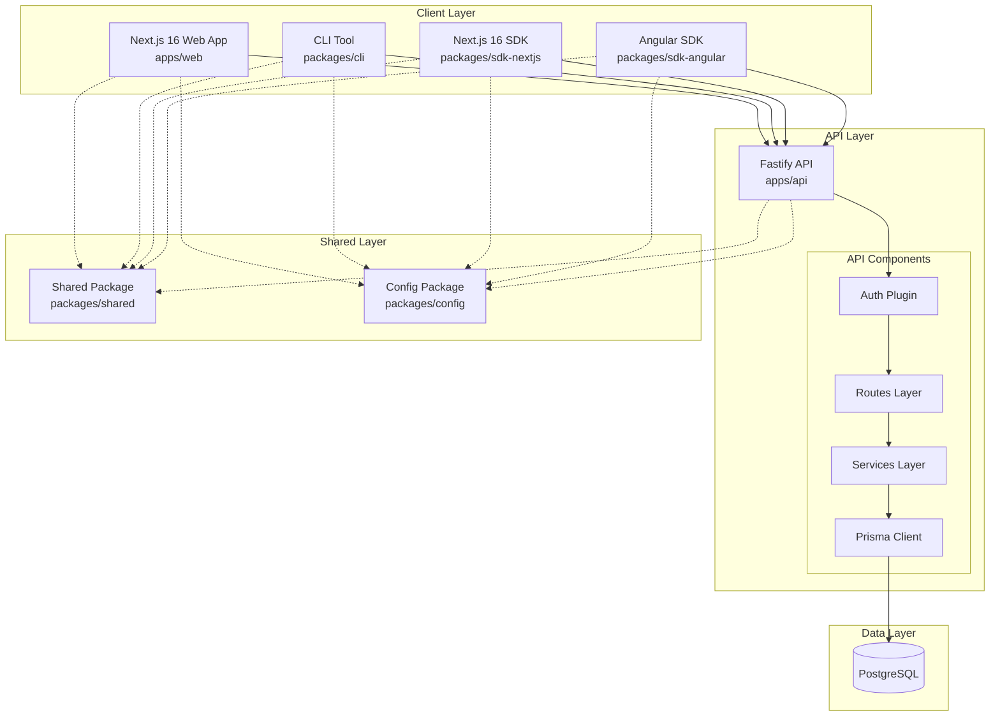
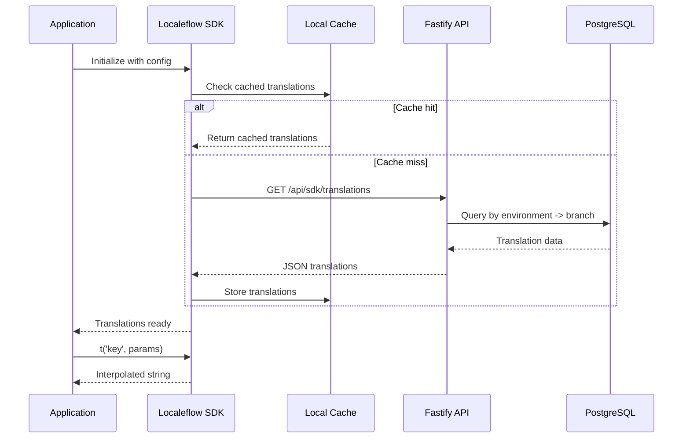
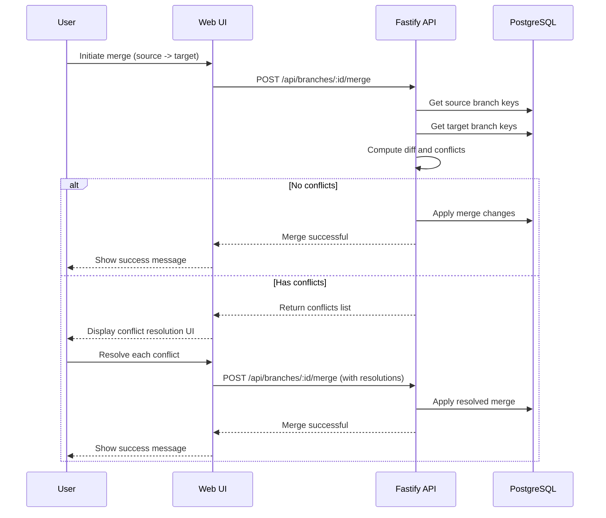
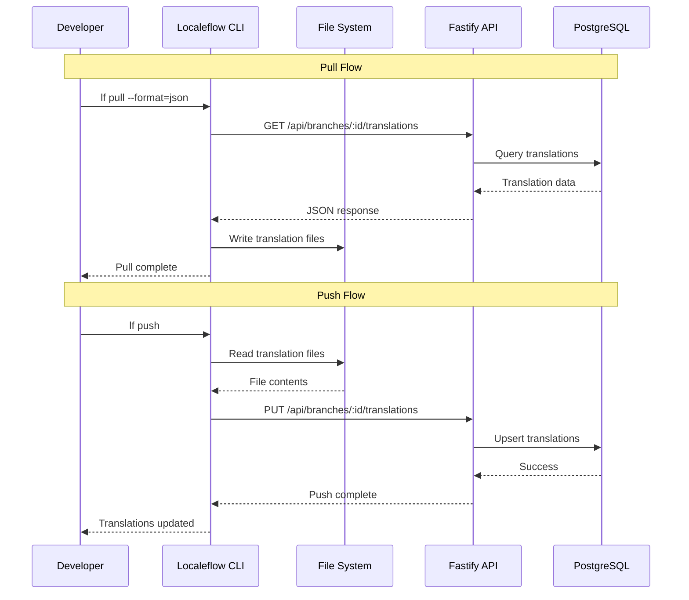
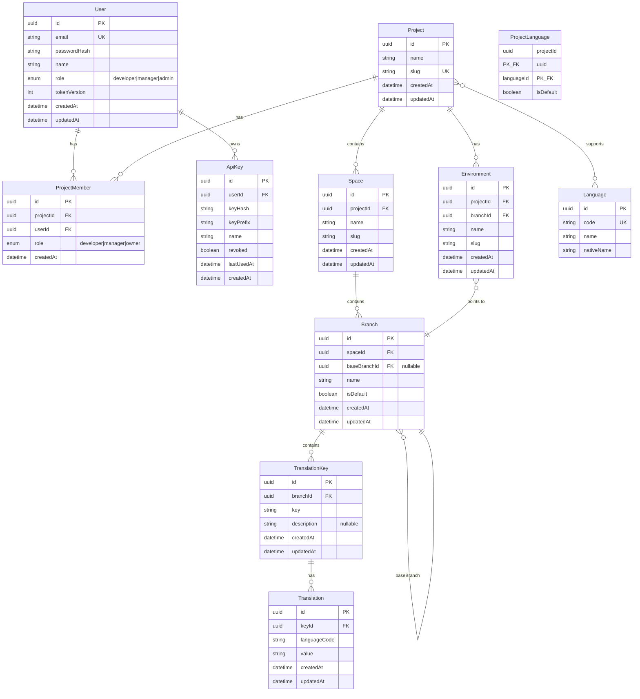
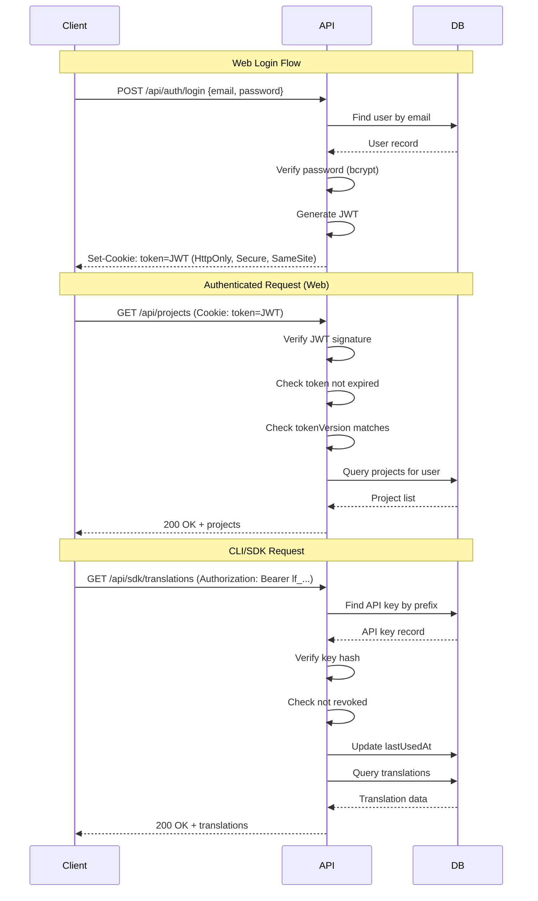
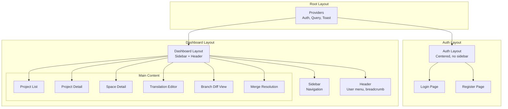
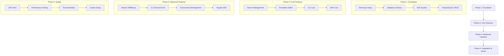

# Localeflow Platform Design Document

## Overview

This Design Document defines the technical implementation for Localeflow, a self-hosted localization management platform with git-like branching for translations. The platform enables development teams to safely manage translations across multiple environments, preventing feature work from polluting production translations.

The system consists of six packages: a Next.js web application, Fastify backend API, Node.js CLI tool, Next.js 16 SDK, Angular SDK (Phase 2), and shared utilities package, all managed in a pnpm + Turborepo monorepo.

## Design Summary (Meta)

```yaml
design_type: "new_feature"
risk_level: "medium"
main_constraints:
  - "Self-hosted single-tenant deployment"
  - "Copy-on-write branch storage (storage growth trade-off)"
  - "JWT 24h expiry for MVP (security trade-off)"
  - "100+ file implementation across 6 packages"
biggest_risks:
  - "Branch storage growth with many active branches"
  - "Merge conflict complexity at scale"
  - "SDK performance with large translation sets"
  - "CLI extraction accuracy across framework versions"
unknowns:
  - "Performance characteristics at 10K+ keys per branch"
  - "Memory footprint under sustained concurrent load"
  - "User adoption of branching workflow"
```

## Background and Context

### Prerequisite ADRs

| ADR | Related Decisions |
|-----|-------------------|
| [ADR-0001: Monorepo Structure](../adr/ADR-0001-monorepo-structure.md) | pnpm workspaces + Turborepo for package management |
| [ADR-0002: Branch Storage Strategy](../adr/ADR-0002-branch-storage-strategy.md) | Copy-on-write full copy for branch data |
| [ADR-0003: Authentication Approach](../adr/ADR-0003-authentication-approach.md) | JWT (24h) + API Keys for CLI/SDK |
| [ADR-0004: API Framework Selection](../adr/ADR-0004-api-framework-selection.md) | Fastify + Prisma ORM |

### Agreement Checklist

#### Scope
- [x] Web application with project/space/branch/translation management
- [x] Backend API with RESTful endpoints
- [x] CLI tool with pull/push/sync/extract/branch operations
- [x] Next.js 16 SDK with Provider, hooks, and SSR support
- [x] Angular SDK with module, pipe, and service (Phase 2)
- [x] Shared types and utilities package
- [x] Docker deployment configuration

#### Non-Scope (Explicitly not changing)
- [x] Translation memory and suggestions
- [x] Machine translation integration
- [x] Webhooks for external notifications
- [x] Automatic git branch integration
- [x] Comments and discussions on translations
- [x] Audit logging
- [x] Multi-tenant SaaS features
- [x] Variable validation across languages

#### Constraints
- [x] Self-hosted deployment: Yes (single-tenant)
- [x] Backward compatibility: Not applicable (greenfield)
- [x] Performance measurement: Required (see NFR targets)
- [x] Branch storage: Copy-on-write (simpler implementation, higher storage)
- [x] Authentication: JWT 24h + revocable API keys

### Problem to Solve

Current localization tools fail developers and translation managers:
1. No environment isolation - development changes immediately affect production
2. No branching model - feature translations cannot be isolated until release
3. Poor CLI experience - no conflict detection, unreliable extraction
4. Weak framework SDKs - poor developer experience for modern frameworks
5. No space separation - frontend/backend translations mixed together

### Current Challenges

This is a greenfield project with no existing codebase. The challenge is building a complete localization platform from scratch with:
- Multiple interconnected packages (web, api, cli, sdks, shared)
- Complex branching and merge logic
- Real-time SDK access patterns
- Cross-platform CLI tool

### Requirements

#### Functional Requirements

**Web Application**
- Project, Space, Branch CRUD operations
- Translation editor with multi-language view
- Branch diff and merge with conflict resolution UI
- Environment management with branch pointers
- User authentication (email/password, JWT)
- Role-based access (developer, manager)

**CLI**
- Authentication commands
- Pull/push/sync operations
- Key extraction for Next.js and Angular
- Branch operations with conflict display
- Configurable file format system

**SDKs**
- Next.js 16 SDK (complete) - Provider, hooks, SSR, SSG support with React 19.2 features, ICU MessageFormat
- Angular SDK (complete) - Module, pipe, service, ICU MessageFormat

#### Non-Functional Requirements

| Category | Requirement | Target |
|----------|-------------|--------|
| Performance | API response time | < 200ms (P95) |
| Performance | Translation editor load | < 1s for 1000 keys |
| Performance | CLI pull/push | < 5s for 10,000 translations |
| Performance | SDK initial load | < 100ms for 500 translations |
| Reliability | API availability | 99.9% uptime |
| Reliability | Error rate | < 0.1% of requests |
| Scalability | Concurrent users | 100+ |
| Scalability | Projects per installation | 50+ |
| Scalability | Keys per branch | 10,000+ |
| Scalability | Languages per project | 20+ |
| Security | JWT token expiry | 24 hours |
| Security | Password hashing | bcrypt (cost factor 12+) |
| Security | Rate limiting | 10 req/min on auth endpoints |

---

## Acceptance Criteria (AC) - EARS Format

### AC-WEB: Web Application

#### Project Management
- [x] **AC-WEB-001**: When user creates a project with name, slug, and languages, the system shall create the project and display it in the project list
- [x] **AC-WEB-002**: When user adds or removes languages from a project, the system shall update all spaces to inherit the language configuration
- [x] **AC-WEB-003**: When viewing project details, the system shall display total keys, translation count per language, and coverage percentage

#### Space Management
- [x] **AC-WEB-004**: When user creates a space, the system shall create it with an auto-generated `main` branch
- [x] **AC-WEB-005**: When viewing space details, the system shall display key count and per-language coverage
- [x] **AC-WEB-006**: When selecting a space, the system shall update the view to show only that space's translations

#### Translation Editor
- [x] **AC-WEB-007**: When searching for keys in a branch with 100+ keys, the system shall return matching keys within 500ms
- [x] **AC-WEB-008**: When clicking edit on a key, the system shall display all language translations editable simultaneously
- [x] **AC-WEB-009**: When adding a description to a key, the system shall persist and display it to translators
- [x] **AC-WEB-010**: When selecting keys for bulk delete, the system shall remove all selected keys and their translations
- [x] **AC-WEB-011**: When viewing translations, the system shall display coverage percentage for each language

#### Branch Management
- [x] **AC-WEB-012**: When creating a branch from an existing branch, the system shall copy all keys and translations to the new branch
- [x] **AC-WEB-013**: When viewing branches, the system shall display name, creation date, and key count for each
- [x] **AC-WEB-014**: When comparing two branches, the system shall show added, modified, and deleted keys with translation differences
- [x] **AC-WEB-015**: When merging branches with conflicts, the system shall display conflicts and allow resolution choices
- [x] **AC-WEB-016**: When deleting a merged branch, the system shall remove it from the branch list

#### Environment Management
- [x] **AC-WEB-017**: When creating an environment, the system shall associate it with the project
- [x] **AC-WEB-018**: When pointing an environment to a branch, the system shall route SDK requests to that branch
- [x] **AC-WEB-019**: When switching an environment's branch pointer, the system shall update SDK responses within 5 seconds

#### User Management
- [x] **AC-WEB-020**: When registering with valid email and password, the system shall create a new user account
- [x] **AC-WEB-021**: When logging in with valid credentials, the system shall return a JWT token for subsequent requests
- [x] **AC-WEB-022**: If user with developer role accesses manager-only features, then the system shall deny access with appropriate message
- [x] **AC-WEB-023**: When generating an API key, the system shall create a unique key and display it once

### AC-CLI: Command Line Interface

#### Authentication
- [x] **AC-CLI-001**: When running `lf auth login` with valid credentials, the system shall store API key locally
- [x] **AC-CLI-002**: While API key is stored, the system shall automatically authenticate subsequent commands
- [x] **AC-CLI-003**: When running `lf auth logout`, the system shall remove stored credentials

#### Translation Sync
- [x] **AC-CLI-004**: When running `lf pull --format=json`, the system shall download translations to local files
- [x] **AC-CLI-005**: When running `lf push`, the system shall upload local translations and reflect in web UI immediately
- [x] **AC-CLI-006**: When running `lf sync` with local and remote changes, the system shall detect and report conflicts

#### Code Analysis
- [x] **AC-CLI-007**: When running `lf extract --format=nextjs`, the system shall detect translation function calls and extract keys
- [x] **AC-CLI-008**: When running `lf check --missing --unused`, the system shall report keys in code but not platform, and vice versa
- [x] **AC-CLI-009**: When running `lf extract --detect-icu`, the system shall detect ICU MessageFormat patterns in translation function calls and report variables used
- [x] **AC-CLI-010**: When running `lf check --validate-icu`, the system shall validate ICU MessageFormat syntax in all translations and report errors for invalid syntax

#### Branch Operations
- [x] **AC-CLI-011**: When running `lf branch create feature-x --from=main`, the system shall create a branch with copied translations
- [x] **AC-CLI-012**: When running `lf branch diff`, the system shall display added, modified, deleted keys with values
- [x] **AC-CLI-013**: When running `lf branch merge`, the system shall perform merge with conflict handling
- [x] **AC-CLI-014**: When running `lf merge --interactive`, the system shall present each conflict for individual resolution

### AC-SDK: Software Development Kits

#### Next.js 16 SDK

- [x] **AC-SDK-001**: When app is wrapped with `<LocaleflowProvider>` with required config (apiKey, environment, defaultLanguage), the system shall initialize the translation context and make translations available to child components
- [x] **AC-SDK-002**: When calling `useTranslation()` hook, the system shall return `{ t, ready, error }` where `t()` translates keys with ICU MessageFormat support, `ready` indicates load status, and `error` contains any fetch errors
- [x] **AC-SDK-003**: When calling `t('key', { params })` with ICU MessageFormat translation containing `{paramName}` placeholders, the system shall substitute all placeholders with provided values
- [x] **AC-SDK-004**: When using `useLanguage()` hook, the system shall return `{ language, setLanguage, availableLanguages, isChanging }` for complete language management
- [x] **AC-SDK-005**: When calling `setLanguage(lang)`, the system shall fetch new translations and update all `t()` calls within 500ms without page reload
- [x] **AC-SDK-006**: When using `useNamespace(ns)` hook, the system shall return `{ namespace, loadNamespace, isLoaded, isLoading }` for lazy-loading translation namespaces
- [x] **AC-SDK-007**: When calling `loadNamespace(ns)` for an unloaded namespace, the system shall fetch and cache the namespace translations, making them available via `t('ns:key')`
- [x] **AC-SDK-008**: When calling `t('cart_items', { count: 5 })` with ICU plural message `{count, plural, =0 {No items} one {1 item} other {{count} items}}`, the system shall return the correctly pluralized string based on count
- [x] **AC-SDK-009**: When calling `t('greeting', { gender: 'female' })` with ICU select message `{gender, select, male {He} female {She} other {They}} liked your post`, the system shall return the correctly selected string based on gender
- [x] **AC-SDK-010**: When calling `t('price', { amount: 1234.56 })` with ICU number message `Price: {amount, number, currency}`, the system shall return the correctly formatted currency string based on locale
- [x] **AC-SDK-011**: When calling `t('updated', { date: new Date() })` with ICU date message `Updated {date, date, medium}`, the system shall return the correctly formatted date string based on locale
- [x] **AC-SDK-012**: When using `getTranslations(namespace)` in Server Components, the system shall return a promise resolving to a `t()` function with all namespace translations available at render time with full ICU MessageFormat support
- [x] **AC-SDK-013**: When building with static generation (SSG), the system shall include translations in static output and support `generateStaticParams` for multi-language static pages

#### Angular SDK

- [x] **AC-SDK-014**: When importing `LocaleflowModule.forRoot({ apiKey, environment, defaultLanguage })`, the system shall configure and initialize the SDK for the entire application
- [x] **AC-SDK-015**: When using `{{ 'key' | translate:params }}` pipe with ICU MessageFormat translation, the system shall display the translated value with properly formatted placeholders
- [x] **AC-SDK-016**: When injecting `LocaleflowService`, the system shall provide `translate()` returning Observable, `instant()` returning string, `get()` returning Promise, and `stream()` returning Observable that updates on language change, all with full ICU MessageFormat support
- [x] **AC-SDK-017**: When injecting `LanguageService`, the system shall provide `currentLanguage$` Observable, `setLanguage(lang)` method returning Promise, and `getAvailableLanguages()` returning string array
- [x] **AC-SDK-018**: When calling `setLanguage(lang)` on `LanguageService`, the system shall fetch new translations and update all pipes and observables within 500ms
- [x] **AC-SDK-019**: When injecting `NamespaceService`, the system shall provide `loadNamespace(ns)` returning Promise and `isNamespaceLoaded(ns)` returning boolean
- [x] **AC-SDK-020**: When using `{{ 'cart_items' | translate:{ count: 5 } }}` with ICU plural message `{count, plural, =0 {No items} one {1 item} other {{count} items}}`, the system shall return the correctly pluralized string
- [x] **AC-SDK-021**: When using `{{ 'greeting' | translate:{ gender: 'female' } }}` with ICU select message, the system shall return the correctly selected string based on the value
- [x] **AC-SDK-022**: When using `{{ 'price' | translate:{ amount: 1234.56 } }}` with ICU number message `Price: {amount, number, currency}`, the system shall return the correctly formatted currency string based on locale
- [x] **AC-SDK-023**: When `LocaleflowService.translate()` Observable emits and language changes, the system shall automatically emit the new translation value without manual resubscription

---

## Existing Codebase Analysis

### Implementation Path Mapping

This is a greenfield project. All paths are new implementations:

| Type | Path | Description |
|------|------|-------------|
| New | apps/web/ | Next.js 16 web application |
| New | apps/api/ | Fastify backend API |
| New | packages/cli/ | Node.js CLI tool |
| New | packages/sdk-nextjs/ | Next.js 16 SDK |
| New | packages/sdk-angular/ | Angular SDK (Phase 2) |
| New | packages/shared/ | Shared types and utilities |
| New | packages/config/ | Shared ESLint, TypeScript configs |

### Integration Points

| Integration Point | Components | Method | Impact Level |
|-------------------|------------|--------|--------------|
| Web -> API | Next.js app -> Fastify | REST API calls | High |
| CLI -> API | Commander.js -> Fastify | REST API calls | High |
| SDK -> API | SDK clients -> Fastify | REST API (cached) | High |
| Shared -> All | Types/utils -> all packages | Package imports | Medium |
| Prisma -> PostgreSQL | Prisma client -> Database | ORM queries | High |

---

## Design

### Change Impact Map

```yaml
Change Target: Complete platform implementation
Direct Impact:
  - All 6 packages in monorepo
  - PostgreSQL database schema
  - Docker deployment configuration
Indirect Impact:
  - CI/CD pipeline configuration
  - Documentation
No Ripple Effect:
  - External systems (none integrated)
```

### System Architecture Overview



### Data Flow Diagrams

#### Translation Fetch Flow (SDK)



#### Branch Merge Flow



#### CLI Pull/Push Flow



### Integration Boundary Contracts

```yaml
Web <-> API Boundary:
  Input: HTTP requests with JWT cookie or API key header
  Output: JSON responses (sync)
  On Error: HTTP status codes with error body { message, code, details? }

CLI <-> API Boundary:
  Input: HTTP requests with API key header
  Output: JSON responses (sync)
  On Error: Process exit code + stderr message

SDK <-> API Boundary:
  Input: HTTP GET with API key + environment
  Output: JSON translation bundle (sync, cacheable)
  On Error: Use fallback translations, log warning

API <-> Database Boundary:
  Input: Prisma queries
  Output: Typed model objects (sync via Prisma Client)
  On Error: Prisma exceptions wrapped in service errors
```

---

## Data Model

### Entity Relationship Diagram



### Prisma Schema Definition

```prisma
// prisma/schema.prisma

generator client {
  provider = "prisma-client-js"
}

datasource db {
  provider = "postgresql"
  url      = env("DATABASE_URL")
}

enum UserRole {
  developer
  manager
  admin
}

enum ProjectRole {
  developer
  manager
  owner
}

model User {
  id           String   @id @default(uuid())
  email        String   @unique
  passwordHash String
  name         String
  role         UserRole @default(developer)
  tokenVersion Int      @default(0)
  createdAt    DateTime @default(now())
  updatedAt    DateTime @updatedAt

  apiKeys        ApiKey[]
  projectMembers ProjectMember[]
}

model ApiKey {
  id         String    @id @default(uuid())
  userId     String
  keyHash    String
  keyPrefix  String
  name       String
  revoked    Boolean   @default(false)
  lastUsedAt DateTime?
  createdAt  DateTime  @default(now())

  user User @relation(fields: [userId], references: [id], onDelete: Cascade)

  @@index([keyPrefix])
  @@index([userId])
}

model Language {
  id         String @id @default(uuid())
  code       String @unique
  name       String
  nativeName String

  projects ProjectLanguage[]
}

model Project {
  id        String   @id @default(uuid())
  name      String
  slug      String   @unique
  createdAt DateTime @default(now())
  updatedAt DateTime @updatedAt

  languages    ProjectLanguage[]
  members      ProjectMember[]
  spaces       Space[]
  environments Environment[]
}

model ProjectLanguage {
  projectId  String
  languageId String
  isDefault  Boolean @default(false)

  project  Project  @relation(fields: [projectId], references: [id], onDelete: Cascade)
  language Language @relation(fields: [languageId], references: [id], onDelete: Cascade)

  @@id([projectId, languageId])
}

model ProjectMember {
  id        String      @id @default(uuid())
  projectId String
  userId    String
  role      ProjectRole @default(developer)
  createdAt DateTime    @default(now())

  project Project @relation(fields: [projectId], references: [id], onDelete: Cascade)
  user    User    @relation(fields: [userId], references: [id], onDelete: Cascade)

  @@unique([projectId, userId])
  @@index([userId])
}

model Space {
  id        String   @id @default(uuid())
  projectId String
  name      String
  slug      String
  createdAt DateTime @default(now())
  updatedAt DateTime @updatedAt

  project  Project  @relation(fields: [projectId], references: [id], onDelete: Cascade)
  branches Branch[]

  @@unique([projectId, slug])
  @@index([projectId])
}

model Branch {
  id           String   @id @default(uuid())
  spaceId      String
  baseBranchId String?
  name         String
  isDefault    Boolean  @default(false)
  createdAt    DateTime @default(now())
  updatedAt    DateTime @updatedAt

  space           Space             @relation(fields: [spaceId], references: [id], onDelete: Cascade)
  baseBranch      Branch?           @relation("BranchHierarchy", fields: [baseBranchId], references: [id])
  childBranches   Branch[]          @relation("BranchHierarchy")
  keys            TranslationKey[]
  environments    Environment[]

  @@unique([spaceId, name])
  @@index([spaceId])
  @@index([baseBranchId])
}

model TranslationKey {
  id          String   @id @default(uuid())
  branchId    String
  key         String
  description String?
  createdAt   DateTime @default(now())
  updatedAt   DateTime @updatedAt

  branch       Branch        @relation(fields: [branchId], references: [id], onDelete: Cascade)
  translations Translation[]

  @@unique([branchId, key])
  @@index([branchId])
  @@index([key])
}

model Translation {
  id           String   @id @default(uuid())
  keyId        String
  languageCode String
  value        String
  createdAt    DateTime @default(now())
  updatedAt    DateTime @updatedAt

  key TranslationKey @relation(fields: [keyId], references: [id], onDelete: Cascade)

  @@unique([keyId, languageCode])
  @@index([keyId])
  @@index([languageCode])
}

model Environment {
  id        String   @id @default(uuid())
  projectId String
  branchId  String
  name      String
  slug      String
  createdAt DateTime @default(now())
  updatedAt DateTime @updatedAt

  project Project @relation(fields: [projectId], references: [id], onDelete: Cascade)
  branch  Branch  @relation(fields: [branchId], references: [id])

  @@unique([projectId, slug])
  @@index([projectId])
  @@index([branchId])
}
```

### Key Database Indexes

| Table | Index | Purpose |
|-------|-------|---------|
| ApiKey | keyPrefix | Fast API key lookup by prefix |
| TranslationKey | (branchId, key) | Unique key lookup within branch |
| TranslationKey | branchId | List all keys in branch |
| Translation | (keyId, languageCode) | Unique translation lookup |
| Branch | (spaceId, name) | Unique branch per space |
| Environment | branchId | Find environments pointing to branch |

### Branch Storage Model (Copy-on-Write)

Per ADR-0002, branches use full copy storage:

```
Creating branch "feature-x" from "main":
1. Create new Branch record with baseBranchId = main.id
2. Bulk INSERT TranslationKey records copying from main
3. Bulk INSERT Translation records copying from main

Storage estimate:
- 10,000 keys x 5 languages x 100 bytes = ~5 MB per branch
- 10 active branches = ~50 MB per space
- Acceptable for self-hosted single-tenant deployment
```

---

## API Design

### API Architecture

```
apps/api/
├── src/
│   ├── app.ts                 # Fastify application setup
│   ├── server.ts              # Server entry point
│   ├── plugins/
│   │   ├── prisma.ts          # Prisma client plugin
│   │   ├── auth.ts            # JWT/API key authentication
│   │   ├── cors.ts            # CORS configuration
│   │   └── rate-limit.ts      # Rate limiting
│   ├── routes/
│   │   ├── auth/
│   │   │   ├── index.ts       # Auth route registration
│   │   │   ├── register.ts    # POST /auth/register
│   │   │   ├── login.ts       # POST /auth/login
│   │   │   ├── logout.ts      # POST /auth/logout
│   │   │   ├── me.ts          # GET /auth/me
│   │   │   └── api-keys.ts    # API key management
│   │   ├── projects/
│   │   ├── spaces/
│   │   ├── branches/
│   │   ├── keys/
│   │   ├── translations/
│   │   ├── environments/
│   │   └── sdk/
│   ├── services/
│   │   ├── auth.service.ts
│   │   ├── project.service.ts
│   │   ├── space.service.ts
│   │   ├── branch.service.ts
│   │   ├── translation.service.ts
│   │   ├── merge.service.ts
│   │   └── sdk.service.ts
│   ├── schemas/
│   │   ├── auth.schema.ts
│   │   ├── project.schema.ts
│   │   ├── space.schema.ts
│   │   ├── branch.schema.ts
│   │   ├── translation.schema.ts
│   │   └── common.schema.ts
│   └── utils/
│       ├── errors.ts
│       ├── pagination.ts
│       └── validation.ts
├── prisma/
│   ├── schema.prisma
│   └── migrations/
└── test/
```

### REST API Endpoints Specification

#### Authentication Endpoints

| Method | Endpoint | Description | Auth |
|--------|----------|-------------|------|
| POST | /api/auth/register | Create new user account | None |
| POST | /api/auth/login | Authenticate and get JWT | None |
| POST | /api/auth/logout | Clear authentication | JWT |
| GET | /api/auth/me | Get current user profile | JWT |
| POST | /api/auth/api-keys | Create new API key | JWT |
| GET | /api/auth/api-keys | List user's API keys | JWT |
| DELETE | /api/auth/api-keys/:id | Revoke API key | JWT |

#### Project Endpoints

| Method | Endpoint | Description | Auth |
|--------|----------|-------------|------|
| GET | /api/projects | List user's projects | JWT/Key |
| POST | /api/projects | Create new project | JWT |
| GET | /api/projects/:id | Get project details | JWT/Key |
| PUT | /api/projects/:id | Update project | JWT |
| DELETE | /api/projects/:id | Delete project | JWT |
| GET | /api/projects/:id/stats | Get project statistics | JWT/Key |

#### Space Endpoints

| Method | Endpoint | Description | Auth |
|--------|----------|-------------|------|
| GET | /api/projects/:projectId/spaces | List project spaces | JWT/Key |
| POST | /api/projects/:projectId/spaces | Create space | JWT |
| GET | /api/spaces/:id | Get space details | JWT/Key |
| PUT | /api/spaces/:id | Update space | JWT |
| DELETE | /api/spaces/:id | Delete space | JWT |
| GET | /api/spaces/:id/stats | Get space statistics | JWT/Key |

#### Branch Endpoints

| Method | Endpoint | Description | Auth |
|--------|----------|-------------|------|
| GET | /api/spaces/:spaceId/branches | List space branches | JWT/Key |
| POST | /api/spaces/:spaceId/branches | Create branch | JWT/Key |
| GET | /api/branches/:id | Get branch details | JWT/Key |
| DELETE | /api/branches/:id | Delete branch | JWT |
| GET | /api/branches/:id/diff/:targetId | Compare two branches | JWT/Key |
| POST | /api/branches/:id/merge | Merge branch into target | JWT/Key |

#### Translation Key Endpoints

| Method | Endpoint | Description | Auth |
|--------|----------|-------------|------|
| GET | /api/branches/:branchId/keys | List keys with pagination | JWT/Key |
| POST | /api/branches/:branchId/keys | Create key(s) | JWT/Key |
| GET | /api/keys/:id | Get key with translations | JWT/Key |
| PUT | /api/keys/:id | Update key | JWT/Key |
| DELETE | /api/keys/:id | Delete key | JWT/Key |
| POST | /api/branches/:branchId/keys/bulk | Bulk key operations | JWT/Key |

#### Translation Endpoints

| Method | Endpoint | Description | Auth |
|--------|----------|-------------|------|
| PUT | /api/keys/:keyId/translations/:lang | Set translation | JWT/Key |
| DELETE | /api/keys/:keyId/translations/:lang | Delete translation | JWT/Key |
| GET | /api/branches/:branchId/translations | Get all translations | JWT/Key |
| PUT | /api/branches/:branchId/translations | Bulk update translations | JWT/Key |

#### Environment Endpoints

| Method | Endpoint | Description | Auth |
|--------|----------|-------------|------|
| GET | /api/projects/:projectId/environments | List environments | JWT/Key |
| POST | /api/projects/:projectId/environments | Create environment | JWT |
| GET | /api/environments/:id | Get environment details | JWT/Key |
| PUT | /api/environments/:id | Update environment | JWT |
| DELETE | /api/environments/:id | Delete environment | JWT |
| PUT | /api/environments/:id/branch | Switch branch pointer | JWT |

#### SDK Endpoints

| Method | Endpoint | Description | Auth |
|--------|----------|-------------|------|
| GET | /api/sdk/translations | Get translations for SDK | API Key |
| GET | /api/sdk/namespaces/:ns | Get namespace translations for SDK | API Key |

### Request/Response Schemas

#### Authentication Schemas

```typescript
// POST /api/auth/register
interface RegisterRequest {
  email: string;      // Valid email format
  password: string;   // Min 8 chars, 1 uppercase, 1 number
  name: string;       // 2-100 chars
}

interface RegisterResponse {
  user: {
    id: string;
    email: string;
    name: string;
    role: 'developer' | 'manager' | 'admin';
  };
}

// POST /api/auth/login
interface LoginRequest {
  email: string;
  password: string;
}

interface LoginResponse {
  user: {
    id: string;
    email: string;
    name: string;
    role: string;
  };
  // JWT set in HttpOnly cookie
}

// GET /api/auth/me
interface MeResponse {
  id: string;
  email: string;
  name: string;
  role: string;
  createdAt: string;
}

// POST /api/auth/api-keys
interface CreateApiKeyRequest {
  name: string;  // Descriptive name
}

interface CreateApiKeyResponse {
  id: string;
  name: string;
  key: string;        // Full key, shown only once
  keyPrefix: string;  // e.g., "lf_live_abc..."
  createdAt: string;
}
```

#### Project Schemas

```typescript
// POST /api/projects
interface CreateProjectRequest {
  name: string;           // 2-100 chars
  slug: string;           // Unique, lowercase, alphanumeric + hyphens
  languageCodes: string[]; // e.g., ["en", "uk", "de"]
  defaultLanguage: string; // Must be in languageCodes
}

interface ProjectResponse {
  id: string;
  name: string;
  slug: string;
  languages: Array<{
    code: string;
    name: string;
    nativeName: string;
    isDefault: boolean;
  }>;
  createdAt: string;
  updatedAt: string;
}

// GET /api/projects/:id/stats
interface ProjectStatsResponse {
  id: string;
  name: string;
  spaces: number;
  totalKeys: number;
  translationsByLanguage: Record<string, {
    translated: number;
    total: number;
    percentage: number;
  }>;
}
```

#### Branch Schemas

```typescript
// POST /api/spaces/:spaceId/branches
interface CreateBranchRequest {
  name: string;         // Branch name
  fromBranchId: string; // Source branch to copy from
}

interface BranchResponse {
  id: string;
  name: string;
  spaceId: string;
  baseBranchId: string | null;
  isDefault: boolean;
  keyCount: number;
  createdAt: string;
  updatedAt: string;
}

// GET /api/branches/:id/diff/:targetId
interface BranchDiffResponse {
  source: { id: string; name: string };
  target: { id: string; name: string };
  added: Array<{
    key: string;
    translations: Record<string, string>;
  }>;
  modified: Array<{
    key: string;
    source: Record<string, string>;
    target: Record<string, string>;
  }>;
  deleted: Array<{
    key: string;
    translations: Record<string, string>;
  }>;
  conflicts: Array<{
    key: string;
    source: Record<string, string>;
    target: Record<string, string>;
  }>;
}

// POST /api/branches/:id/merge
interface MergeRequest {
  targetBranchId: string;
  resolutions?: Array<{
    key: string;
    resolution: 'source' | 'target' | Record<string, string>;
  }>;
}

interface MergeResponse {
  success: boolean;
  merged: number;
  conflicts?: Array<{
    key: string;
    source: Record<string, string>;
    target: Record<string, string>;
  }>;
}
```

#### SDK Schemas

```typescript
// GET /api/sdk/translations?project=slug&space=slug&environment=slug&lang=en&namespace=ns
interface SdkTranslationsRequest {
  project: string;     // Project slug
  space: string;       // Space slug
  environment: string; // Environment slug
  lang?: string;       // Optional, defaults to all
  namespace?: string;  // Optional, for namespace-specific requests
}

interface SdkTranslationsResponse {
  language: string;
  translations: Record<string, string>;
  // Or if lang not specified:
  // translations: Record<string, Record<string, string>>
}
```

### Authentication Flow



### Error Handling Strategy

```typescript
// Error response format
interface ErrorResponse {
  error: {
    code: string;         // Machine-readable error code
    message: string;      // Human-readable message
    details?: unknown;    // Additional context (validation errors, etc.)
  };
}

// Error codes
const ERROR_CODES = {
  // Authentication (401)
  UNAUTHORIZED: 'UNAUTHORIZED',
  INVALID_CREDENTIALS: 'INVALID_CREDENTIALS',
  TOKEN_EXPIRED: 'TOKEN_EXPIRED',
  API_KEY_REVOKED: 'API_KEY_REVOKED',

  // Authorization (403)
  FORBIDDEN: 'FORBIDDEN',
  INSUFFICIENT_PERMISSIONS: 'INSUFFICIENT_PERMISSIONS',

  // Validation (400)
  VALIDATION_ERROR: 'VALIDATION_ERROR',
  INVALID_INPUT: 'INVALID_INPUT',

  // Not Found (404)
  NOT_FOUND: 'NOT_FOUND',
  PROJECT_NOT_FOUND: 'PROJECT_NOT_FOUND',
  BRANCH_NOT_FOUND: 'BRANCH_NOT_FOUND',

  // Conflict (409)
  CONFLICT: 'CONFLICT',
  MERGE_CONFLICT: 'MERGE_CONFLICT',
  DUPLICATE_ENTRY: 'DUPLICATE_ENTRY',

  // Server (500)
  INTERNAL_ERROR: 'INTERNAL_ERROR',
  DATABASE_ERROR: 'DATABASE_ERROR',
} as const;
```

---

## Frontend Architecture

### Next.js 16 App Router Structure

```
apps/web/
├── src/
│   ├── app/
│   │   ├── layout.tsx              # Root layout with providers
│   │   ├── page.tsx                # Landing page
│   │   ├── (auth)/
│   │   │   ├── login/
│   │   │   │   └── page.tsx
│   │   │   ├── register/
│   │   │   │   └── page.tsx
│   │   │   └── layout.tsx          # Auth layout (no sidebar)
│   │   ├── (dashboard)/
│   │   │   ├── layout.tsx          # Dashboard layout with sidebar
│   │   │   ├── projects/
│   │   │   │   ├── page.tsx        # Project list
│   │   │   │   ├── new/
│   │   │   │   │   └── page.tsx    # Create project
│   │   │   │   └── [projectId]/
│   │   │   │       ├── page.tsx    # Project overview
│   │   │   │       ├── settings/
│   │   │   │       │   └── page.tsx
│   │   │   │       ├── spaces/
│   │   │   │       │   ├── page.tsx
│   │   │   │       │   └── [spaceId]/
│   │   │   │       │       ├── page.tsx
│   │   │   │       │       ├── branches/
│   │   │   │       │       │   ├── page.tsx
│   │   │   │       │       │   ├── [branchId]/
│   │   │   │       │       │   │   ├── page.tsx    # Translation editor
│   │   │   │       │       │   │   ├── diff/
│   │   │   │       │       │   │   │   └── [targetId]/
│   │   │   │       │       │   │   │       └── page.tsx
│   │   │   │       │       │   │   └── merge/
│   │   │   │       │       │   │       └── page.tsx
│   │   │   │       │       │   └── new/
│   │   │   │       │       │       └── page.tsx
│   │   │   │       │       └── settings/
│   │   │   │       │           └── page.tsx
│   │   │   │       └── environments/
│   │   │   │           └── page.tsx
│   │   │   ├── settings/
│   │   │   │   ├── page.tsx        # User settings
│   │   │   │   └── api-keys/
│   │   │   │       └── page.tsx
│   │   │   └── page.tsx            # Dashboard home
│   │   └── api/                    # API routes (if needed)
│   ├── components/
│   │   ├── ui/                     # shadcn/ui components
│   │   │   ├── button.tsx
│   │   │   ├── card.tsx
│   │   │   ├── dialog.tsx
│   │   │   ├── dropdown-menu.tsx
│   │   │   ├── input.tsx
│   │   │   ├── select.tsx
│   │   │   ├── table.tsx
│   │   │   ├── tabs.tsx
│   │   │   └── toast.tsx
│   │   ├── layout/
│   │   │   ├── header.tsx
│   │   │   ├── sidebar.tsx
│   │   │   ├── nav-link.tsx
│   │   │   └── breadcrumb.tsx
│   │   ├── features/
│   │   │   ├── auth/
│   │   │   │   ├── login-form.tsx
│   │   │   │   ├── register-form.tsx
│   │   │   │   └── logout-button.tsx
│   │   │   ├── projects/
│   │   │   │   ├── project-card.tsx
│   │   │   │   ├── project-list.tsx
│   │   │   │   ├── project-form.tsx
│   │   │   │   └── project-stats.tsx
│   │   │   ├── spaces/
│   │   │   │   ├── space-list.tsx
│   │   │   │   └── space-form.tsx
│   │   │   ├── branches/
│   │   │   │   ├── branch-list.tsx
│   │   │   │   ├── branch-form.tsx
│   │   │   │   ├── branch-diff.tsx
│   │   │   │   └── merge-dialog.tsx
│   │   │   ├── translations/
│   │   │   │   ├── translation-table.tsx
│   │   │   │   ├── translation-editor.tsx
│   │   │   │   ├── translation-row.tsx
│   │   │   │   ├── key-search.tsx
│   │   │   │   └── language-filter.tsx
│   │   │   └── environments/
│   │   │       ├── environment-list.tsx
│   │   │       └── environment-form.tsx
│   │   └── shared/
│   │       ├── loading-spinner.tsx
│   │       ├── error-boundary.tsx
│   │       ├── empty-state.tsx
│   │       └── confirmation-dialog.tsx
│   ├── lib/
│   │   ├── api/
│   │   │   ├── client.ts           # API client setup
│   │   │   ├── auth.ts             # Auth API functions
│   │   │   ├── projects.ts
│   │   │   ├── spaces.ts
│   │   │   ├── branches.ts
│   │   │   ├── translations.ts
│   │   │   └── environments.ts
│   │   ├── hooks/
│   │   │   ├── use-auth.ts
│   │   │   ├── use-projects.ts
│   │   │   ├── use-branches.ts
│   │   │   └── use-translations.ts
│   │   └── utils/
│   │       ├── cn.ts               # Class name helper
│   │       ├── formatters.ts
│   │       └── validators.ts
│   ├── providers/
│   │   ├── auth-provider.tsx
│   │   ├── query-provider.tsx
│   │   └── toast-provider.tsx
│   └── styles/
│       └── globals.css
├── public/
├── next.config.js
├── tailwind.config.js
└── tsconfig.json
```

### Next.js 16 Specific Features

The web application leverages Next.js 16 features:

1. **Cache Components with "use cache" directive**: Explicit opt-in caching for pages, components, and functions
2. **Turbopack (Default)**: Stable bundler with 10x faster Fast Refresh
3. **React 19.2 Integration**: View Transitions, useEffectEvent, Activity components
4. **React Compiler Support**: Automatic memoization of components
5. **proxy.ts**: Network boundary configuration (replaces middleware.ts)

### Component Hierarchy



### State Management Approach

Using **TanStack Query (React Query)** for server state:

```typescript
// lib/hooks/use-translations.ts
import { useQuery, useMutation, useQueryClient } from '@tanstack/react-query';
import * as api from '@/lib/api/translations';

export function useTranslations(branchId: string, options?: {
  search?: string;
  page?: number;
  pageSize?: number;
}) {
  return useQuery({
    queryKey: ['translations', branchId, options],
    queryFn: () => api.getTranslations(branchId, options),
  });
}

export function useUpdateTranslation() {
  const queryClient = useQueryClient();

  return useMutation({
    mutationFn: api.updateTranslation,
    onSuccess: (_, variables) => {
      queryClient.invalidateQueries({
        queryKey: ['translations', variables.branchId],
      });
    },
  });
}
```

Local UI state with React `useState`/`useReducer` for:
- Form state
- UI toggles (modals, dropdowns)
- Search/filter inputs

### Key Page Layouts

#### Translation Editor (Main Feature)

```
+------------------------------------------------------------------+
| Header: Breadcrumb (Project > Space > Branch)    [User Menu]     |
+------------------------------------------------------------------+
| Sidebar    |  Translation Editor                                  |
| - Projects |  +------------------------------------------------+ |
| - Spaces   |  | Search: [______________] [Filter by language v] | |
| - Branches |  +------------------------------------------------+ |
|            |  | Key          | en        | uk        | de      | |
|            |  +------------------------------------------------+ |
|            |  | home.title   | [Welcome] | [Ласкаво] | [Willk] | |
|            |  | home.desc    | [About]   | [Про нас] | [Uber]  | |
|            |  | btn.submit   | [Submit]  | [Надісл]  | [Senden]| |
|            |  +------------------------------------------------+ |
|            |  | < 1 2 3 ... 10 >                                | |
|            |  +------------------------------------------------+ |
+------------------------------------------------------------------+
```

#### Branch Diff View

```
+------------------------------------------------------------------+
| Branch Comparison: feature-checkout -> main          [Merge]     |
+------------------------------------------------------------------+
| Sidebar    |  Diff View                                          |
|            |  +------------------------------------------------+ |
|            |  | [+] Added Keys (3)                    [Expand] | |
|            |  |   checkout.title                               | |
|            |  |   checkout.desc                                | |
|            |  |   checkout.confirm                             | |
|            |  +------------------------------------------------+ |
|            |  | [~] Modified Keys (2)                 [Expand] | |
|            |  |   cart.total                                   | |
|            |  |     en: "Total" -> "Grand Total"               | |
|            |  |   btn.proceed                                  | |
|            |  +------------------------------------------------+ |
|            |  | [!] Conflicts (1)                     [Expand] | |
|            |  |   shipping.label                               | |
|            |  |     Source: "Shipping"                         | |
|            |  |     Target: "Delivery"                         | |
|            |  |     [Use Source] [Use Target] [Edit]           | |
|            |  +------------------------------------------------+ |
+------------------------------------------------------------------+
```

---

## CLI Architecture

### Command Structure

```
packages/cli/
├── src/
│   ├── index.ts                # Entry point
│   ├── cli.ts                  # Commander program setup
│   ├── commands/
│   │   ├── auth/
│   │   │   ├── index.ts        # Auth command group
│   │   │   ├── login.ts        # lf auth login
│   │   │   ├── logout.ts       # lf auth logout
│   │   │   └── status.ts       # lf auth status
│   │   ├── pull.ts             # lf pull
│   │   ├── push.ts             # lf push
│   │   ├── sync.ts             # lf sync
│   │   ├── extract.ts          # lf extract
│   │   ├── check.ts            # lf check
│   │   └── branch/
│   │       ├── index.ts        # Branch command group
│   │       ├── create.ts       # lf branch create
│   │       ├── list.ts         # lf branch list
│   │       ├── diff.ts         # lf branch diff
│   │       └── merge.ts        # lf branch merge
│   ├── lib/
│   │   ├── api.ts              # API client
│   │   ├── config.ts           # Config file management
│   │   ├── auth.ts             # Credential storage
│   │   ├── extractor/
│   │   │   ├── index.ts        # Extractor interface
│   │   │   ├── nextjs.ts       # Next.js/React extractor
│   │   │   └── angular.ts      # Angular extractor
│   │   ├── formatter/
│   │   │   ├── index.ts        # Formatter interface
│   │   │   ├── json.ts         # JSON format
│   │   │   └── yaml.ts         # YAML format
│   │   └── diff/
│   │       ├── compute.ts      # Diff computation
│   │       └── display.ts      # Terminal diff display
│   └── utils/
│       ├── logger.ts           # Console output helpers
│       ├── spinner.ts          # Loading spinners
│       └── prompt.ts           # Interactive prompts
├── bin/
│   └── lf.js                   # CLI binary entry
├── package.json
└── tsconfig.json
```

### CLI Command Reference

```bash
# Authentication
lf auth login                    # Interactive login
lf auth logout                   # Clear stored credentials
lf auth status                   # Show current auth status

# Translation Operations
lf pull [options]                # Download translations
  --project, -p <slug>           # Project slug
  --space, -s <slug>             # Space slug (default: all)
  --branch, -b <name>            # Branch name (default: main)
  --format, -f <type>            # Output format: json|yaml
  --output, -o <dir>             # Output directory
  --lang, -l <code>              # Language code (default: all)

lf push [options]                # Upload translations
  --project, -p <slug>           # Project slug
  --space, -s <slug>             # Space slug
  --branch, -b <name>            # Branch name
  --source, -S <dir>             # Source directory
  --format, -f <type>            # File format

lf sync [options]                # Bidirectional sync
  --project, -p <slug>
  --space, -s <slug>
  --branch, -b <name>
  --format, -f <type>
  --dir, -d <dir>                # Directory to sync

# Code Analysis
lf extract [options]             # Extract keys from code
  --source, -s <dir>             # Source directory
  --format, -f <type>            # Framework: nextjs|angular
  --output, -o <file>            # Output file (optional)
  --detect-icu                   # Detect ICU MessageFormat patterns in code

lf check [options]               # Check key coverage
  --project, -p <slug>
  --space, -S <slug>
  --branch, -b <name>
  --source, -s <dir>
  --missing                      # Show keys in code but not platform
  --unused                       # Show keys in platform but not code
  --validate-icu                 # Validate ICU MessageFormat syntax in translations

# Branch Operations
lf branch create <name> [options]
  --from, -f <name>              # Source branch (default: main)
  --project, -p <slug>
  --space, -s <slug>

lf branch list [options]
  --project, -p <slug>
  --space, -s <slug>

lf branch diff <source> [target] [options]
  --project, -p <slug>
  --space, -s <slug>

lf branch merge <source> [options]
  --into, -i <name>              # Target branch (default: main)
  --project, -p <slug>
  --space, -s <slug>
  --interactive                  # Resolve conflicts interactively
  --force                        # Overwrite all conflicts with source
```

### Configuration File Format

```yaml
# .localeflow.yml or localeflow.config.yml

# API configuration
api:
  url: "https://localeflow.example.com"  # API base URL

# Default project settings
project: my-app
defaultSpace: frontend
defaultBranch: main

# File format configuration
format:
  type: json                          # json | yaml
  nested: true                        # Use nested structure
  indentation: 2

# Paths configuration
paths:
  translations: ./locales             # Translation file directory
  source: ./src                       # Source code directory

# Pull/Push configuration
pull:
  languages:
    - en
    - uk
    - de
  filePattern: "{lang}.json"          # Output file pattern

push:
  filePattern: "{lang}.json"          # Input file pattern

# Extraction configuration
extract:
  framework: nextjs                   # nextjs | angular
  patterns:
    - "src/**/*.tsx"
    - "src/**/*.ts"
  exclude:
    - "**/*.test.ts"
    - "**/*.spec.ts"
  functions:                          # Custom function names to detect
    - t
    - useTranslation
```

### Authentication Storage

```typescript
// ~/.config/localeflow/credentials.json
interface CredentialsFile {
  version: 1;
  profiles: {
    [profileName: string]: {
      apiUrl: string;
      apiKey: string;         // Stored securely
      userId?: string;
      email?: string;
      createdAt: string;
    };
  };
  defaultProfile: string;
}

// Default location:
// - Linux: ~/.config/localeflow/credentials.json
// - macOS: ~/Library/Application Support/localeflow/credentials.json
// - Windows: %APPDATA%\localeflow\credentials.json
```

---

## SDK Design

### Next.js 16 SDK Architecture

```
packages/sdk-nextjs/
├── src/
│   ├── index.ts                      # Public exports
│   ├── provider.tsx                  # LocaleflowProvider component
│   ├── hooks/
│   │   ├── useTranslation.ts         # Main translation hook (ICU MessageFormat)
│   │   ├── useLanguage.ts            # Language management hook
│   │   ├── useNamespace.ts           # Namespace management hook
│   │   └── useLocaleflow.ts          # Context access hook
│   ├── server/
│   │   ├── getTranslations.ts        # Server-side translations (ICU MessageFormat)
│   │   ├── getServerLanguage.ts      # Server language detection
│   │   └── cache.ts                  # Server-side caching with "use cache"
│   ├── client/
│   │   ├── LocaleflowClient.ts       # Core translation client
│   │   ├── icu-formatter.ts          # ICU MessageFormat wrapper (@formatjs/intl-messageformat)
│   │   └── cache.ts                  # Client-side caching
│   ├── context/
│   │   └── LocaleflowContext.tsx     # React context
│   └── types.ts                      # TypeScript types
├── package.json
└── tsconfig.json
```

**Key Dependency**: `@formatjs/intl-messageformat` - Industry standard ICU MessageFormat implementation

### Next.js 16 SDK Interface Design

```typescript
// =============================================================================
// Provider Configuration
// =============================================================================

interface LocaleflowProviderProps {
  children: React.ReactNode;
  apiKey: string;
  environment: string;
  defaultLanguage: string;
  fallbackLanguage?: string;
  namespaces?: string[];
  staticData?: Record<string, Record<string, string>>;  // For SSG
  fallback?: React.ReactNode;  // Loading fallback
}

// Usage:
<LocaleflowProvider
  apiKey="lf_live_..."
  environment="production"
  defaultLanguage="en"
  fallbackLanguage="en"
  namespaces={['common', 'auth']}
>
  <App />
</LocaleflowProvider>

// =============================================================================
// useTranslation Hook - Main Translation Access with ICU MessageFormat
// =============================================================================

interface UseTranslationReturn {
  /**
   * Translate a key with ICU MessageFormat support.
   * Supports: plural, select, selectordinal, number, date, time formatting.
   *
   * @param key - Translation key
   * @param values - Values for ICU MessageFormat placeholders
   * @returns Formatted translation string
   */
  t: (key: string, values?: Record<string, string | number | Date>) => string;
  ready: boolean;
  error: Error | null;
}

function useTranslation(namespace?: string): UseTranslationReturn;

// Usage Examples:

// Simple interpolation
// Translation: "greeting": "Hello, {name}!"
const { t, ready, error } = useTranslation();
t('greeting', { name: 'Nick' });        // "Hello, Nick!"

// ICU Plural
// Translation: "cart_items": "{count, plural, =0 {No items} one {1 item} other {{count} items}}"
t('cart_items', { count: 0 });          // "No items"
t('cart_items', { count: 1 });          // "1 item"
t('cart_items', { count: 5 });          // "5 items"

// ICU Select (gender, status, etc.)
// Translation: "greeting": "{gender, select, male {He} female {She} other {They}} liked your post"
t('greeting', { gender: 'female' });    // "She liked your post"
t('greeting', { gender: 'male' });      // "He liked your post"
t('greeting', { gender: 'other' });     // "They liked your post"

// ICU Number formatting
// Translation: "price": "Price: {amount, number, ::currency/USD}"
t('price', { amount: 1234.56 });        // "Price: $1,234.56" (in en-US)

// ICU Date formatting
// Translation: "updated": "Updated {date, date, medium}"
t('updated', { date: new Date() });     // "Updated Dec 27, 2025" (in en-US)

// ICU Time formatting
// Translation: "time_info": "Event starts at {time, time, short}"
t('time_info', { time: new Date() });   // "Event starts at 3:30 PM" (in en-US)

// ICU SelectOrdinal
// Translation: "place": "You finished {place, selectordinal, one {#st} two {#nd} few {#rd} other {#th}}"
t('place', { place: 1 });               // "You finished 1st"
t('place', { place: 2 });               // "You finished 2nd"
t('place', { place: 3 });               // "You finished 3rd"
t('place', { place: 4 });               // "You finished 4th"

// Nested messages
// Translation: "notification": "{count, plural, =0 {No notifications} other {You have {count} {count, plural, one {notification} other {notifications}}}}"
t('notification', { count: 3 });        // "You have 3 notifications"

// Namespace usage
const { t } = useTranslation('auth');
t('login.title');                       // "Sign In"

// =============================================================================
// useLanguage Hook - Language Management
// =============================================================================

interface UseLanguageReturn {
  language: string;
  setLanguage: (lang: string) => Promise<void>;
  availableLanguages: string[];
  isChanging: boolean;
}

function useLanguage(): UseLanguageReturn;

// Usage:
const { language, setLanguage, availableLanguages, isChanging } = useLanguage();

console.log(language);                  // "en"
console.log(availableLanguages);        // ["en", "uk", "de"]

await setLanguage('uk');                // Fetches Ukrainian translations
// isChanging is true during fetch

// =============================================================================
// useNamespace Hook - Namespace Management
// =============================================================================

interface UseNamespaceReturn {
  namespace: string;
  loadNamespace: (ns: string) => Promise<void>;
  isLoaded: boolean;
  isLoading: boolean;
}

function useNamespace(ns: string): UseNamespaceReturn;

// Usage:
const { loadNamespace, isLoaded, isLoading } = useNamespace('checkout');

useEffect(() => {
  if (!isLoaded) {
    loadNamespace('checkout');
  }
}, [isLoaded, loadNamespace]);

// After loading, translations are available:
const { t } = useTranslation('checkout');
t('cart.total');                        // "Total: {amount}"

// =============================================================================
// Server Components - getTranslations (with ICU MessageFormat)
// =============================================================================

// packages/sdk-nextjs/server
async function getTranslations(namespace?: string): Promise<{
  /**
   * Translate a key with ICU MessageFormat support (server-side).
   * Full support for plural, select, number, date, time formatting.
   */
  t: (key: string, values?: Record<string, string | number | Date>) => string;
}>;

// Usage in Server Component (app/[locale]/page.tsx):
import { getTranslations } from '@localeflow/nextjs/server';

export default async function HomePage() {
  const { t } = await getTranslations('home');

  return (
    <div>
      <h1>{t('title')}</h1>
      <p>{t('description', { year: 2025 })}</p>
      {/* ICU Plural in Server Component */}
      <p>{t('items_count', { count: 5 })}</p>
      {/* Translation: "{count, plural, =0 {No items} one {1 item} other {{count} items}}" */}

      {/* ICU Date in Server Component */}
      <p>{t('last_updated', { date: new Date() })}</p>
      {/* Translation: "Last updated: {date, date, medium}" */}
    </div>
  );
}

// With generateStaticParams for SSG:
export async function generateStaticParams() {
  return [{ locale: 'en' }, { locale: 'uk' }, { locale: 'de' }];
}
```

### Angular SDK Architecture

```
packages/sdk-angular/
├── src/
│   ├── index.ts                      # Public exports
│   ├── lib/
│   │   ├── localeflow.module.ts      # LocaleflowModule
│   │   ├── localeflow.service.ts     # Main translation service (ICU MessageFormat)
│   │   ├── language.service.ts       # Language management service
│   │   ├── namespace.service.ts      # Namespace management service
│   │   ├── translate.pipe.ts         # Translate pipe (ICU MessageFormat)
│   │   ├── translate.directive.ts    # Localeflow directive
│   │   ├── icu-formatter.ts          # ICU MessageFormat wrapper (@formatjs/intl-messageformat)
│   │   └── localeflow-client.ts      # Core client
│   └── types.ts
├── package.json
└── tsconfig.json
```

**Key Dependency**: `@formatjs/intl-messageformat` - Industry standard ICU MessageFormat implementation

### Angular SDK Interface

```typescript
// =============================================================================
// Module Configuration
// =============================================================================

interface LocaleflowConfig {
  apiKey: string;
  environment: string;
  defaultLanguage: string;
  fallbackLanguage?: string;
  namespaces?: string[];
}

@NgModule({
  imports: [
    LocaleflowModule.forRoot({
      apiKey: 'lf_live_...',
      environment: 'production',
      defaultLanguage: 'en',
      fallbackLanguage: 'en',
      namespaces: ['common', 'auth']
    }),
  ],
})
export class AppModule {}

// =============================================================================
// LocaleflowService - Main Translation Service with ICU MessageFormat
// =============================================================================

@Injectable({ providedIn: 'root' })
class LocaleflowService {
  /**
   * Returns Observable that updates on language change.
   * Full ICU MessageFormat support: plural, select, number, date, time.
   */
  translate(key: string, values?: Record<string, string | number | Date>): Observable<string>;

  /**
   * Returns current cached translation (synchronous).
   * Full ICU MessageFormat support.
   */
  instant(key: string, values?: Record<string, string | number | Date>): string;

  /**
   * Returns Promise resolving to translation.
   * Full ICU MessageFormat support.
   */
  get(key: string, values?: Record<string, string | number | Date>): Promise<string>;

  /**
   * Returns Observable that re-emits on language change (for reactive UI).
   * Full ICU MessageFormat support.
   */
  stream(key: string, values?: Record<string, string | number | Date>): Observable<string>;
}

// Usage:
@Component({
  selector: 'app-greeting',
  template: `
    <h1>{{ greeting$ | async }}</h1>
    <p>{{ localeflow.instant('welcome') }}</p>

    <!-- ICU Plural -->
    <p>{{ cartItems$ | async }}</p>

    <!-- ICU Date -->
    <p>{{ lastUpdated$ | async }}</p>
  `
})
export class GreetingComponent {
  greeting$: Observable<string>;
  cartItems$: Observable<string>;
  lastUpdated$: Observable<string>;

  constructor(private localeflow: LocaleflowService) {
    // Simple interpolation
    this.greeting$ = this.localeflow.stream('greeting', { name: 'Nick' });

    // ICU Plural: "{count, plural, =0 {No items} one {1 item} other {{count} items}}"
    this.cartItems$ = this.localeflow.stream('cart_items', { count: 5 });

    // ICU Date: "Last updated: {date, date, medium}"
    this.lastUpdated$ = this.localeflow.stream('last_updated', { date: new Date() });
  }
}

// =============================================================================
// LanguageService - Language Management
// =============================================================================

@Injectable({ providedIn: 'root' })
class LanguageService {
  // Observable of current language
  currentLanguage$: Observable<string>;

  // Current language (synchronous)
  get currentLanguage(): string;

  // Change language (fetches new translations)
  setLanguage(lang: string): Promise<void>;

  // Get list of available languages
  getAvailableLanguages(): string[];
}

// Usage:
@Component({
  selector: 'app-language-switcher',
  template: `
    <select [value]="languageService.currentLanguage" (change)="onLanguageChange($event)">
      <option *ngFor="let lang of languageService.getAvailableLanguages()" [value]="lang">
        {{ lang }}
      </option>
    </select>
  `
})
export class LanguageSwitcherComponent {
  constructor(public languageService: LanguageService) {}

  async onLanguageChange(event: Event) {
    const lang = (event.target as HTMLSelectElement).value;
    await this.languageService.setLanguage(lang);
  }
}

// =============================================================================
// NamespaceService - Namespace Management
// =============================================================================

@Injectable({ providedIn: 'root' })
class NamespaceService {
  // Load a namespace on demand
  loadNamespace(ns: string): Promise<void>;

  // Check if namespace is loaded
  isNamespaceLoaded(ns: string): boolean;
}

// Usage:
@Component({
  selector: 'app-checkout',
  template: `<div *ngIf="ready">...</div>`
})
export class CheckoutComponent implements OnInit {
  ready = false;

  constructor(private namespaceService: NamespaceService) {}

  async ngOnInit() {
    if (!this.namespaceService.isNamespaceLoaded('checkout')) {
      await this.namespaceService.loadNamespace('checkout');
    }
    this.ready = true;
  }
}

// =============================================================================
// Translate Pipe (with ICU MessageFormat)
// =============================================================================

// Usage in templates:

// Simple key
{{ 'welcome' | translate }}

// Simple interpolation
{{ 'greeting' | translate:{ name: 'Nick' } }}
// Translation: "Hello, {name}!" -> "Hello, Nick!"

// Namespace key
{{ 'auth:login.title' | translate }}

// ICU Plural
{{ 'cart_items' | translate:{ count: itemCount } }}
// Translation: "{count, plural, =0 {No items} one {1 item} other {{count} items}}"
// Output with count=5: "5 items"

// ICU Select
{{ 'greeting_gender' | translate:{ gender: userGender } }}
// Translation: "{gender, select, male {He} female {She} other {They}} liked your post"
// Output with gender='female': "She liked your post"

// ICU Number
{{ 'price_display' | translate:{ amount: productPrice } }}
// Translation: "Price: {amount, number, ::currency/USD}"
// Output with amount=1234.56: "Price: $1,234.56"

// ICU Date
{{ 'updated_at' | translate:{ date: lastUpdate } }}
// Translation: "Updated {date, date, medium}"
// Output: "Updated Dec 27, 2025"

// ICU Time
{{ 'event_time' | translate:{ time: eventStart } }}
// Translation: "Event starts at {time, time, short}"
// Output: "Event starts at 3:30 PM"

// ICU SelectOrdinal
{{ 'ranking' | translate:{ place: userRank } }}
// Translation: "You finished {place, selectordinal, one {#st} two {#nd} few {#rd} other {#th}}"
// Output with place=2: "You finished 2nd"
```

### ICU MessageFormat Reference

The SDK uses [ICU MessageFormat](https://formatjs.github.io/docs/core-concepts/icu-syntax/) via `@formatjs/intl-messageformat` library for advanced message formatting.

#### Syntax Overview

```
{variable}                           - Simple interpolation
{variable, type}                     - Typed formatting
{variable, type, format}             - Typed formatting with style
```

#### Supported Types

| Type | Description | Example |
|------|-------------|---------|
| `plural` | Pluralization based on count | `{count, plural, =0 {none} one {one} other {{count}}}` |
| `select` | Selection based on string value | `{gender, select, male {his} female {her} other {their}}` |
| `selectordinal` | Ordinal numbers | `{n, selectordinal, one {#st} two {#nd} few {#rd} other {#th}}` |
| `number` | Number formatting | `{amount, number, currency}` |
| `date` | Date formatting | `{date, date, medium}` |
| `time` | Time formatting | `{time, time, short}` |

#### Plural Categories

ICU plural categories vary by language. English uses:
- `one` - singular (1 item)
- `other` - plural (0, 2, 3, ... items)

Other languages (like Ukrainian, Arabic) may use: `zero`, `one`, `two`, `few`, `many`, `other`

#### Number Skeleton Support

For advanced number formatting, ICU Number Skeletons are supported:
```
{price, number, ::currency/USD}           - Currency formatting
{percent, number, ::percent}               - Percentage
{value, number, ::.00}                     - Fixed decimal places
{value, number, ::compact-short}           - Compact notation (1K, 1M)
```

#### Date/Time Styles

| Style | Example Output (en-US) |
|-------|------------------------|
| `short` | 12/27/25 |
| `medium` | Dec 27, 2025 |
| `long` | December 27, 2025 |
| `full` | Friday, December 27, 2025 |

#### Escaping

- Use single quotes to escape ICU syntax: `'{'` outputs `{`
- Two consecutive single quotes output one: `''` outputs `'`
- Recommendation: Use curly quote `'` (U+2019) for human-readable apostrophes

#### Example Translations

```json
{
  "greeting": "Hello, {name}!",
  "cart_items": "{count, plural, =0 {Your cart is empty} one {1 item in cart} other {{count} items in cart}}",
  "notification": "{gender, select, male {He} female {She} other {They}} sent you a message",
  "price": "Total: {amount, number, ::currency/USD}",
  "updated": "Last updated: {date, date, medium} at {date, time, short}",
  "ranking": "You placed {place, selectordinal, one {#st} two {#nd} few {#rd} other {#th}}"
}
```

### SDK Caching Strategy

```typescript
// SDK caching layers (both Next.js 16 and Angular)

interface CacheConfig {
  ttl: number;                        // Time-to-live in seconds
  staleWhileRevalidate: boolean;
  storage?: 'memory' | 'localStorage' | 'sessionStorage';
}

// Default configuration
const DEFAULT_CACHE: CacheConfig = {
  ttl: 300,                           // 5 minutes
  staleWhileRevalidate: true,
  storage: 'memory',
};

// Caching flow:
// 1. Check in-memory cache (fastest)
// 2. Check storage cache (if configured)
// 3. Fetch from API
// 4. Update caches

// ICU MessageFormat Compilation Caching:
// - Parsed ICU AST is cached per message key
// - Compiled formatters are memoized per locale
// - Reduces repeated parsing overhead for same messages

// packages/sdk-*/client/icu-formatter.ts
import IntlMessageFormat from '@formatjs/intl-messageformat';

class ICUFormatterCache {
  private cache = new Map<string, IntlMessageFormat>();

  format(message: string, locale: string, values?: Record<string, unknown>): string {
    const cacheKey = `${locale}:${message}`;

    if (!this.cache.has(cacheKey)) {
      this.cache.set(cacheKey, new IntlMessageFormat(message, locale));
    }

    return this.cache.get(cacheKey)!.format(values) as string;
  }

  clear(): void {
    this.cache.clear();
  }
}

// Next.js 16 Server-side caching with "use cache" directive
// Uses React cache() and Next.js cache components

// packages/sdk-nextjs/server/cache.ts
'use cache';

import { cache } from 'react';

export const getTranslationsFromApi = cache(
  async (project: string, space: string, environment: string, lang: string) => {
    const response = await fetch(
      `${process.env.LOCALEFLOW_API_URL}/api/sdk/translations?` +
      new URLSearchParams({ project, space, environment, lang })
    );
    return response.json();
  }
);

// The "use cache" directive makes this function cacheable
// Cache keys are automatically generated from parameters
```

#### Performance Optimization: Pre-compiled Messages

For production builds, messages can be pre-compiled to AST using `@formatjs/cli`:

```bash
# Pre-compile translations to AST for faster runtime performance
npx formatjs compile translations/en.json --ast --out-file translations/en-compiled.json
```

This eliminates runtime parsing overhead (approximately 40% bundle size reduction when using pre-compiled AST).

---

## Implementation Plan

### Implementation Approach

**Selected Approach**: Hybrid (Foundation-first with Vertical Slices)

**Selection Reason**:
1. Foundation (shared types, database schema, auth) must exist before features
2. After foundation, implement features as vertical slices for faster value delivery
3. Each phase produces a demonstrable, testable increment

### Technical Dependencies and Implementation Order



### Phase 1: Foundation (Weeks 1-2)

#### Tasks

1. **Monorepo Setup**
   - Initialize pnpm workspace with Turborepo
   - Configure shared TypeScript, ESLint configs
   - Set up package structure (apps/*, packages/*)
   - Verification: L3 - All packages build successfully

2. **Database Schema**
   - Implement Prisma schema with all models
   - Create initial migration
   - Seed scripts for development
   - Verification: L2 - Migration tests pass

3. **Authentication System**
   - Implement user registration/login
   - JWT generation and validation
   - API key generation and validation
   - Rate limiting on auth endpoints
   - Verification: L2 - Auth tests pass

4. **Project & Space CRUD**
   - API endpoints for projects
   - API endpoints for spaces
   - Basic web UI for project/space management
   - Verification: L1 - Can create project in UI

#### Integration Point 1: API Foundation
- Components: Fastify + Prisma + Auth
- Verification: Authenticated request returns user data

### Phase 2: Core Features (Weeks 3-5)

#### Tasks

1. **Branch Management**
   - API endpoints for branch CRUD
   - Copy-on-write branch creation
   - Branch listing with statistics
   - Web UI for branch management
   - Verification: L1 - Can create and switch branches

2. **Translation Editor**
   - Translation key CRUD API
   - Translation value CRUD API
   - Multi-language editor component
   - Search and pagination
   - Bulk operations
   - Verification: L1 - Can edit translations in UI

3. **CLI Core**
   - CLI project setup with Commander.js
   - Auth commands (login, logout, status)
   - Pull command with JSON/YAML output
   - Push command with file upload
   - Verification: L1 - Pull/push works locally

4. **Next.js 16 SDK Core**
   - LocaleflowProvider component
   - useTranslation hook with interpolation
   - useLanguage hook with setLanguage
   - useNamespace hook for lazy loading
   - usePlural hook for pluralization
   - Client-side caching
   - Verification: L1 - Translations display in demo app

#### Integration Point 2: Full Translation Workflow
- Components: Web UI -> API -> Database -> CLI -> SDK
- Verification: Create translation in UI, pull via CLI, display in SDK

### Phase 3: Advanced Features (Weeks 6-8)

#### Tasks

1. **Branch Diff & Merge**
   - Diff computation algorithm
   - Conflict detection
   - Merge API with resolution support
   - Web UI diff view
   - Web UI merge conflict resolution
   - Verification: L1 - Can merge branches with conflicts

2. **CLI Extract & Check**
   - Next.js key extractor (AST-based)
   - Angular key extractor
   - Check command for missing/unused keys
   - Sync command with conflict detection
   - Interactive merge mode
   - Verification: L1 - Extract finds keys in code

3. **Environment Management**
   - Environment CRUD API
   - Branch pointer management
   - SDK environment-based routing
   - Web UI for environments
   - Verification: L1 - SDK fetches correct branch

4. **Angular SDK**
   - LocaleflowModule setup
   - LocaleflowService with translate/instant/get/stream
   - LanguageService with language management
   - NamespaceService for lazy loading
   - TranslatePipe implementation
   - PluralPipe implementation
   - Verification: L1 - Translations work in Angular demo

5. **Server Components Support (Next.js 16)**
   - getTranslations function for Server Components
   - Server-side caching with "use cache" directive
   - generateStaticParams support for SSG
   - Verification: L1 - Server Components render translations

#### Integration Point 3: Complete Platform
- Components: All packages integrated
- Verification: Full workflow from branch creation to SDK consumption

### Phase 4: Quality Assurance (Weeks 9-10)

#### Tasks

1. **E2E Testing**
   - API integration tests
   - Web UI E2E tests (Playwright)
   - CLI integration tests
   - SDK integration tests

2. **Performance Testing**
   - API load testing (target: < 200ms P95)
   - Translation editor with 1000+ keys
   - CLI operations with 10,000 translations
   - SDK initial load benchmarks

3. **Documentation**
   - API documentation (OpenAPI/Swagger)
   - CLI usage documentation
   - SDK integration guides
   - Deployment documentation

4. **Docker Setup**
   - API Dockerfile
   - Web Dockerfile
   - docker-compose.yml
   - Health check endpoints
   - Environment configuration

### E2E Verification Procedures

| Phase | Integration Point | Verification Procedure |
|-------|-------------------|------------------------|
| 1 | API Foundation | POST /auth/login returns JWT, GET /auth/me with JWT returns user |
| 2 | Translation CRUD | Create key via API, edit in UI, verify via API |
| 2 | CLI Pull/Push | Push translations via CLI, verify in web UI |
| 2 | SDK Display | Edit translation in UI, refresh SDK app, see update |
| 3 | Branch Merge | Create branch, modify, merge, verify in target |
| 3 | CLI Extract | Run extract, push keys, verify in platform |
| 3 | Environment Routing | Switch environment pointer, SDK gets new translations |
| 4 | Full Workflow | Complete user journey from project setup to SDK integration |

### Migration Strategy

Not applicable - greenfield project with no existing data to migrate.

---

## Test Strategy

### Basic Test Design Policy

- Minimum 80% code coverage for business logic
- All acceptance criteria must have corresponding tests
- Tests organized by type: unit, integration, E2E

### Unit Tests

| Package | Focus Areas | Tools |
|---------|-------------|-------|
| apps/api | Services, utilities, auth logic | Vitest |
| apps/web | React components, hooks | Vitest, React Testing Library |
| packages/cli | Command handlers, extractors | Vitest |
| packages/sdk-* | Core client, interpolation, pluralization | Vitest |
| packages/shared | Utilities, validators | Vitest |

### Integration Tests

| Layer | Tests | Tools |
|-------|-------|-------|
| API | Route handlers with real DB | Vitest, Prisma test utils |
| Web | Page flows with API mocks | Vitest, MSW |
| CLI | Commands with API mocks | Vitest |

### E2E Tests

| Flow | Description | Tool |
|------|-------------|------|
| Auth flow | Register, login, logout | Playwright |
| Project setup | Create project, add languages | Playwright |
| Translation editing | Create, edit, delete translations | Playwright |
| Branch workflow | Create branch, edit, merge | Playwright |
| CLI workflow | Push, pull, sync operations | Custom runner |

### Performance Tests

| Test | Target | Tool |
|------|--------|------|
| API response time | < 200ms (P95) | k6 |
| Editor load (1000 keys) | < 1s | Lighthouse |
| CLI pull (10K translations) | < 5s | Custom timer |
| SDK initial load | < 100ms | Performance API |

---

## Security Considerations

### Authentication Security

| Measure | Implementation |
|---------|----------------|
| Password hashing | bcrypt with cost factor 12 |
| JWT signing | RS256 (or HS256 for MVP) |
| Token expiry | 24 hours |
| Token invalidation | tokenVersion increment on password change |
| API key storage | SHA-256 hash of random key |

### API Security

| Measure | Implementation |
|---------|----------------|
| Rate limiting | 10 req/min on auth, 100 req/min general |
| CORS | Configured for web app origin |
| Helmet | Security headers via @fastify/helmet |
| Input validation | JSON Schema at route level |
| SQL injection | Prisma parameterized queries |

### Data Protection

| Measure | Implementation |
|---------|----------------|
| HTTPS | Required in production |
| Cookie security | HttpOnly, Secure, SameSite=Strict |
| Sensitive data logging | Passwords, tokens excluded |
| API key display | Shown once, then only prefix |

---

## Future Extensibility

### Planned Extension Points

1. **File Format Plugins** (CLI)
   - Interface for custom formatters
   - Support for XLIFF, PO, ARB

2. **Framework Extractors** (CLI)
   - Plugin system for new frameworks
   - Vue.js, Svelte extractors

3. **Additional SDKs**
   - Vue.js SDK
   - React Native SDK
   - Plain JavaScript SDK

4. **Storage Optimization**
   - Delta storage migration path
   - Branch archival system

5. **Collaboration Features**
   - Comments on translations
   - Translation suggestions
   - Review workflow

---

## Alternative Solutions

### Alternative 1: Git-Backed Storage

- **Overview**: Store translations in actual Git repository
- **Advantages**: Leverage Git's merge algorithms, native history
- **Disadvantages**: Complex integration, file-level conflicts
- **Reason for Rejection**: ADR-0002 decided on copy-on-write for simplicity

### Alternative 2: Delta Storage from Start

- **Overview**: Store only changes from base branch
- **Advantages**: Minimal storage usage
- **Disadvantages**: Complex read queries, debugging difficulty
- **Reason for Rejection**: ADR-0002 prioritized simplicity for MVP

### Alternative 3: Express + TypeORM

- **Overview**: Traditional Node.js stack
- **Advantages**: Larger ecosystem, more tutorials
- **Disadvantages**: Lower performance, less type safety
- **Reason for Rejection**: ADR-0004 selected Fastify + Prisma for performance

---

## Risks and Mitigation

| Risk | Impact | Probability | Mitigation |
|------|--------|-------------|------------|
| Branch storage grows large | High | Medium | Implement cleanup, monitor usage, optimization path in ADR-0002 |
| Merge conflicts confuse users | Medium | Medium | Clear conflict UI, default resolution options, CLI interactive mode |
| CLI extraction misses keys | High | Low | Extensive test coverage, configurable patterns, fallback to manual |
| SDK performance on large projects | Medium | Medium | Caching strategy, lazy loading, pagination |
| Security vulnerabilities | High | Low | Security audit, OWASP guidelines, rate limiting |
| Framework version compatibility | Medium | Medium | Test against multiple versions, compatibility matrix |

---

## References

### Official Documentation
- [Next.js 16 Documentation](https://nextjs.org/docs)
- [Next.js 16 Release Blog](https://nextjs.org/blog/next-16)
- [Fastify Documentation](https://www.fastify.io/docs/latest/)
- [Prisma Documentation](https://www.prisma.io/docs)
- [Commander.js Documentation](https://github.com/tj/commander.js)
- [shadcn/ui Documentation](https://ui.shadcn.com/docs)

### ICU MessageFormat Documentation
- [FormatJS - ICU Message Syntax](https://formatjs.github.io/docs/core-concepts/icu-syntax/) - Official ICU syntax documentation
- [FormatJS - Intl MessageFormat](https://formatjs.github.io/docs/intl-messageformat/) - Core library documentation
- [FormatJS - React Intl](https://formatjs.github.io/docs/react-intl/) - React integration patterns
- [FormatJS - Advanced Usage](https://formatjs.github.io/docs/guides/advanced-usage/) - Performance optimization and advanced patterns
- [ICU MessageFormat Guide](https://messageformat.github.io/messageformat/guide/) - Comprehensive ICU syntax guide
- [ngx-translate-messageformat-compiler](https://www.npmjs.com/package/ngx-translate-messageformat-compiler) - Angular ICU support

### Best Practices Research
- [Next.js 16 Turbopack Performance](https://www.infoq.com/news/2025/12/nextjs-16-release/)
- [Next.js 16.1 Update Review](https://staticmania.com/blog/next.js-16.1-review)
- [Fastify + Prisma Best Practices](https://www.prisma.io/fastify)
- [Node.js CLI Best Practices](https://github.com/lirantal/nodejs-cli-apps-best-practices)
- [React i18n with FormatJS](https://phrase.com/blog/posts/react-i18n-format-js/) - React localization patterns
- [Angular i18n Best Practices](https://phrase.com/blog/posts/best-libraries-for-angular-i18n/) - Angular localization comparison
- [shadcn/ui Best Practices](https://insight.akarinti.tech/best-practices-for-using-shadcn-ui-in-next-js-2134108553ae)

### Related ADRs
- [ADR-0001: Monorepo Structure](../adr/ADR-0001-monorepo-structure.md)
- [ADR-0002: Branch Storage Strategy](../adr/ADR-0002-branch-storage-strategy.md)
- [ADR-0003: Authentication Approach](../adr/ADR-0003-authentication-approach.md)
- [ADR-0004: API Framework Selection](../adr/ADR-0004-api-framework-selection.md)

---

## Update History

| Date | Version | Changes | Author |
|------|---------|---------|--------|
| 2025-12-27 | 1.0 | Initial design document | AI Assistant |
| 2025-12-27 | 2.0 | Renamed to Localeflow, updated to Next.js 16, rewrote SDK design with feature-rich API including namespace management, pluralization, server components support | AI Assistant |
| 2025-12-27 | 3.0 | Migrated to ICU MessageFormat: removed `usePlural` hook and `PluralPipe`, updated `useTranslation` and translate pipe to support ICU syntax (plural, select, selectordinal, number, date, time), added `@formatjs/intl-messageformat` dependency, updated CLI with `--detect-icu` and `--validate-icu` options, added ICU MessageFormat reference section | AI Assistant |
