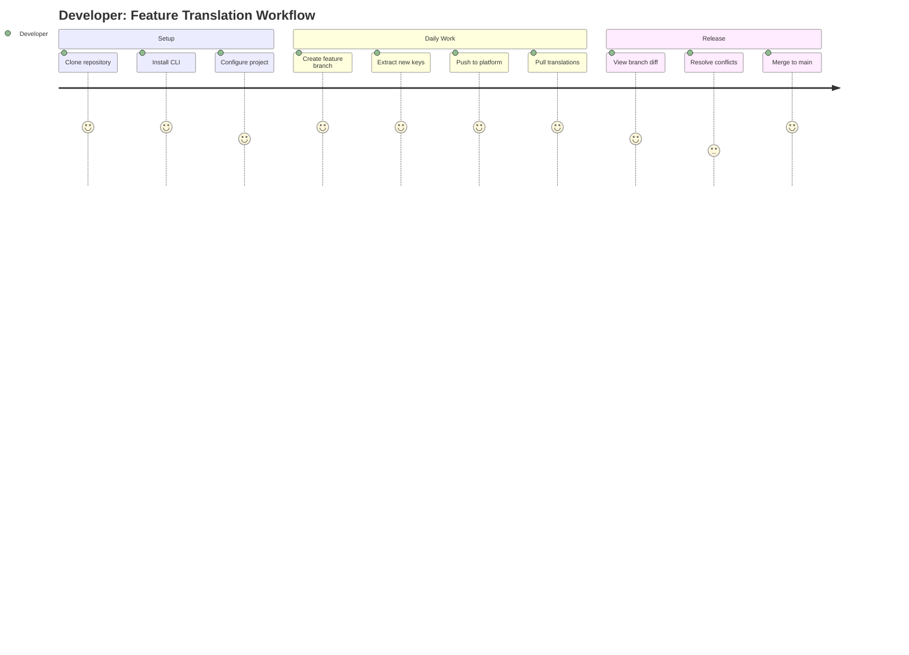
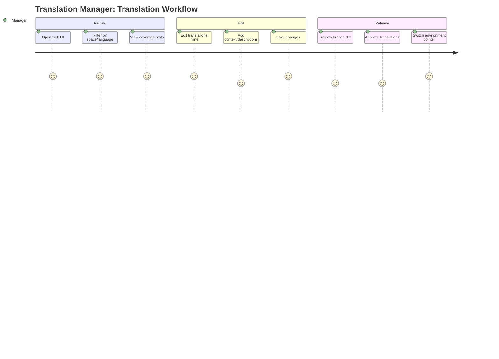
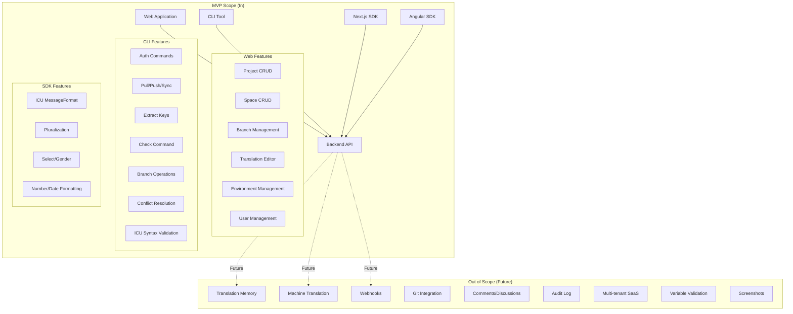
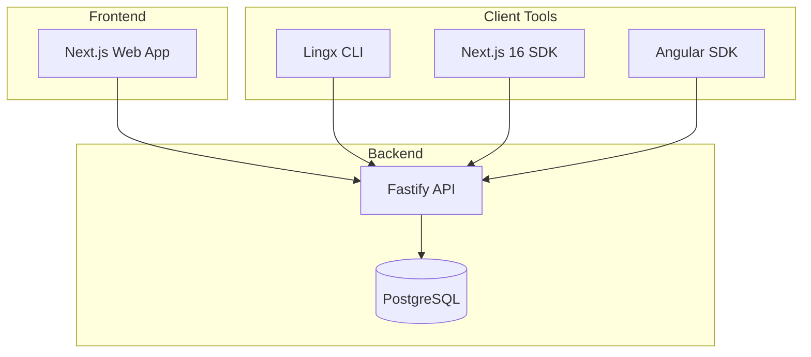
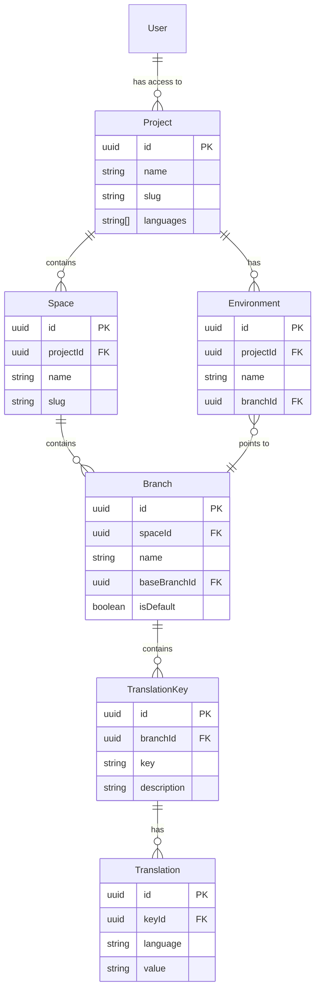

# PRD: Lingx Localization Management Platform

**Version**: 1.2
**Date**: 2025-12-27
**Status**: Final

---

## 1. Executive Summary

### One-line Summary

A self-hosted, developer-friendly localization management platform with git-like branching for translations, enabling teams to safely manage translations across multiple environments without feature work polluting production.

### Background

The translation management system (TMS) market is projected to grow from USD 2.53 billion in 2025 to USD 10.06 billion by 2035, with a CAGR of 17.2%. Despite this growth, existing localization tools fail developers and translation managers in critical ways:

- **No environment isolation**: Development changes immediately affect production
- **No branching model**: Feature translations cannot be isolated until release
- **Poor CLI experience**: No conflict detection, unreliable key extraction
- **Weak framework SDKs**: Poor developer experience for modern frameworks like Angular and Next.js
- **No space separation**: Frontend/backend translations are mixed together

Current tools like Lokalise offer branching but with significant limitations (no reverting merges, no branching from non-master branches). The industry is moving toward "Localization as Code" with CI/CD integration and Git-based workflows, but no solution fully addresses the developer workflow needs.

Lingx addresses these gaps with a feature-rich SDK API providing specialized hooks for translations, language management, and namespaces with full ICU MessageFormat support for pluralization and formatting, alongside a powerful CLI with comprehensive conflict detection and ICU syntax validation.

### Real-World Problem

> "We changed a button text while developing a feature. It went live to production immediately, but the feature won't be released for another month. Users saw text that didn't match their experience."

This platform addresses this by treating translations like code with proper branching, environments, and merge workflows.

---

## 2. Problem Statement

### Current Pain Points

| Pain Point | Impact | Affected Users |
|------------|--------|----------------|
| No environment isolation | Dev changes immediately affect production users | Developers, Translation Managers, End Users |
| No branching model | Feature translations cannot be isolated until release | Developers |
| Poor CLI experience | No conflict detection, unreliable extraction | Developers |
| Weak framework SDKs | Poor DX for Angular and modern frameworks | Developers |
| No space separation | Frontend/backend translations mixed together | Translation Managers, Developers |

### Market Gap

While platforms like Phrase, Lokalise, and Crowdin offer Git integration, none provide:
1. True git-like branching semantics (branch from any branch, revert merges)
2. Space isolation for logical separation (frontend, backend, mobile)
3. Environment pointers that can switch between branches for releases
4. A CLI with comprehensive conflict detection and resolution

---

## 3. Goals and Success Metrics

### Business Goals

1. **Enable safe development workflows** - Allow translation changes to be isolated until features are ready
2. **Improve developer experience** - Provide modern CLI and SDKs that fit into existing workflows
3. **Support translation workflows** - Give translation managers efficient editing and review capabilities
4. **Self-hosted control** - Enable organizations to maintain full control of their translation data

### Success Metrics

| Metric | Target | Measurement Method |
|--------|--------|-------------------|
| Translation coverage | 95%+ of keys translated per language | Platform analytics |
| Branch merge time | < 5 minutes average from creation to merge | Platform analytics |
| CLI adoption | 10+ pull/push operations per developer per day | CLI telemetry |
| Conflict resolution rate | 90%+ conflicts resolved without escalation | Merge operation logs |
| Time to first translation | < 30 minutes for new project setup | User onboarding tracking |
| SDK integration time | < 1 hour to integrate SDK into existing app | Documentation + support tickets |

### User Experience Goals

1. Simple workflow is default - branching is opt-in for power users
2. Zero configuration for basic usage
3. Clear conflict visualization in CLI
4. Multi-language editing view for translation managers

---

## 4. User Personas and Journeys

### Primary Users

#### Persona 1: Developer

**Profile**:
- Software developer integrating translations into applications
- Uses CLI daily, prefers code-first workflows
- Works on feature branches, needs translation isolation

**Goals**:
- Quickly integrate translations into applications
- Extract and sync translation keys from code
- Work on feature translations without affecting production
- Resolve translation conflicts before merging

**Pain Points**:
- Manual key management is error-prone
- No way to isolate feature translations
- Conflict resolution is unclear or unavailable

#### Persona 2: Translation Manager

**Profile**:
- Manages translations across multiple languages
- Reviews translation quality and coverage
- Coordinates releases with development team

**Goals**:
- Edit translations efficiently across languages
- Review translation changes before they go live
- Manage multiple projects and environments
- Understand translation coverage and gaps

**Pain Points**:
- No visibility into translation completeness
- Cannot review changes before production
- Hard to coordinate with development cycles

### User Stories

```
As a Developer
I want to create a feature branch for my translations
So that my translation changes don't affect production until the feature is released
```

```
As a Developer
I want to pull translations to my local environment
So that I can test with real translations during development
```

```
As a Developer
I want to extract translation keys from my source code
So that new keys are automatically detected and added to the platform
```

```
As a Developer
I want to see clear conflict information when merging branches
So that I can make informed decisions about which translations to keep
```

```
As a Translation Manager
I want to edit translations with a multi-language view
So that I can ensure consistency across all supported languages
```

```
As a Translation Manager
I want to review branch changes before they are merged
So that I can ensure translation quality before release
```

```
As a Translation Manager
I want to switch which branch an environment points to
So that I can control when translations go live to staging or production
```

### User Journey Diagrams

#### Developer Journey: Feature Development with Branches



#### Translation Manager Journey: Daily Translation Work



---

## 5. Functional Requirements

### Categorized by Component

#### 5.1 Web Application

##### 5.1.1 Project Management (Must Have)

- [ ] **FR-WEB-001**: Create, edit, delete projects
  - AC: Given a logged-in user, when they create a project with name and languages, then the project is created and visible in the project list
- [ ] **FR-WEB-002**: Configure supported languages per project
  - AC: Given an existing project, when languages are added/removed, then all spaces inherit the language configuration
- [ ] **FR-WEB-003**: View project-level statistics (keys, translations, coverage)
  - AC: Given a project, when viewing details, then display total keys, translation count per language, and coverage percentage

##### 5.1.2 Space Management (Must Have)

- [ ] **FR-WEB-004**: Create isolated spaces within projects
  - AC: Given a project, when creating a space with name "frontend", then a new space is created with its own `main` branch
- [ ] **FR-WEB-005**: View space-level translation statistics
  - AC: Given a space, when viewing details, then display key count and per-language coverage
- [ ] **FR-WEB-006**: Navigate between spaces
  - AC: Given multiple spaces, when selecting a space, then the view updates to show only that space's translations

##### 5.1.3 Translation Editor (Must Have)

- [ ] **FR-WEB-007**: Browse translation keys with search and filter
  - AC: Given a branch with 100+ keys, when searching for "checkout", then only matching keys are displayed within 500ms
- [ ] **FR-WEB-008**: Edit translations inline with multi-language view
  - AC: Given a key, when clicking edit, then all language translations are visible and editable simultaneously
- [ ] **FR-WEB-009**: Add context/description for translators
  - AC: Given a key, when adding a description, then translators see this context when editing
- [ ] **FR-WEB-010**: Bulk operations (delete, export)
  - AC: Given selected keys, when choosing bulk delete, then all selected keys and their translations are removed
- [ ] **FR-WEB-011**: Display translation coverage per language
  - AC: Given a branch, when viewing translations, then each language shows percentage of translated keys

##### 5.1.4 Branch Management (Must Have)

- [ ] **FR-WEB-012**: Create branches from existing branch
  - AC: Given a `main` branch, when creating branch "feature-auth", then all keys/translations are copied to the new branch
- [ ] **FR-WEB-013**: View branch list with metadata
  - AC: Given a space, when viewing branches, then display name, creation date, and key count for each
- [ ] **FR-WEB-014**: Compare branches (diff view)
  - AC: Given two branches, when comparing, then show added, modified, and deleted keys with translation differences
- [ ] **FR-WEB-015**: Merge branches with conflict resolution
  - AC: Given branches with conflicts, when merging, then display conflicts and allow resolution choices
- [ ] **FR-WEB-016**: Delete merged branches
  - AC: Given a merged branch, when deleting, then the branch is removed and no longer accessible

##### 5.1.5 Environment Management (Must Have)

- [ ] **FR-WEB-017**: Create environments (dev, staging, prod)
  - AC: Given a project, when creating environment "production", then it is associated with the project
- [ ] **FR-WEB-018**: Point environments to specific branches
  - AC: Given an environment, when selecting branch "main", then SDK requests for that environment return translations from `main`
- [ ] **FR-WEB-019**: Quick-switch branch pointers for releases
  - AC: Given environment "staging" pointing to "release-1.0", when switching to "release-1.1", then SDK requests immediately reflect the change

##### 5.1.6 User Management (Must Have)

- [ ] **FR-WEB-020**: User registration with email/password
  - AC: Given valid email and password, when registering, then a new user account is created
- [ ] **FR-WEB-021**: User authentication with JWT
  - AC: Given valid credentials, when logging in, then a JWT token is returned for subsequent requests
- [ ] **FR-WEB-022**: Role-based access (developer, manager)
  - AC: Given a developer role, when accessing manager-only features, then access is denied with appropriate message
- [ ] **FR-WEB-023**: API key generation for SDK/CLI access
  - AC: Given a logged-in user, when generating an API key, then a unique key is created and displayed once

#### 5.2 Command Line Interface (CLI)

##### 5.2.1 Authentication (Must Have)

- [ ] **FR-CLI-001**: Login with credentials
  - AC: Given valid credentials, when running `tl auth login`, then API key is stored locally
- [ ] **FR-CLI-002**: Store and manage API keys
  - AC: Given a stored API key, when running subsequent commands, then authentication is automatic
- [ ] **FR-CLI-003**: Logout and token cleanup
  - AC: When running `tl auth logout`, then stored credentials are removed

##### 5.2.2 Translation Sync (Must Have)

- [ ] **FR-CLI-004**: Pull translations to local files
  - AC: When running `tl pull --format=json`, then translations are downloaded to local files in specified format
- [ ] **FR-CLI-005**: Push local changes to platform
  - AC: When running `tl push`, then local translation files are uploaded to the specified branch
- [ ] **FR-CLI-006**: Sync with conflict detection
  - AC: When running `tl sync` with local and remote changes, then conflicts are detected and reported

##### 5.2.3 Code Analysis (Must Have)

- [ ] **FR-CLI-007**: Extract translation keys from source code with ICU pattern detection
  - AC: When running `tl extract --format=nextjs`, then translation function calls are detected and keys extracted
  - AC: When extracting keys with ICU syntax, then ICU patterns are detected and validated for correctness
- [ ] **FR-CLI-008**: Check for missing, unused keys and ICU syntax validation
  - AC: When running `tl check --missing --unused`, then report shows keys in code but not platform, and vice versa
  - AC: When running `tl check --icu`, then validates ICU syntax in all translations and reports errors for malformed patterns

##### 5.2.4 Branch Operations (Must Have)

- [ ] **FR-CLI-009**: Create new branches
  - AC: When running `tl branch create feature-x --from=main`, then a new branch is created with copied translations
- [ ] **FR-CLI-010**: View branch diff with clear conflict display
  - AC: When running `tl branch diff feature-x main`, then display added, modified, deleted keys with values
- [ ] **FR-CLI-011**: Merge branches with resolution options
  - AC: When running `tl branch merge feature-x --into=main`, then merge is performed with conflict handling
- [ ] **FR-CLI-012**: Interactive conflict resolution
  - AC: When running `tl merge --interactive`, then each conflict is presented for individual resolution

##### 5.2.5 File Format Support (Must Have)

- [ ] **FR-CLI-013**: Configurable/pluggable file format system
  - AC: When configuring `tl` with custom format handler, then pull/push operations use that format

#### 5.3 SDKs

##### 5.3.1 Next.js 16 SDK (Must Have - Priority 1)

- [ ] **FR-SDK-001**: Provider component for app setup
  - AC: When wrapping app with `<LingxProvider>`, then translations are available to child components
- [ ] **FR-SDK-002**: `useTranslation()` hook - main translation hook with ICU MessageFormat support
  - AC: When calling `const { t } = useTranslation()`, then `t('key')` returns translated string with:
    - Simple interpolation: `t('greeting', { name: 'Nick' })` with translation `"Hello, {name}!"`
    - ICU plural syntax: `t('items', { count: 5 })` with translation `"{count, plural, =0 {No items} one {1 item} other {{count} items}}"`
    - ICU select syntax: `t('pronoun', { gender: 'female' })` with translation `"{gender, select, male {He} female {She} other {They}}"`
    - ICU number formatting: `t('price', { amount: 1234.56 })` with translation `"Price: {amount, number, currency}"`
    - ICU date formatting: `t('updated', { date: new Date() })` with translation `"Updated {date, date, medium}"`
- [ ] **FR-SDK-003**: `useLanguage()` hook - language switching and detection
  - AC: When calling `const { language, setLanguage, languages } = useLanguage()`, then current language is accessible and can be changed programmatically
- [ ] **FR-SDK-004**: `useNamespace()` hook - namespace-based translation loading
  - AC: When calling `const { t, isLoading } = useNamespace('checkout')`, then only translations for that namespace are loaded and accessible
- [ ] **FR-SDK-005**: Server component support
  - AC: When using `getTranslation()` in server component, then translations are available at render time
- [ ] **FR-SDK-006**: Static generation compatible
  - AC: When building with static generation, then translations are included in static output

##### 5.3.2 Angular SDK (Should Have - Priority 2)

- [ ] **FR-SDK-007**: Module-based configuration
  - AC: When importing `LingxModule.forRoot({...})`, then SDK is configured for the application
- [ ] **FR-SDK-008**: Translate pipe for templates with ICU MessageFormat support
  - AC: When using `{{ 'key' | translate }}`, then translated value is displayed with full ICU support:
    - Simple interpolation: `{{ 'greeting' | translate: { name: 'Nick' } }}` with translation `"Hello, {name}!"`
    - ICU plural syntax: `{{ 'items' | translate: { count: 5 } }}` with translation `"{count, plural, =0 {No items} one {1 item} other {{count} items}}"`
    - ICU select syntax: `{{ 'pronoun' | translate: { gender: 'male' } }}` with translation `"{gender, select, male {He} female {She} other {They}}"`
    - ICU number formatting: `{{ 'price' | translate: { amount: 1234.56 } }}` with translation `"Price: {amount, number, currency}"`
    - ICU date formatting: `{{ 'updated' | translate: { date: dateValue } }}` with translation `"Updated {date, date, medium}"`
- [ ] **FR-SDK-009**: `LingxService` for programmatic access
  - AC: When injecting `LingxService`, then `instant()`, `get()`, and `stream()` methods are available with ICU MessageFormat support
- [ ] **FR-SDK-010**: `LanguageService` for language management
  - AC: When injecting `LanguageService`, then `getCurrentLanguage()`, `setLanguage()`, and `getAvailableLanguages()` methods are available
- [ ] **FR-SDK-011**: `NamespaceService` for namespace-based loading
  - AC: When injecting `NamespaceService`, then `loadNamespace()` and `hasNamespace()` methods are available for lazy loading translations

---

## 6. Non-Functional Requirements

### 6.1 Performance

| Requirement | Target | Measurement |
|-------------|--------|-------------|
| API response time | < 200ms for 95th percentile | Request logging |
| Translation editor load | < 1s for 1000 keys | Performance testing |
| CLI pull/push operations | < 5s for 10,000 translations | CLI timing |
| SDK initial load | < 100ms for 500 translations | Browser performance API |
| Search/filter response | < 500ms | User interaction timing |

### 6.2 Reliability

| Requirement | Target | Measurement |
|-------------|--------|-------------|
| API availability | 99.9% uptime | Health check monitoring |
| Data durability | Zero data loss | Database backups, replication |
| Error rate | < 0.1% of requests | Error logging |

### 6.3 Security

- [ ] **NFR-SEC-001**: All API endpoints require authentication (except public SDK endpoint)
- [ ] **NFR-SEC-002**: Passwords hashed with bcrypt (cost factor 12+)
- [ ] **NFR-SEC-003**: JWT tokens expire after 24 hours
- [ ] **NFR-SEC-004**: API keys can be revoked
- [ ] **NFR-SEC-005**: Rate limiting on authentication endpoints (10 requests/minute)
- [ ] **NFR-SEC-006**: Input validation on all user-provided data
- [ ] **NFR-SEC-007**: CORS configuration for web application

### 6.4 Scalability

- [ ] **NFR-SCA-001**: Support 100+ concurrent users
- [ ] **NFR-SCA-002**: Handle 50+ projects per installation
- [ ] **NFR-SCA-003**: Support 10,000+ keys per branch
- [ ] **NFR-SCA-004**: Support 20+ languages per project

### 6.5 Usability

- [ ] **NFR-USA-001**: Mobile-responsive web interface
- [ ] **NFR-USA-002**: Keyboard shortcuts for common operations
- [ ] **NFR-USA-003**: CLI provides helpful error messages with suggested fixes
- [ ] **NFR-USA-004**: SDK provides TypeScript type definitions

### 6.6 Deployment

- [ ] **NFR-DEP-001**: Single docker-compose command to start entire stack
- [ ] **NFR-DEP-002**: Environment variables for all configuration
- [ ] **NFR-DEP-003**: Database migrations run automatically on startup
- [ ] **NFR-DEP-004**: Health check endpoints for container orchestration

---

## 7. MVP Scope Definition

### Scope Boundary Diagram



### MoSCoW Prioritization

#### Must Have (MVP Core)

1. **Web Application**
   - Project, Space, Branch CRUD operations
   - Translation editor with multi-language view
   - Branch diff and merge with conflict resolution UI
   - Environment management with branch pointers
   - User authentication (email/password, JWT)
   - Role-based access (developer, manager)

2. **CLI**
   - Authentication commands
   - Pull/push/sync operations
   - Key extraction for Next.js and Angular
   - Branch operations with conflict display
   - Configurable file format system

3. **SDKs**
   - Next.js 16 SDK (complete with feature-rich API and ICU MessageFormat)
   - Angular SDK (complete with feature-rich services/pipes and ICU MessageFormat)
   - ICU MessageFormat support for pluralization, select, number, and date formatting

4. **Infrastructure**
   - Docker deployment
   - PostgreSQL database
   - API with all documented endpoints

#### Should Have (MVP Enhancement)

- Bulk operations in translation editor
- CLI check command for missing/unused keys
- SDK caching for offline support
- Translation coverage visualization

#### Could Have (Post-MVP)

- Import/export functionality
- Advanced search with regex
- Translation history per key
- Keyboard shortcuts throughout UI

#### Won't Have (Future Releases)

- Translation memory and suggestions
- Machine translation integration
- Webhooks for external notifications
- Automatic git branch integration
- Comments and discussions on translations
- Audit logging
- Multi-tenant SaaS features (organizations, billing)
- Variable validation across languages
- Screenshot attachments

---

## 8. Acceptance Criteria

### 8.1 Web Application

| Feature | Acceptance Criteria |
|---------|-------------------|
| Project Creation | User can create project with name, slug, and languages in under 1 minute |
| Space Navigation | User can switch between spaces with single click |
| Translation Editing | User can edit translations for all languages on same screen |
| Branch Creation | New branch contains exact copy of source branch translations |
| Branch Merge | Merge completes successfully with clear conflict resolution |
| Environment Switch | SDK requests reflect new branch within 5 seconds of switch |

### 8.2 CLI

| Feature | Acceptance Criteria |
|---------|-------------------|
| Authentication | API key stored securely and persists across sessions |
| Pull | Translations downloaded in specified format to specified directory |
| Push | Local changes uploaded and visible in web UI immediately |
| Extract | All translation function calls detected in supported frameworks |
| ICU Validation | ICU syntax errors detected and reported with line numbers and suggestions |
| Branch Diff | Output clearly shows added, modified, deleted keys with values |
| Merge | Conflicts displayed with clear resolution options |

### 8.3 SDKs

| Feature | Acceptance Criteria |
|---------|-------------------|
| Setup | SDK initialized and working in under 10 lines of code |
| Translation | `t('key')` returns correct translation for current language |
| Interpolation | Variables correctly substituted in translation output |
| ICU Plural | Given translation `{count, plural, =0 {No items} one {1 item} other {{count} items}}`, when `t('key', { count: 5 })` called, then `"5 items"` rendered |
| ICU Select | Given translation `{gender, select, male {He} female {She} other {They}}`, when `t('key', { gender: 'female' })` called, then `"She"` rendered |
| ICU Number | Given translation `Price: {amount, number, currency}`, when `t('key', { amount: 1234.56 })` called, then locale-formatted currency displayed |
| ICU Date | Given translation `Updated {date, date, medium}`, when `t('key', { date: new Date() })` called, then locale-formatted date displayed |
| Language Switch | UI updates to new language without page refresh |
| Server Rendering | Translations available during server-side rendering (Next.js) |

---

## 9. Out of Scope (Future Considerations)

### Phase 2 Features

| Feature | Description | Rationale for Deferral |
|---------|-------------|----------------------|
| Translation Memory | Suggest translations based on similar keys | Requires ML infrastructure |
| Machine Translation | Auto-translate with review workflow | External API dependency |
| Webhooks | Notify external systems on changes | Not critical for core workflow |
| Git Integration | Auto-create translation branches from git | Complex integration |

### Phase 3 Features

| Feature | Description | Rationale for Deferral |
|---------|-------------|----------------------|
| Comments & Discussions | Collaborate on specific translations | Social features add complexity |
| Audit Log | Track who changed what and when | Storage and performance implications |
| Multi-tenant SaaS | Organization management, billing | Business model decision |

### Long-term Vision

| Feature | Description |
|---------|-------------|
| Import/Export | Bulk operations with XLIFF, PO, ARB formats |
| Screenshots | Attach context screenshots to keys |
| Variable Validation | Ensure interpolation variables match across languages |
| Mobile App | Native mobile app for translation management |

---

## 10. Dependencies and Risks

### 10.1 Technical Dependencies

| Dependency | Type | Impact |
|------------|------|--------|
| PostgreSQL | Database | Required for all data storage |
| Node.js 18+ | Runtime | Required for API, CLI, and SDKs |
| Docker | Deployment | Required for self-hosted installation |
| pnpm | Package Manager | Required for monorepo management |

### 10.2 External Dependencies

| Dependency | Type | Impact |
|------------|------|--------|
| npm registry | Distribution | Required for CLI and SDK distribution |
| shadcn/ui | UI Components | Required for web application styling |
| Prisma | ORM | Required for database access |
| @formatjs/intl-messageformat | ICU Formatting | Required for ICU MessageFormat parsing and formatting in SDKs |

### 10.3 Risks and Mitigation

| Risk | Impact | Probability | Mitigation |
|------|--------|-------------|------------|
| Copy-on-write storage grows large | High | Medium | Implement branch cleanup, consider storage optimization in Phase 2 |
| Merge conflicts confuse users | Medium | Medium | Provide clear conflict visualization, default resolution options |
| CLI extraction misses keys | High | Low | Extensive test coverage, configurable extraction patterns |
| SDK performance on large projects | Medium | Medium | Implement caching, lazy loading, pagination |
| Security vulnerabilities in auth | High | Low | Security audit, follow OWASP guidelines, rate limiting |
| Framework version compatibility | Medium | Medium | Test against multiple versions, clear compatibility matrix |

### 10.4 Assumptions

1. Users have basic understanding of git branching concepts
2. Development teams use modern frameworks (React/Next.js, Angular)
3. Organizations are willing to self-host their localization platform
4. Translation files are primarily JSON or YAML format
5. Single-tenant deployment is acceptable for MVP

---

## 11. Technical Considerations

### 11.1 Architecture Overview



### 11.2 Data Model Summary



### 11.3 Branch Storage Strategy

**Copy-on-write approach for MVP**:
- Creating a branch copies all keys/translations from parent
- Merge compares and applies changes
- Trade-off: More storage for simpler logic
- Future optimization: Consider diff-based storage if storage becomes an issue

---

## Appendix

### A. References

- [Translation Management Systems Market Report](https://www.marketsandmarkets.com/Market-Reports/translation-management-systems-market-62967239.html) - Market analysis
- [Localization as Code](https://phrase.com/blog/posts/localization-as-code-composable-workflow/) - Industry trend

### B. Glossary

| Term | Definition |
|------|------------|
| **Project** | Top-level container for a product/application, defines supported languages |
| **Space** | Isolated segment within a project (e.g., frontend, backend, mobile) |
| **Branch** | Git-like branch for translation changes, enables isolated feature work |
| **Environment** | Deployment target (dev, staging, prod) that points to a specific branch |
| **Translation Key** | Unique identifier for a translatable string (e.g., "checkout.button.submit") |
| **Translation** | The actual translated text for a key in a specific language |
| **Copy-on-write** | Branch storage strategy where new branch copies all data from parent |
| **MoSCoW** | Prioritization method: Must/Should/Could/Won't have |
| **ICU MessageFormat** | International Components for Unicode message formatting standard for pluralization, gender selection, and number/date formatting in translations |

### C. API Endpoint Summary

| Category | Endpoints |
|----------|-----------|
| Auth | POST /api/auth/register, /login, /logout; GET /api/auth/me |
| Projects | CRUD at /api/projects |
| Spaces | CRUD at /api/projects/:projectId/spaces |
| Branches | CRUD at /api/spaces/:spaceId/branches; merge, diff operations |
| Keys | CRUD at /api/branches/:branchId/keys |
| Translations | PUT/DELETE at /api/keys/:keyId/translations/:lang |
| Environments | CRUD at /api/projects/:projectId/environments |
| SDK | GET /api/sdk/translations |

### D. CLI Command Reference

```bash
# Authentication
tl auth login
tl auth logout

# Translation Operations
tl pull --project=X --space=frontend --branch=main --format=json
tl push --project=X --space=frontend --branch=feature-auth
tl sync --project=X --space=frontend --branch=main

# Code Analysis
tl extract --source=./src --format=angular|nextjs
tl check --missing --unused --project=X --space=frontend
tl check --icu --project=X --space=frontend  # Validate ICU syntax

# Branch Operations
tl branch create feature-auth --from=main
tl branch merge feature-auth --into=main
tl branch diff feature-auth main
```

---

**Document History**

| Version | Date | Author | Changes |
|---------|------|--------|---------|
| 1.0 | 2025-12-27 | AI Assistant | Initial PRD creation |
| 1.1 | 2025-12-27 | AI Assistant | Renamed to Lingx, updated SDK API to feature-rich style with specialized hooks (useTranslation, useLanguage, useNamespace, usePlural), Next.js 16, pluralization now in-scope |
| 1.2 | 2025-12-27 | AI Assistant | Added ICU MessageFormat support for SDK pluralization and formatting; removed separate usePlural/PluralPipe in favor of ICU syntax; updated CLI for ICU validation |

### Update History

| Date | Changes |
|------|---------|
| 2025-12-27 | Initial creation |
| 2025-12-27 | Renamed to Lingx, updated SDK API to feature-rich style, Next.js 16 |
| 2025-12-27 | Added ICU MessageFormat support for SDK pluralization and formatting |
