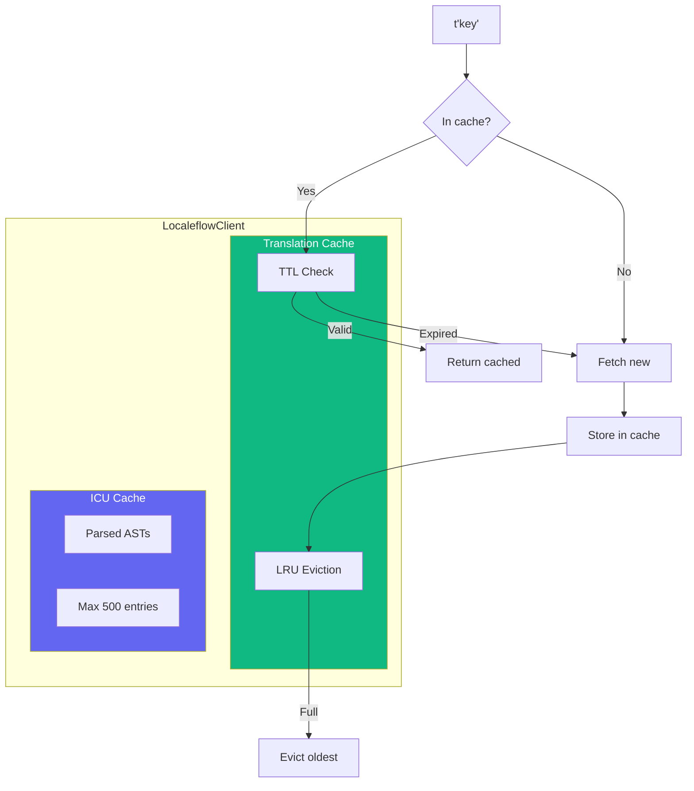
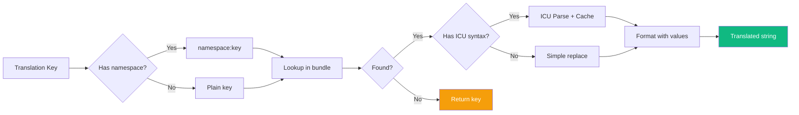

# Advanced Topics

This guide covers advanced features including caching, performance optimization, TypeScript integration, and error handling.

## Translation Caching

### Caching Architecture



### Translation Resolution Flow



### In-Memory Cache

The SDK includes an in-memory cache for translations with TTL and LRU eviction:

```tsx
import { TranslationCache } from '@localeflow/sdk-nextjs';

const cache = new TranslationCache({
  ttl: 5 * 60 * 1000,  // 5 minutes (default)
  maxEntries: 50,       // Maximum cached entries (default)
});
```

### Cache Behavior

- **TTL-based expiration**: Entries expire after the configured time
- **LRU eviction**: Least-recently-used entries are removed when capacity is exceeded
- **Per-language/namespace**: Each language and namespace combination is cached separately
- **Auto-cleanup**: Expired entries are cleaned up on access

### ICU Format Caching

Parsed ICU message ASTs are cached for performance:

```tsx
// First call: parses and caches
t('items', { count: 5 });  // ~1ms

// Subsequent calls: uses cached AST
t('items', { count: 10 }); // ~0.1ms
```

Cache settings:
- Maximum 500 cached ASTs (LRU eviction)
- Cache clears on language change

## Performance Optimization

### 1. Use Static Data

The fastest approach is bundling translations:

```tsx
import en from '@/locales/en.json';
import de from '@/locales/de.json';

<LocaleflowProvider
  defaultLanguage="en"
  staticData={{ en, de }}  // Instant - no network request
>
```

### 2. Multi-Language Bundle

For instant language switching without network requests:

```tsx
// All languages pre-loaded
staticData={{ en, de, es, fr }}
```

### 3. Namespace Code Splitting

Load translations per route/feature:

```tsx
// Only load checkout translations when needed
function CheckoutPage() {
  const { isLoaded } = useNamespace('checkout', { autoLoad: true });
  // ...
}
```

### 4. Fast Path Detection

The SDK detects simple placeholders and skips ICU parsing:

```json
{
  "simple": "Hello, {name}!",
  "complex": "{count, plural, one {# item} other {# items}}"
}
```

```tsx
t('simple', { name: 'World' })   // Fast path - simple string replace
t('complex', { count: 5 })        // Full ICU parsing
```

### 5. Non-Blocking Initialization

The provider never blocks rendering:

```tsx
// ready is always true - render immediately
const { t, ready } = useTranslation();

// Components render with translations (or keys as fallback)
return <h1>{t('title')}</h1>;
```

## Request Deduplication

Concurrent requests for the same language are deduplicated:

```tsx
// These trigger only ONE API request
Promise.all([
  client.setLanguage('de'),
  client.setLanguage('de'),
  client.setLanguage('de'),
]);
```

## Namespace Merging

Namespaces are merged into the main translation bundle:

```tsx
// Initial translations
{ "common.hello": "Hello" }

// After loading 'auth' namespace
{
  "common.hello": "Hello",
  "auth:login.title": "Sign In",
  "auth:login.submit": "Continue"
}
```

## TypeScript Integration

### Type Exports

```tsx
import type {
  // Provider types
  LocaleflowConfig,
  LocaleflowProviderProps,
  LocaleflowContextValue,

  // Hook return types
  UseTranslationReturn,
  UseLanguageReturn,
  UseNamespaceReturn,

  // Translation types
  TranslationFunction,
  DynamicTranslationFunction,
  TranslationKey,
  TranslationValues,
  TranslationBundle,
  MultiLanguageBundle,

  // Detection types
  DetectionConfig,
  LanguageDetector,
  DetectorOptions,

  // Cache types
  CacheOptions,
  CacheEntry,
} from '@localeflow/sdk-nextjs';
```

### Type-Safe Dynamic Keys

Use `tKey()` and `td()` for type-safe dynamic translations:

```tsx
import { tKey, useTranslation } from '@localeflow/sdk-nextjs';

// Define keys with tKey() - enables static extraction
const MENU_ITEMS = [
  { id: 'home', labelKey: tKey('menu.home') },
  { id: 'about', labelKey: tKey('menu.about') },
] as const;

function Menu() {
  const { td } = useTranslation();

  return (
    <nav>
      {MENU_ITEMS.map((item) => (
        <a key={item.id}>
          {td(item.labelKey)}  {/* Type-safe */}
        </a>
      ))}
    </nav>
  );
}
```

### TranslationKey Brand

The `TranslationKey` type is a branded string:

```tsx
type TranslationKey<T extends string = string> = T & {
  readonly [TranslationKeyBrand]: true;
};

// Only tKey() creates TranslationKey
const key = tKey('menu.home');  // TranslationKey<'menu.home'>

// td() only accepts TranslationKey
td(key);        // OK
td('menu.home'); // TypeScript error!
```

## Error Handling

### Error Sources

1. **Translation not found**: Returns the key as fallback
2. **API failure**: Falls back to local JSON
3. **ICU parse error**: Returns original message, logs warning
4. **Both API and local fail**: Throws error, sets `error` state

### Graceful Degradation

```tsx
function MyComponent() {
  const { t, error } = useTranslation();

  if (error) {
    // Show fallback UI or log error
    console.error('Translation error:', error);
  }

  // Keys are returned as-is if translation missing
  return <h1>{t('unknown.key')}</h1>;  // Renders: "unknown.key"
}
```

### Provider Error State

```tsx
const { error } = useLocaleflow();

if (error) {
  return <ErrorBoundary error={error} />;
}
```

## Custom Client Usage

For advanced use cases, use the client directly:

```tsx
import { LocaleflowClient } from '@localeflow/sdk-nextjs';

const client = new LocaleflowClient({
  defaultLanguage: 'en',
  staticData: { en, de },
  localePath: '/locales',
});

// Initialize
await client.init();

// Get translations
const translations = client.getTranslations();

// Translate
const text = client.translate('greeting', { name: 'World' });

// Switch language
await client.setLanguage('de');

// Load namespace
await client.loadNamespace('checkout');

// Get formatter for direct ICU formatting
const formatter = client.getFormatter();
formatter.format('{count, plural, one {#} other {#}}', { count: 5 });
```

## Context Without Provider

Access context internals with `useLocaleflowContext`:

```tsx
import { useLocaleflowContext } from '@localeflow/sdk-nextjs';

function DebugInfo() {
  const context = useLocaleflowContext();

  return (
    <pre>
      Language: {context.language}
      Loaded Namespaces: {[...context.loadedNamespaces].join(', ')}
      Ready: {context.ready}
    </pre>
  );
}
```

Note: Throws if used outside `LocaleflowProvider`.

## Bundle Analysis

The SDK is tree-shakeable. Unused exports are eliminated:

```tsx
// Only imports what you use
import { useTranslation } from '@localeflow/sdk-nextjs';

// Detection, LanguageSwitcher, etc. are not bundled
```

Core bundle (~15KB gzipped):
- Provider and context
- Hooks
- ICU formatter (intl-messageformat)

Optional additions:
- Detection system (~2KB)
- LanguageSwitcher component (~1KB)

## Retry Configuration

Configure retry behavior for API failures:

```tsx
<LocaleflowProvider
  retry={{
    maxAttempts: 3,      // Default: 3
    baseDelay: 1000,     // Default: 1000ms
    maxDelay: 10000,     // Default: 10000ms
  }}
>
```

Retry uses exponential backoff with jitter:
- Attempt 1: immediate
- Attempt 2: ~1000ms delay
- Attempt 3: ~2000ms delay
- And so on...

## Related

- [Provider Configuration](./provider.md) - Configuration options
- [ICU MessageFormat](./icu-format.md) - Formatting performance
- [Troubleshooting](./troubleshooting.md) - Common issues
