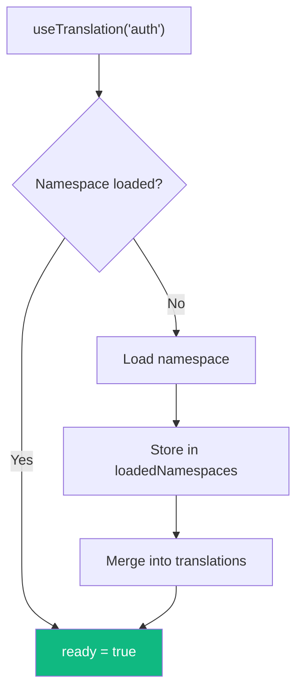

# Advanced Topics

This guide covers advanced features including caching, performance optimization, TypeScript integration, and error handling.

## Translation Caching

### Caching Architecture


### Translation Resolution Flow


### In-Memory Cache

The SDK includes an in-memory cache for translations with TTL and LRU eviction:

```tsx
import { TranslationCache } from '@lingx/sdk-nextjs';

const cache = new TranslationCache({
  ttl: 5 * 60 * 1000,  // 5 minutes (default)
  maxEntries: 50,       // Maximum cached entries (default)
});
```

### Cache Behavior

- **TTL-based expiration**: Entries expire after the configured time
- **LRU eviction**: Least-recently-used entries are removed when capacity is exceeded
- **Per-language/namespace**: Each language and namespace combination is cached separately
- **Auto-cleanup**: Expired entries are cleaned up on access

### ICU Format Caching

Parsed ICU message ASTs are cached for performance:

```tsx
// First call: parses and caches
t('items', { count: 5 });  // ~1ms

// Subsequent calls: uses cached AST
t('items', { count: 10 }); // ~0.1ms
```

Cache settings:
- Maximum 500 cached ASTs (LRU eviction)
- Cache clears on language change

## Performance Optimization

### 1. Use Static Data

The fastest approach is bundling translations:

```tsx
import en from '@/locales/en.json';
import de from '@/locales/de.json';

<LingxProvider
  defaultLanguage="en"
  staticData={{ en, de }}  // Instant - no network request
>
```

### 2. Multi-Language Bundle

For instant language switching without network requests:

```tsx
// All languages pre-loaded
staticData={{ en, de, es, fr }}
```

### 3. Namespace Code Splitting

Load translations per route/feature:

```tsx
// Only load checkout translations when needed
function CheckoutPage() {
  const { isLoaded } = useNamespace('checkout', { autoLoad: true });
  // ...
}
```

### 4. Fast Path Detection

The SDK detects simple placeholders and skips ICU parsing:

```json
{
  "simple": "Hello, {name}!",
  "complex": "{count, plural, one {# item} other {# items}}"
}
```

```tsx
t('simple', { name: 'World' })   // Fast path - simple string replace
t('complex', { count: 5 })        // Full ICU parsing
```

### 5. Non-Blocking Initialization

The provider never blocks rendering:

```tsx
// ready is always true - render immediately
const { t, ready } = useTranslation();

// Components render with translations (or keys as fallback)
return <h1>{t('title')}</h1>;
```

## Request Deduplication

Concurrent requests for the same language are deduplicated:

```tsx
// These trigger only ONE API request
Promise.all([
  client.setLanguage('de'),
  client.setLanguage('de'),
  client.setLanguage('de'),
]);
```

## Namespace Internals

### Namespace Delimiter

Internally, namespaces use the `U+001F` (Unit Separator) character to combine namespace and key:

```
namespace␟key  (where ␟ = U+001F)
```

- **Never appears in user code**: You write `t('key')` with `useTranslation('namespace')`
- **Safe for all systems**: Databases, JSON, file systems all handle it correctly
- **Invisible in storage**: The delimiter separates namespace from key in internal format

### Key Resolution

When you call `useTranslation('namespace')`, the hook automatically prefixes keys:

```tsx
const { t } = useTranslation('auth');

t('login.title');
// Looks up: auth␟login.title (internal format)
// You never see the delimiter
```

### Namespace Loading



### Storage Format

Namespaces are merged into the main translation bundle:

```tsx
// Initial translations (root)
{ "common.hello": "Hello" }

// After loading 'auth' namespace (with delimiter ␟)
{
  "common.hello": "Hello",
  "auth␟login.title": "Sign In",
  "auth␟login.submit": "Continue"
}
```

### Tracking Loaded Namespaces

The context tracks which namespaces are loaded:

```tsx
const { loadedNamespaces, loadNamespace } = useLingx();

// Check if namespace is loaded
if (!loadedNamespaces.has('checkout')) {
  await loadNamespace('checkout');
}
```

### Namespace Caching

Each namespace + language combination is cached separately:
- Cache key: `{language}-{namespace}` (e.g., `en-auth`, `de-checkout`)
- TTL applies per-entry
- LRU eviction considers all entries equally

## TypeScript Integration

### Type-Safe Translations

For compile-time validation of translation keys and ICU parameters, see the dedicated [Type-Safe Translations](./type-safety.md) guide. It covers:

- Generating types with `lingx types`
- The `TKey` convenience type
- `tKey()` for strict keys, `tKeyUnsafe()` for dynamic keys
- ICU parameter type inference (plural → number, date → Date, etc.)
- Module augmentation patterns

### Quick Example

```tsx
import { tKey, type TKey } from '@lingx/sdk-nextjs';

// Type your interfaces with TKey
interface MenuItem {
  id: string;
  labelKey: TKey;
}

const MENU_ITEMS: MenuItem[] = [
  { id: 'home', labelKey: tKey('menu.home') },
  { id: 'about', labelKey: tKey('menu.about') },
];

// TypeScript validates keys exist (when types are generated)
tKey('menu.home');    // OK
tKey('invalid.key');  // TypeScript error!
```

### Type Exports

```tsx
import type {
  // Provider types
  LingxConfig,
  LingxProviderProps,
  LingxContextValue,

  // Hook return types
  UseTranslationReturn,
  UseNamespacedTranslationReturn,  // For namespaced useTranslation
  UseLanguageReturn,
  UseNamespaceReturn,

  // Translation types
  TranslationFunction,
  DynamicTranslationFunction,
  NamespacedTranslationFunction,   // For namespace-scoped t()
  NamespacedDynamicTranslationFunction,
  TKey,                 // Convenience alias for TranslationKey<TranslationKeys>
  TNsKey,               // Namespace-scoped key: TNsKey<'glossary'>
  TranslationKey,
  TranslationKeys,      // Union of valid keys (when types generated)
  NamespaceKeys,        // Per-namespace key unions (when types generated)
  TranslationParams,    // ICU params per key (when types generated)
  TranslationValues,
  TranslationBundle,
  MultiLanguageBundle,

  // Detection types
  DetectionConfig,
  LanguageDetector,
  DetectorOptions,

  // Cache types
  CacheOptions,
  CacheEntry,
} from '@lingx/sdk-nextjs';
```

## Error Handling

### Error Sources

1. **Translation not found**: Returns the key as fallback
2. **API failure**: Falls back to local JSON
3. **ICU parse error**: Returns original message, logs warning
4. **Both API and local fail**: Throws error, sets `error` state

### Graceful Degradation

```tsx
function MyComponent() {
  const { t, error } = useTranslation();

  if (error) {
    // Show fallback UI or log error
    console.error('Translation error:', error);
  }

  // Keys are returned as-is if translation missing
  return <h1>{t('unknown.key')}</h1>;  // Renders: "unknown.key"
}
```

### Provider Error State

```tsx
const { error } = useLingx();

if (error) {
  return <ErrorBoundary error={error} />;
}
```

## Custom Client Usage

For advanced use cases, use the client directly:

```tsx
import { LingxClient } from '@lingx/sdk-nextjs';

const client = new LingxClient({
  defaultLanguage: 'en',
  staticData: { en, de },
  localePath: '/locales',
});

// Initialize
await client.init();

// Get translations
const translations = client.getTranslations();

// Translate
const text = client.translate('greeting', { name: 'World' });

// Switch language
await client.setLanguage('de');

// Load namespace
await client.loadNamespace('checkout');

// Get formatter for direct ICU formatting
const formatter = client.getFormatter();
formatter.format('{count, plural, one {#} other {#}}', { count: 5 });
```

## Context Without Provider

Access context internals with `useLingxContext`:

```tsx
import { useLingxContext } from '@lingx/sdk-nextjs';

function DebugInfo() {
  const context = useLingxContext();

  return (
    <pre>
      Language: {context.language}
      Loaded Namespaces: {[...context.loadedNamespaces].join(', ')}
      Ready: {context.ready}
    </pre>
  );
}
```

Note: Throws if used outside `LingxProvider`.

## Bundle Analysis

The SDK is tree-shakeable. Unused exports are eliminated:

```tsx
// Only imports what you use
import { useTranslation } from '@lingx/sdk-nextjs';

// Detection, LanguageSwitcher, etc. are not bundled
```

Core bundle (~15KB gzipped):
- Provider and context
- Hooks
- ICU formatter (intl-messageformat)

Optional additions:
- Detection system (~2KB)
- LanguageSwitcher component (~1KB)

## Retry Configuration

Configure retry behavior for API failures:

```tsx
<LingxProvider
  retry={{
    maxAttempts: 3,      // Default: 3
    baseDelay: 1000,     // Default: 1000ms
    maxDelay: 10000,     // Default: 10000ms
  }}
>
```

Retry uses exponential backoff with jitter:
- Attempt 1: immediate
- Attempt 2: ~1000ms delay
- Attempt 3: ~2000ms delay
- And so on...

## Related

- [Type-Safe Translations](./type-safety.md) - Namespace types, `tKey()`, and type generation
- [Provider Configuration](./provider.md) - Namespace preloading configuration
- [Hooks Reference](./hooks.md) - Namespace loading and `ready` state
- [ICU MessageFormat](./icu-format.md) - Formatting performance
- [Troubleshooting](./troubleshooting.md) - Common issues
