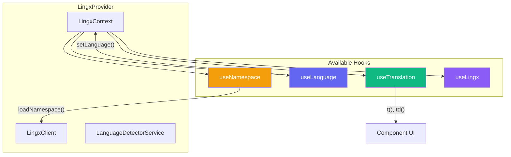
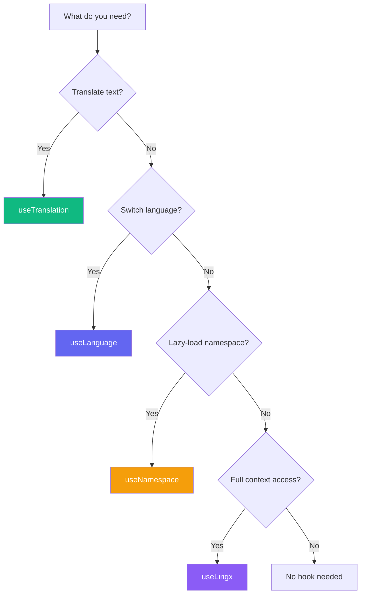

# Hooks Reference

The SDK provides four hooks for accessing translations and managing language state.

## Architecture Overview



### Hook Selection Guide



## useTranslation

The main hook for translating strings. Provides both static (`t`) and dynamic (`td`) translation functions.

### Basic Usage

```tsx
'use client';

import { useTranslation } from '@lingx/sdk-nextjs';

function MyComponent() {
  const { t, td, ready, error } = useTranslation();

  return <h1>{t('greeting', { name: 'World' })}</h1>;
}
```

### Return Value

| Property | Type | Description |
|----------|------|-------------|
| `t` | `(key: TranslationKeys, values?) => string` | Translate with string literal keys |
| `td` | `(key: TKey, values?) => string` | Translate with dynamic keys from `tKey()` |
| `ready` | `boolean` | Always `true` (non-blocking) |
| `error` | `Error \| null` | Any loading error |

> **Tip**: With [type generation](./type-safety.md), `t()` and `td()` provide autocomplete for valid keys and validate ICU parameter types.

### The `t()` Function

Use `t()` for direct string literal keys:

```tsx
// Simple translation
t('welcome')

// With interpolation
t('greeting', { name: 'John' })

// With ICU pluralization
t('items', { count: 5 })

// Nested keys (dot notation)
t('auth.login.title')
```

### The `td()` Function and `tKey()`

Use `td()` for dynamic keys stored in variables, arrays, or objects. Pair with `tKey()` for type safety and static extraction:

```tsx
import { useTranslation, tKey, type TKey } from '@lingx/sdk-nextjs';

// Type your objects with TKey for type-safe key storage
interface NavItem {
  path: string;
  labelKey: TKey;
}

// Define keys with tKey() for extraction
const navItems: NavItem[] = [
  { path: '/', labelKey: tKey('nav.home') },
  { path: '/about', labelKey: tKey('nav.about') },
  { path: '/contact', labelKey: tKey('nav.contact') },
];

function Navigation() {
  const { td } = useTranslation();

  return (
    <nav>
      {navItems.map((item) => (
        <a key={item.path} href={item.path}>
          {td(item.labelKey)}  {/* Use td() for dynamic keys */}
        </a>
      ))}
    </nav>
  );
}
```

Why `tKey()` + `td()`?
- **Static extraction**: Build tools can find `tKey()` calls to extract translation keys
- **Type safety**: `td()` only accepts `TKey` (from `tKey()`), preventing accidental dynamic strings
- **Runtime flexibility**: Keys from variables work correctly at runtime

> See [Type-Safe Translations](./type-safety.md) for advanced patterns with `TKey`, `tKeyUnsafe()`, and ICU parameter types.

### With Namespace

Scope translations to a specific namespace. The namespace is automatically loaded when the component mounts.

```tsx
'use client';

import { useTranslation } from '@lingx/sdk-nextjs';

function AuthPage() {
  const { t, td, ready, error } = useTranslation('auth');

  // IMPORTANT: Check ready state before rendering
  if (!ready) {
    return <LoadingSpinner />;
  }

  // t() only accepts keys from the 'auth' namespace
  return (
    <div>
      <h1>{t('login.title')}</h1>
      <p>{t('login.description')}</p>
    </div>
  );
}
```

### Namespace Loading Behavior

When you call `useTranslation('namespace')`:

1. **Auto-load on mount**: The namespace is automatically loaded if not already cached
2. **`ready` is `false` while loading**: Prevents displaying raw keys during load
3. **Type-scoped keys**: `t()` only accepts keys valid for that namespace

```tsx
const { t, ready } = useTranslation('glossary');

// ready = false while loading namespace translations
// ready = true once namespace is loaded and ready to use
```

> **Tip**: Always check `ready` before rendering content with namespaced translations. Otherwise, users may briefly see translation keys like `dialog.title` instead of translated text.

### Type-Safe Namespaced Keys

Use `tKey()` with a namespace for type-safe key storage:

```tsx
import { useTranslation, tKey, type TNsKey } from '@lingx/sdk-nextjs';

// TNsKey<'glossary'> only accepts keys from the glossary namespace
interface GlossaryItem {
  id: string;
  labelKey: TNsKey<'glossary'>;
}

const items: GlossaryItem[] = [
  { id: '1', labelKey: tKey('tags.title', 'glossary') },
  { id: '2', labelKey: tKey('tags.addTag', 'glossary') },
];

function GlossaryTags() {
  const { td, ready } = useTranslation('glossary');

  if (!ready) return <Loading />;

  return (
    <ul>
      {items.map(item => (
        <li key={item.id}>{td(item.labelKey)}</li>
      ))}
    </ul>
  );
}
```

### Internal Key Format

Internally, namespaced keys use a special delimiter (`U+001F` Unit Separator) to combine namespace and key:

- `useTranslation('auth')` + `t('login.title')` → looks up `auth␟login.title`
- This delimiter never appears in user-facing code or translation files
- The CLI handles conversion between file structure and internal format

---

## useLanguage

Hook for language management and switching.

### Basic Usage

```tsx
'use client';

import { useLanguage } from '@lingx/sdk-nextjs';

function LanguageSelector() {
  const { language, setLanguage, availableLanguages, isChanging } = useLanguage();

  return (
    <select
      value={language}
      onChange={(e) => setLanguage(e.target.value)}
      disabled={isChanging}
    >
      {availableLanguages.map((lang) => (
        <option key={lang} value={lang}>
          {lang.toUpperCase()}
        </option>
      ))}
    </select>
  );
}
```

### Return Value

| Property | Type | Description |
|----------|------|-------------|
| `language` | `string` | Current language code |
| `setLanguage` | `(lang: string) => Promise<void>` | Switch language (async) |
| `availableLanguages` | `string[]` | All supported languages |
| `isChanging` | `boolean` | `true` during language switch |

### Language Switching

```tsx
const { setLanguage, isChanging } = useLanguage();

// Switch language (non-blocking)
await setLanguage('de');

// Language is now 'de' and all t() calls use German translations
```

With multi-language `staticData`, switching is instant. Otherwise, translations are fetched asynchronously.

---

## useNamespace

Hook for lazy-loading translation namespaces. Use for code-splitting translations by feature or route.

### Basic Usage

```tsx
'use client';

import { useNamespace, useTranslation } from '@lingx/sdk-nextjs';

function CheckoutPage() {
  const { isLoaded, isLoading } = useNamespace('checkout', { autoLoad: true });
  const { t } = useTranslation('checkout');

  if (isLoading) return <LoadingSpinner />;
  if (!isLoaded) return <ErrorMessage />;

  return <div>{t('summary.title')}</div>;
}
```

### Options

| Option | Type | Default | Description |
|--------|------|---------|-------------|
| `autoLoad` | `boolean` | `false` | Automatically load namespace on mount |

### Return Value

| Property | Type | Description |
|----------|------|-------------|
| `namespace` | `string` | The namespace name |
| `loadNamespace` | `() => Promise<void>` | Manually trigger loading |
| `isLoaded` | `boolean` | Whether namespace is loaded |
| `isLoading` | `boolean` | Whether currently loading |

### Manual Loading

```tsx
const { isLoaded, loadNamespace } = useNamespace('checkout');

// Load on user action
<button onClick={loadNamespace} disabled={isLoaded}>
  Load Checkout Translations
</button>
```

### Use Case: Route-Based Code Splitting

```tsx
// app/checkout/page.tsx
'use client';

import { useNamespace, useTranslation } from '@lingx/sdk-nextjs';

export default function CheckoutPage() {
  // Auto-load checkout namespace when this route is accessed
  const { isLoaded, isLoading } = useNamespace('checkout', { autoLoad: true });
  const { t } = useTranslation('checkout');

  if (isLoading) return <Loading />;

  return (
    <div>
      <h1>{t('title')}</h1>
      <p>{t('description')}</p>
    </div>
  );
}
```

---

## useLingx

Low-level hook providing full context access. Use when you need everything.

### Basic Usage

```tsx
'use client';

import { useLingx } from '@lingx/sdk-nextjs';

function DebugPanel() {
  const {
    language,
    setLanguage,
    availableLanguages,
    isChanging,
    isLoading,
    translations,
    loadedNamespaces,
    loadNamespace,
    ready,
    error,
    t,
    config,
  } = useLingx();

  return (
    <pre>
      {JSON.stringify({
        language,
        availableLanguages,
        isChanging,
        isLoading,
        loadedNamespaces: [...loadedNamespaces],
        ready,
        error: error?.message,
      }, null, 2)}
    </pre>
  );
}
```

### Return Value

| Property | Type | Description |
|----------|------|-------------|
| `language` | `string` | Current language code |
| `setLanguage` | `(lang: string) => Promise<void>` | Switch language |
| `availableLanguages` | `string[]` | Supported languages |
| `isChanging` | `boolean` | During language switch |
| `isLoading` | `boolean` | During initial load |
| `translations` | `TranslationBundle` | All translations for current language |
| `loadedNamespaces` | `Set<string>` | Currently loaded namespaces |
| `loadNamespace` | `(ns: string) => Promise<void>` | Load a namespace |
| `ready` | `boolean` | Always `true` |
| `error` | `Error \| null` | Any error |
| `t` | `TranslationFunction` | Translate function |
| `config` | `LingxConfig` | Provider configuration |

---

## TypeScript Types

All hooks are fully typed. Import types as needed:

```tsx
import type {
  // Hook return types
  UseTranslationReturn,
  UseNamespacedTranslationReturn,  // For namespaced useTranslation
  UseLanguageReturn,
  UseNamespaceReturn,
  LingxContextValue,

  // Translation function types
  TranslationFunction,
  DynamicTranslationFunction,
  NamespacedTranslationFunction,   // For namespace-scoped t()
  NamespacedDynamicTranslationFunction,

  // Key types (for type-safe translations)
  TKey,                  // Convenience alias for TranslationKey<TranslationKeys>
  TNsKey,                // Namespace-scoped key type: TNsKey<'glossary'>
  TranslationKey,        // Branded string type
  TranslationKeys,       // Union of all valid keys (when types generated)
  NamespaceKeys,         // Per-namespace key unions
  TranslationParams,     // ICU parameter types per key

  // Value types
  TranslationValues,
  TranslationParamsFor,  // Get params for a specific key
} from '@lingx/sdk-nextjs';
```

## Related

- [Type-Safe Translations](./type-safety.md) - Namespace types, `tKey()`, and `TNsKey<NS>`
- [ICU MessageFormat](./icu-format.md) - Formatting syntax for `t()` values
- [Components](./components.md) - Built-in UI components
- [Advanced](./advanced.md) - Namespace internals and performance tips
