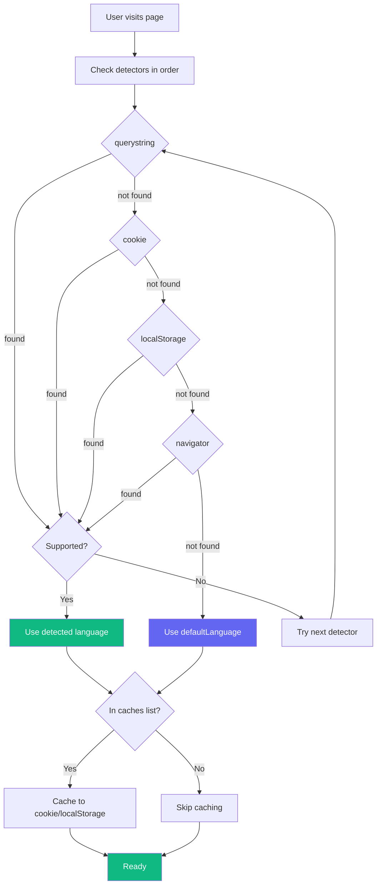
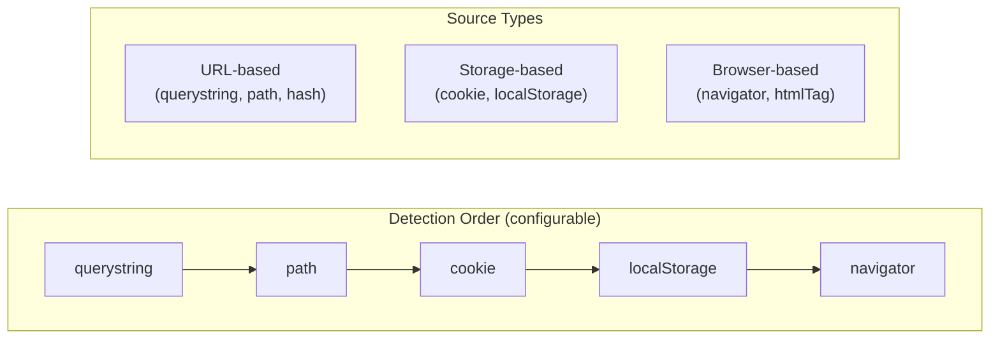

# Language Detection

The SDK includes a flexible language detection system with 9 built-in detectors and support for custom detectors.

## How It Works

On mount, the provider:
1. Checks each detector in order until a supported language is found
2. Falls back to `defaultLanguage` if no match
3. Caches the detected/selected language for future visits

## Configuration

Configure detection via the `detection` prop:

```tsx
<LingxProvider
  defaultLanguage="en"
  staticData={{ en, de }}
  detection={{
    order: ['querystring', 'cookie', 'localStorage', 'navigator'],
    caches: ['cookie', 'localStorage'],
    cookieName: 'lingx-lang',
    cookieMaxAge: 31536000,  // 1 year
    localStorageKey: 'lingx-lang',
  }}
>
```

### Configuration Options

| Option | Type | Default | Description |
|--------|------|---------|-------------|
| `order` | `string[]` | `['querystring', 'cookie', 'localStorage', 'navigator']` | Detection order |
| `caches` | `string[]` | `['cookie', 'localStorage']` | Where to cache language |
| `excludeCacheFor` | `string[]` | `[]` | Languages to exclude from caching |
| `cookieName` | `string` | `'lingx-lang'` | Cookie name |
| `cookieMaxAge` | `number` | `31536000` (1 year) | Cookie max-age in seconds |
| `cookieDomain` | `string` | - | Cookie domain for cross-subdomain |
| `localStorageKey` | `string` | `'lingx-lang'` | localStorage key |

## Built-in Detectors

### 1. querystring

Reads from URL query parameters: `?lang=de`, `?lng=de`, or `?locale=de`

```
https://example.com/?lang=de → 'de'
https://example.com/page?locale=es → 'es'
```

### 2. cookie

Reads/writes from browser cookies. Supports cross-subdomain sharing.

```tsx
detection={{
  order: ['cookie'],
  caches: ['cookie'],
  cookieName: 'my-lang',
  cookieMaxAge: 86400 * 365,  // 1 year
  cookieDomain: '.example.com',  // Share across subdomains
}}
```

### 3. localStorage

Reads/writes from browser localStorage. Persists across sessions.

```tsx
detection={{
  order: ['localStorage'],
  caches: ['localStorage'],
  localStorageKey: 'app-language',
}}
```

### 4. sessionStorage

Reads/writes from sessionStorage. Persists only for current tab.

### 5. navigator

Reads from browser language preferences (`navigator.languages`).

- Checks exact match first (e.g., `en-US`)
- Falls back to base language (e.g., `en-US` → `en`)

```tsx
// Browser has ['en-US', 'de-DE', 'fr']
// Available: ['en', 'de', 'es']
// Detected: 'en' (from 'en-US' base code)
```

### 6. path

Reads from URL path segment: `/de/about` → `'de'`

```tsx
detection={{
  order: ['path', 'cookie', 'navigator'],
}}
```

Works with Next.js i18n routing:
```
/en/products → 'en'
/de/products → 'de'
```

### 7. htmlTag

Reads from `<html lang="...">` attribute. Useful when server sets the language.

```html
<html lang="de">
```

### 8. hash

Reads from URL hash: `#lang=de` or `#/de`

```
https://example.com/#lang=de → 'de'
https://example.com/#/de/about → 'de'
```

### 9. subdomain

Reads from subdomain: `de.example.com` → `'de'`

```tsx
detection={{
  order: ['subdomain', 'navigator'],
}}
```

## Disabling Detection

To always use `defaultLanguage`:

```tsx
<LingxProvider
  defaultLanguage="en"
  detection={false}
>
```

## Custom Detectors

Create custom detectors for special use cases:

```tsx
import { createLanguageDetector } from '@lingx/sdk-nextjs';

// Detector that reads from a custom header (server-passed)
const headerDetector = createLanguageDetector({
  name: 'header',

  lookup(options) {
    // Read from meta tag set by server
    const meta = document.querySelector('meta[name="user-language"]');
    const lang = meta?.getAttribute('content');

    if (lang && options.supportedLanguages.includes(lang)) {
      return lang;
    }
    return undefined;
  },

  // Optional: cache the language
  cacheUserLanguage(language, options) {
    // Custom caching logic
  },
});
```

### Adding Custom Detectors

```tsx
import { LanguageDetectorService } from '@lingx/sdk-nextjs';

const service = new LanguageDetectorService({
  order: ['header', 'cookie', 'navigator'],
  caches: ['cookie'],
});

// Add custom detector
service.addDetector(headerDetector);

// Use in provider config
<LingxProvider
  defaultLanguage="en"
  detection={{
    order: ['header', 'cookie', 'navigator'],
    caches: ['cookie'],
  }}
>
```

### Removing Built-in Detectors

```tsx
const service = new LanguageDetectorService();

// Remove a detector by name
service.removeDetector('navigator');
service.removeDetector('sessionStorage');
```

## Detection Flow



### Detector Priority



## Best Practices

### Recommended Order

```tsx
detection={{
  // URL first (explicit user choice)
  // Then persisted preference
  // Then browser setting as fallback
  order: ['querystring', 'path', 'cookie', 'localStorage', 'navigator'],
  caches: ['cookie', 'localStorage'],
}}
```

### Cross-Subdomain Sharing

```tsx
detection={{
  cookieDomain: '.example.com',  // Leading dot required
}}
```

This allows `app.example.com` and `www.example.com` to share the language preference.

### Exclude Test Languages

```tsx
detection={{
  excludeCacheFor: ['cimode'],  // Don't cache test mode
}}
```

## Examples

### Next.js with Path-Based i18n

```tsx
// app/[lang]/layout.tsx
<LingxProvider
  defaultLanguage={params.lang}
  staticData={{ en, de }}
  detection={{
    order: ['path', 'cookie', 'navigator'],
    caches: ['cookie'],
  }}
>
```

### Query String Override

Allow `?lang=X` to temporarily override:

```tsx
detection={{
  order: ['querystring', 'cookie', 'navigator'],
  caches: ['cookie'],  // Note: querystring not in caches
}}
```

Users can share links with `?lang=de` without affecting their saved preference.

## Related

- [Provider Configuration](./provider.md) - Full provider options
- [Server-Side Usage](./server-side.md) - Language detection on server
