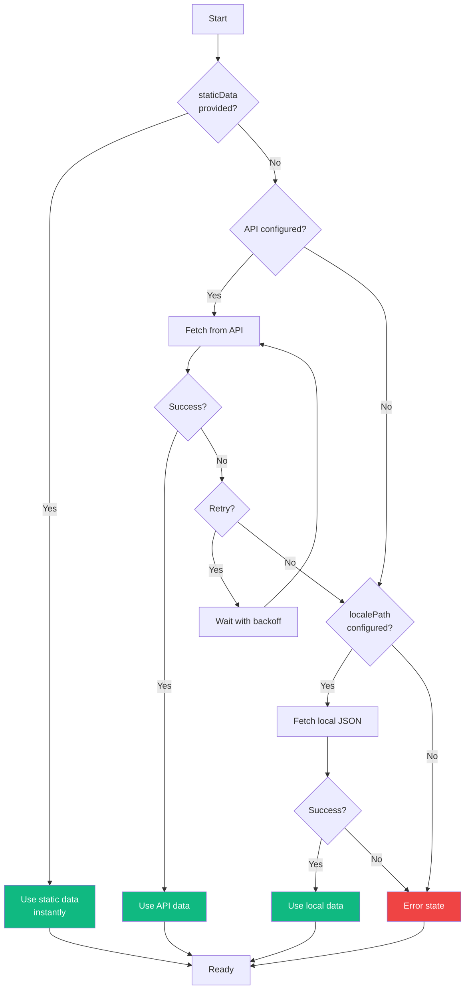

# Provider Configuration

The `LocaleflowProvider` is the core component that wraps your application and provides translation context to all child components.

## Basic Usage

```tsx
import { LocaleflowProvider } from '@localeflow/sdk-nextjs';
import en from '@/locales/en.json';
import de from '@/locales/de.json';

<LocaleflowProvider
  defaultLanguage="en"
  staticData={{ en, de }}
>
  <App />
</LocaleflowProvider>
```

## Props Reference

| Prop | Type | Required | Description |
|------|------|----------|-------------|
| `defaultLanguage` | `string` | Yes | Default language code (e.g., `'en'`) |
| `children` | `ReactNode` | Yes | Your application components |
| `staticData` | `object` | No | Static translation data |
| `localePath` | `string` | No | Path to local JSON files (e.g., `'/locales'`) |
| `availableLanguages` | `string[]` | No | List of supported languages (auto-detected from `staticData`) |
| `fallbackLanguage` | `string` | No | Fallback when translation is missing |
| `namespaces` | `string[]` | No | Namespaces to preload |
| `fallback` | `ReactNode` | No | Loading fallback UI |
| `apiUrl` | `string` | No | LocaleFlow API URL |
| `project` | `string` | No | Project slug (required with API) |
| `space` | `string` | No | Space slug (required with API) |
| `environment` | `string` | No | Environment slug (required with API) |
| `retry` | `object` | No | Retry configuration for API failures |
| `detection` | `object \| false` | No | Language detection config (see [Language Detection](./language-detection.md)) |

## Loading Strategies

### Static Data (Recommended)

Best for performance and SSG/SSR. Translations are bundled with your app.

**Single-language bundle:**
```tsx
import en from '@/locales/en.json';

<LocaleflowProvider
  defaultLanguage="en"
  staticData={en}
  localePath="/locales"  // For other languages
  availableLanguages={['en', 'de', 'es']}
>
```

**Multi-language bundle (recommended):**
```tsx
import en from '@/locales/en.json';
import de from '@/locales/de.json';
import es from '@/locales/es.json';

<LocaleflowProvider
  defaultLanguage="en"
  staticData={{ en, de, es }}
>
```

With multi-language bundles:
- Available languages are auto-detected
- Language switching is instant (no network requests)
- Works offline

### Local JSON Fallback

Load translations from local JSON files at runtime:

```tsx
<LocaleflowProvider
  defaultLanguage="en"
  localePath="/locales"
  availableLanguages={['en', 'de', 'es']}
>
```

Files should be at `/public/locales/{lang}.json`.

### API with Fallback (Hybrid)

Try LocaleFlow API first, fall back to local files:

```tsx
<LocaleflowProvider
  defaultLanguage="en"
  apiUrl="https://api.localeflow.io"
  project="my-project"
  space="main"
  environment="production"
  localePath="/locales"  // Fallback
  retry={{
    maxAttempts: 3,
    baseDelay: 1000,
    maxDelay: 10000,
  }}
>
```

Loading priority:
1. API (with retry and exponential backoff)
2. Local JSON files (if API fails)
3. Error (if both fail)



## Loading Fallback

Show a loading UI while translations load:

```tsx
<LocaleflowProvider
  defaultLanguage="en"
  apiUrl="https://api.localeflow.io"
  fallback={<LoadingSpinner />}
>
```

Note: With `staticData`, the fallback is not shown because translations are immediately available.

## Non-Blocking Initialization

The provider is designed for instant rendering:

- `ready` is always `true` (never blocks rendering)
- With `staticData`: translations available immediately
- Without `staticData`: loads asynchronously in background
- Components can render immediately and update when translations load

```tsx
const { t, ready } = useTranslation();

// ready is always true - safe to render immediately
return <h1>{t('title')}</h1>;
```

## Retry Configuration

Configure retry behavior for API failures:

```tsx
<LocaleflowProvider
  retry={{
    maxAttempts: 3,      // Number of retries (default: 3)
    baseDelay: 1000,     // Initial delay in ms (default: 1000)
    maxDelay: 10000,     // Maximum delay in ms (default: 10000)
  }}
>
```

Uses exponential backoff: 1s → 2s → 4s → ... → maxDelay

## TypeScript

The provider props are fully typed:

```tsx
import type { LocaleflowProviderProps } from '@localeflow/sdk-nextjs';

const config: LocaleflowProviderProps = {
  defaultLanguage: 'en',
  staticData: { en, de },
  children: <App />,
};
```

## Examples

### Next.js App Router with i18n Routing

```tsx
// app/[lang]/layout.tsx
import { LocaleflowProvider } from '@localeflow/sdk-nextjs';
import en from '@/locales/en.json';
import de from '@/locales/de.json';

const translations = { en, de };

export default function LocaleLayout({
  children,
  params,
}: {
  children: React.ReactNode;
  params: { lang: string };
}) {
  return (
    <LocaleflowProvider
      defaultLanguage={params.lang}
      staticData={translations}
    >
      {children}
    </LocaleflowProvider>
  );
}

export function generateStaticParams() {
  return [{ lang: 'en' }, { lang: 'de' }];
}
```

### With Namespace Preloading

```tsx
<LocaleflowProvider
  defaultLanguage="en"
  staticData={{ en, de }}
  namespaces={['common', 'auth']}  // Preload these namespaces
>
```

## Related

- [Getting Started](./getting-started.md)
- [Language Detection](./language-detection.md)
- [Server-Side Usage](./server-side.md)
