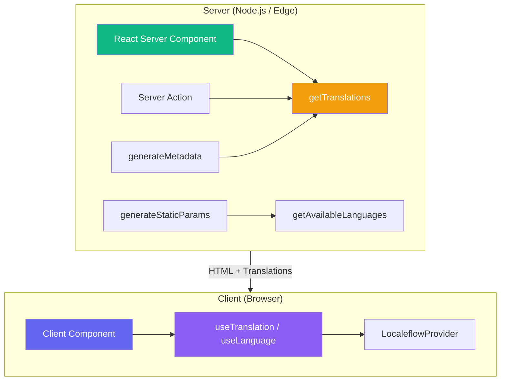
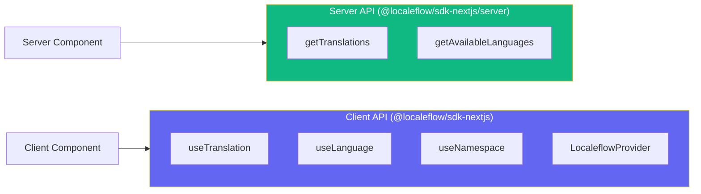

# Server-Side Usage

The SDK provides server-side translation support for Next.js App Router, including React Server Components (RSC).

## Architecture Overview



### Server vs Client API



## Why Server-Side Translations?

- **SEO**: Search engines index pre-rendered translated content
- **Performance**: No client-side loading delay
- **Hydration**: Consistent content between server and client

## getTranslations

Use `getTranslations` in Server Components:

```tsx
// app/[lang]/page.tsx
import { getTranslations } from '@localeflow/sdk-nextjs/server';
import en from '@/locales/en.json';
import de from '@/locales/de.json';

const translations = { en, de };

export default async function Page({
  params,
}: {
  params: { lang: string };
}) {
  const { t, language } = await getTranslations({
    staticData: translations,
    language: params.lang,
    defaultLanguage: 'en',
  });

  return (
    <main>
      <h1>{t('home.title')}</h1>
      <p>{t('home.description')}</p>
    </main>
  );
}
```

### Options

| Option | Type | Description |
|--------|------|-------------|
| `staticData` | `object` | Translation data (required) |
| `language` | `string` | Language to use |
| `defaultLanguage` | `string` | Fallback language |
| `namespace` | `string` | Scope translations to namespace |

### Return Value

| Property | Type | Description |
|----------|------|-------------|
| `t` | `TranslationFunction` | Translation function |
| `language` | `string` | Current language code |

## Multi-Language Bundle

Pass a multi-language bundle and specify the language:

```tsx
import en from '@/locales/en.json';
import de from '@/locales/de.json';

const { t } = await getTranslations({
  staticData: { en, de },
  language: 'de',
  defaultLanguage: 'en',
});
```

The SDK auto-detects multi-language bundles and extracts the correct language.

## With Namespaces

Scope translations to a namespace:

```tsx
const { t } = await getTranslations({
  staticData: { en, de },
  language: 'de',
  namespace: 'auth',
});

// Looks up 'auth:login.title'
t('login.title');
```

## Dynamic Routes

Set up i18n routing with Next.js App Router:

```
app/
├── [lang]/
│   ├── layout.tsx
│   ├── page.tsx
│   └── about/
│       └── page.tsx
└── locales/
    ├── en.json
    └── de.json
```

### Layout

```tsx
// app/[lang]/layout.tsx
import { LocaleflowProvider } from '@localeflow/sdk-nextjs';
import en from '@/locales/en.json';
import de from '@/locales/de.json';

const translations = { en, de };

export default function LocaleLayout({
  children,
  params,
}: {
  children: React.ReactNode;
  params: { lang: string };
}) {
  return (
    <html lang={params.lang}>
      <body>
        <LocaleflowProvider
          defaultLanguage={params.lang}
          staticData={translations}
        >
          {children}
        </LocaleflowProvider>
      </body>
    </html>
  );
}
```

### Page

```tsx
// app/[lang]/page.tsx
import { getTranslations } from '@localeflow/sdk-nextjs/server';
import en from '@/locales/en.json';
import de from '@/locales/de.json';

export default async function HomePage({
  params,
}: {
  params: { lang: string };
}) {
  const { t } = await getTranslations({
    staticData: { en, de },
    language: params.lang,
  });

  return <h1>{t('home.title')}</h1>;
}
```

## generateStaticParams

Use `getAvailableLanguages` to generate static paths:

```tsx
// app/[lang]/layout.tsx
import { getAvailableLanguages } from '@localeflow/sdk-nextjs/server';
import en from '@/locales/en.json';
import de from '@/locales/de.json';

const translations = { en, de };

export function generateStaticParams() {
  const languages = getAvailableLanguages(translations);
  return languages.map((lang) => ({ lang }));
}

// Generates:
// /en
// /de
```

## Mixing Server and Client Components

Server Components use `getTranslations`, Client Components use hooks:

```tsx
// app/[lang]/page.tsx (Server Component)
import { getTranslations } from '@localeflow/sdk-nextjs/server';
import { ClientSection } from './ClientSection';

export default async function Page({ params }: { params: { lang: string } }) {
  const { t } = await getTranslations({
    staticData: { en, de },
    language: params.lang,
  });

  return (
    <main>
      {/* Server-rendered */}
      <h1>{t('page.title')}</h1>

      {/* Client-rendered (uses hooks) */}
      <ClientSection />
    </main>
  );
}
```

```tsx
// app/[lang]/ClientSection.tsx
'use client';

import { useTranslation, useLanguage } from '@localeflow/sdk-nextjs';

export function ClientSection() {
  const { t } = useTranslation();
  const { language, setLanguage } = useLanguage();

  return (
    <div>
      <p>{t('client.interactive')}</p>
      <button onClick={() => setLanguage('de')}>
        Switch to German
      </button>
    </div>
  );
}
```

## Server Actions

Use translations in Server Actions:

```tsx
// app/actions.ts
'use server';

import { getTranslations } from '@localeflow/sdk-nextjs/server';
import en from '@/locales/en.json';
import de from '@/locales/de.json';

export async function submitForm(formData: FormData, lang: string) {
  const { t } = await getTranslations({
    staticData: { en, de },
    language: lang,
  });

  // Validate
  const name = formData.get('name');
  if (!name) {
    return { error: t('form.errors.nameRequired') };
  }

  // Success
  return { message: t('form.success') };
}
```

## Metadata

Translate metadata for SEO:

```tsx
// app/[lang]/page.tsx
import { getTranslations } from '@localeflow/sdk-nextjs/server';
import type { Metadata } from 'next';

export async function generateMetadata({
  params,
}: {
  params: { lang: string };
}): Promise<Metadata> {
  const { t } = await getTranslations({
    staticData: { en, de },
    language: params.lang,
  });

  return {
    title: t('meta.title'),
    description: t('meta.description'),
  };
}
```

## ICU Format Support

Server-side translations support full ICU MessageFormat:

```tsx
const { t } = await getTranslations({
  staticData: { en, de },
  language: 'en',
});

// Pluralization
t('items', { count: 5 });  // "5 items"

// Date formatting
t('published', { date: new Date() });  // "Published Dec 28, 2025"

// Number formatting
t('price', { amount: 99.99 });  // "$99.99"
```

## Important Notes

### No API Fetching

Server-side always uses static data. There's no API fetching on the server:

```tsx
// This works
const { t } = await getTranslations({
  staticData: { en, de },
  language: 'de',
});

// This throws an error
const { t } = await getTranslations({
  language: 'de',
});
// Error: No translations provided. Pass staticData to getTranslations()
```

### Serverless/Edge Safe

The server utilities are designed for serverless and edge environments:
- No global state dependencies
- No external network calls
- Pure function execution

### No Hooks on Server

Hooks (`useTranslation`, `useLanguage`, etc.) are client-only. Use `getTranslations` for Server Components.

## Related

- [Provider Configuration](./provider.md) - Client-side setup
- [ICU MessageFormat](./icu-format.md) - Formatting syntax
- [Hooks Reference](./hooks.md) - Client-side hooks
