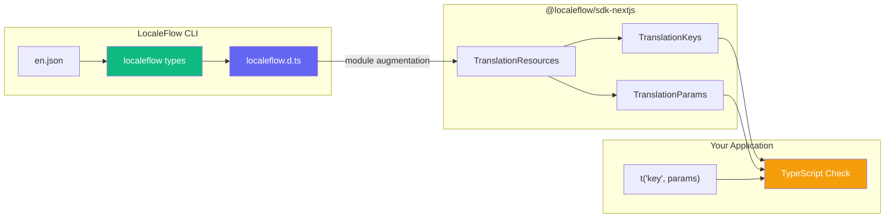

# Type-Safe Translations

This guide covers compile-time type safety for translation keys and ICU parameters. Generate TypeScript types from your translation files for autocomplete, validation, and parameter type checking.

## Overview



### Benefits

- **Autocomplete**: See all available translation keys as you type
- **Compile-time validation**: TypeScript errors for invalid keys
- **Parameter type inference**: ICU syntax determines TypeScript types
- **JSDoc hover**: See translation text in your editor

## Quick Start

### 1. Configure Type Generation

Add the `types` section to your `localeflow.config.ts`:

```typescript
// localeflow.config.ts
export default {
  paths: {
    translations: './public/locales',
    source: './src',
  },
  types: {
    enabled: true,
    output: './src/localeflow.d.ts',
    sourceLocale: 'en',
  },
};
```

### 2. Generate Types

Run the CLI command:

```bash
# Generate once
localeflow types

# Watch mode - regenerate on file changes
localeflow types --watch
```

Output:
```
✔ Generated types: 156 keys (23 with params)
  Output: src/localeflow.d.ts
```

### 3. Use Type-Safe Translations

```tsx
import { useTranslation, tKey, type TKey } from '@localeflow/sdk-nextjs';

function MyComponent() {
  const { t, td } = useTranslation();

  // Autocomplete shows all valid keys
  return (
    <div>
      <h1>{t('common.greeting', { name: 'World' })}</h1>
      {/* TypeScript error if key doesn't exist */}
      {/* TypeScript error if params are wrong type */}
    </div>
  );
}
```

---

## Configuration

### Config Options

| Option | Type | Default | Description |
|--------|------|---------|-------------|
| `enabled` | `boolean` | `true` | Enable/disable type generation |
| `output` | `string` | `'./src/localeflow.d.ts'` | Output path for generated types |
| `sourceLocale` | `string` | `'en'` | Which locale to use as source of truth |

### CLI Options

```bash
localeflow types [options]

Options:
  -o, --output <file>   Output file path (overrides config)
  -l, --locale <code>   Source locale (overrides config)
  -w, --watch           Watch for changes and regenerate
```

### Auto-Generation

Types are automatically regenerated when you run:
- `localeflow extract` - After extracting keys
- `localeflow pull` - After pulling translations
- `localeflow push` - After pushing translations
- `localeflow sync` - After syncing

---

## Generated Types

### Example Output

Given this translation file:

```json
{
  "auth.login.title": "Sign In",
  "common.greeting": "Hello, {name}!",
  "common.items": "{count, plural, =0 {No items} one {1 item} other {{count} items}}"
}
```

The CLI generates:

```typescript
// localeflow.d.ts (auto-generated)
import '@localeflow/sdk-nextjs';

declare module '@localeflow/sdk-nextjs' {
  interface TranslationResources {
    keys:
      | 'auth.login.title'
      | 'common.greeting'
      | 'common.items';
  }

  interface TranslationParams {
    /** Hello, {name}! */
    'common.greeting': { name: string | number };
    /** {count, plural, =0 {No items} one {1 item} other {{count} items}} */
    'common.items': { count: number };
  }
}
```

### Module Augmentation

The generated file uses TypeScript module augmentation to extend the SDK's types without modifying the package itself. The SDK defines base interfaces:

```typescript
// In @localeflow/sdk-nextjs
export interface TranslationResources {
  // Empty by default - augmented by generated types
}

export type TranslationKeys = TranslationResources extends { keys: infer K }
  ? K extends string ? K : string
  : string;
```

When you generate types, they merge with these interfaces to enable strict typing.

---

## ICU Parameter Types

The type generator infers TypeScript types from ICU MessageFormat syntax:

| ICU Syntax | Inferred Type | Example |
|------------|---------------|---------|
| `{name}` | `string \| number` | Simple placeholder |
| `{count, plural, ...}` | `number` | Pluralization |
| `{count, selectordinal, ...}` | `number` | Ordinal numbers |
| `{gender, select, ...}` | `string` | Selection |
| `{amount, number}` | `number` | Number formatting |
| `{date, date}` | `Date` | Date formatting |
| `{time, time}` | `Date` | Time formatting |

### Examples

```json
{
  "items": "{count, plural, one {# item} other {# items}}",
  "greeting": "Hello, {name}!",
  "formatted": "Price: {price, number, currency}"
}
```

Generated types:

```typescript
interface TranslationParams {
  'items': { count: number };           // plural → number
  'greeting': { name: string | number }; // simple → string | number
  'formatted': { price: number };        // number format → number
}
```

---

## Type-Safe Keys

### The `TKey` Type

`TKey` is a convenience alias for `TranslationKey<TranslationKeys>`:

```typescript
import { type TKey } from '@localeflow/sdk-nextjs';

// Use in interfaces
interface NavItem {
  href: string;
  labelKey: TKey;
}

// Use in function signatures
function translateLabel(key: TKey): string {
  const { td } = useTranslation();
  return td(key);
}
```

### `tKey()` - Strict Keys

Use `tKey()` to create type-safe translation keys for extraction and storage:

```typescript
import { tKey, type TKey } from '@localeflow/sdk-nextjs';

// Define keys in arrays/objects
const navItems = [
  { path: '/', labelKey: tKey('nav.home') },
  { path: '/about', labelKey: tKey('nav.about') },
  { path: '/contact', labelKey: tKey('nav.contact') },
];

// TypeScript validates the key exists
tKey('nav.home');       // OK
tKey('invalid.key');    // TypeScript error!
```

### `tKeyUnsafe()` - Escape Hatch

Use `tKeyUnsafe()` for dynamic keys that can't be validated at compile time:

```typescript
import { tKeyUnsafe } from '@localeflow/sdk-nextjs';

// Dynamic key construction
const section = getSectionFromRoute(); // 'home' | 'about' | etc.
const key = tKeyUnsafe(`${section}.title`);

// Keys from external sources
const apiKey = response.translationKey;
const translatedKey = tKeyUnsafe(apiKey);
```

**Warning**: Keys passed to `tKeyUnsafe()` are not validated. Use `tKey()` whenever possible.

### `t()` vs `td()` Functions

| Function | Input | Use Case |
|----------|-------|----------|
| `t(key)` | String literal | Direct translation in JSX |
| `td(key)` | `TKey` (from `tKey()`) | Dynamic keys from variables |

```tsx
const { t, td } = useTranslation();

// t() - direct string literals
t('greeting', { name: 'World' });

// td() - keys from variables
const key = tKey('greeting');
td(key, { name: 'World' });

// Array of keys
const items = [
  { labelKey: tKey('nav.home') },
  { labelKey: tKey('nav.about') },
];
items.map(item => td(item.labelKey));
```

---

## Usage Patterns

### Component Props

```tsx
interface ButtonProps {
  labelKey: TKey;
  icon?: React.ReactNode;
}

function Button({ labelKey, icon }: ButtonProps) {
  const { td } = useTranslation();
  return (
    <button>
      {icon}
      {td(labelKey)}
    </button>
  );
}

// Usage
<Button labelKey={tKey('common.submit')} icon={<SendIcon />} />
```

### Configuration Objects

```tsx
import { tKey, type TKey } from '@localeflow/sdk-nextjs';

interface MenuItem {
  href: string;
  labelKey: TKey;
  icon: LucideIcon;
}

const menuItems: MenuItem[] = [
  { href: '/dashboard', labelKey: tKey('nav.dashboard'), icon: LayoutDashboard },
  { href: '/projects', labelKey: tKey('nav.projects'), icon: FolderOpen },
  { href: '/settings', labelKey: tKey('nav.settings'), icon: Settings },
];
```

### Return Types with Keys

```tsx
import { type TKey, tKey } from '@localeflow/sdk-nextjs';

interface DateInfo {
  type: 'relative' | 'absolute';
  key: TKey;
  value?: number;
}

function getDateInfo(date: Date): DateInfo {
  const diffDays = getDaysDiff(date);

  if (diffDays === 0) {
    return { type: 'relative', key: tKey('time.today') };
  }
  if (diffDays === 1) {
    return { type: 'relative', key: tKey('time.yesterday') };
  }
  return { type: 'relative', key: tKey('time.daysAgo'), value: diffDays };
}
```

### With ICU Parameters

```tsx
interface TranslationKeyObj {
  key: TKey;
  params?: Record<string, string | number>;
}

function getActivityMessage(activity: Activity): TranslationKeyObj {
  switch (activity.type) {
    case 'translation':
      return {
        key: tKey('activity.translation'),
        params: { count: activity.count },
      };
    case 'import':
      return {
        key: tKey('activity.import'),
        params: { fileName: activity.fileName },
      };
    default:
      return { key: tKey('activity.default') };
  }
}
```

---

## TypeScript Setup

### tsconfig.json

Ensure your `tsconfig.json` includes the generated types:

```json
{
  "compilerOptions": {
    "strict": true,
    "moduleResolution": "bundler"
  },
  "include": [
    "src/**/*",
    "src/localeflow.d.ts"
  ]
}
```

### Editor Support

For best autocomplete experience:

1. **VS Code**: Install the TypeScript extension
2. **WebStorm**: TypeScript support is built-in
3. **Restart**: After generating types, restart the TS server (`Cmd+Shift+P` → "TypeScript: Restart TS Server")

---

## Troubleshooting

### Types Not Working

1. **Check generated file exists**:
   ```bash
   cat src/localeflow.d.ts
   ```

2. **Verify tsconfig includes the file**:
   ```json
   {
     "include": ["src/localeflow.d.ts"]
   }
   ```

3. **Restart TypeScript server** in your editor

### "Module has no exported member"

If you see errors like `Module '@localeflow/sdk-nextjs' has no exported member 'useTranslation'`:

- Ensure the generated file starts with `import '@localeflow/sdk-nextjs';`
- Check the file uses `interface` declarations, not `export type`

### Keys Not Autocompleting

1. Run `localeflow types` to regenerate
2. Check the source locale file exists
3. Verify the key exists in the source locale JSON

### Parameter Types Wrong

The ICU parser may not recognize custom formats. Check:
- ICU syntax is valid
- Parameter names match in the translation

---

## Related

- [Hooks Reference](./hooks.md) - Using `t()` and `td()`
- [ICU MessageFormat](./icu-format.md) - Formatting syntax
- [Advanced Topics](./advanced.md) - Performance optimization
